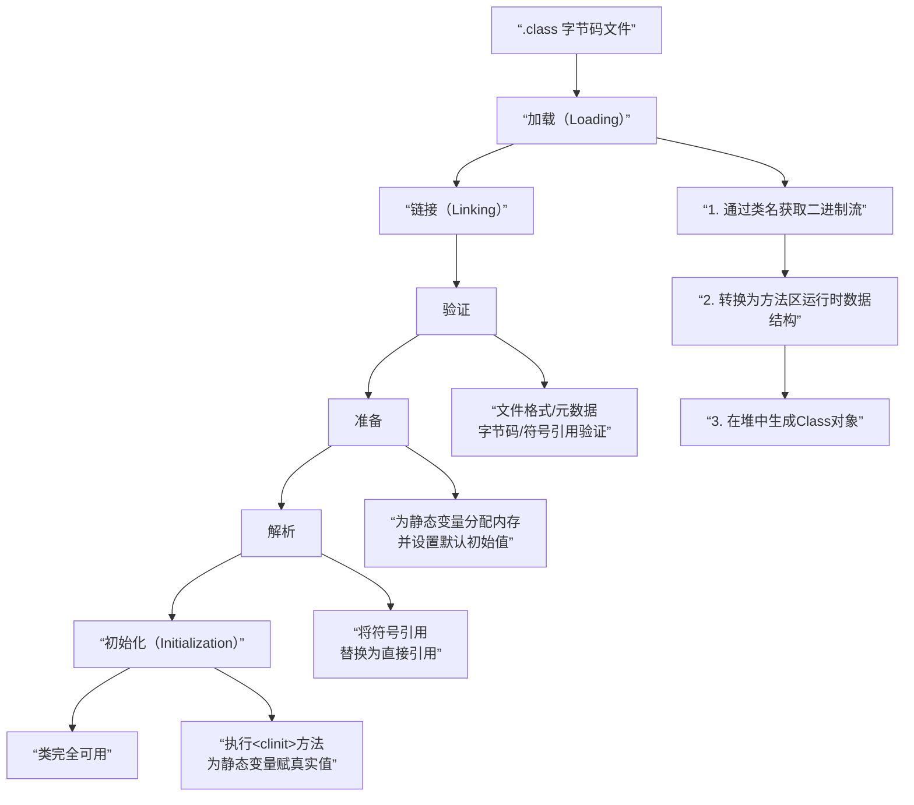

###### 1. 类加载的过程是什么？

上图展示了类加载的宏观过程。下面我们来详细解读图中的关键阶段：
- **加载**：这是第一步。JVM 需要完成三件事：
    1. 通过类的全限定名获取其定义的二进制字节流。
    2. 将这个字节流所代表的静态存储结构转换为**方法区**的运行时数据结构。
    3. 在内存中（通常是堆区）生成一个代表这个类的 `java.lang.Class`对象，作为方法区中这些数据的访问入口。这个阶段是可控性最强的，开发者可以自定义类加载器来控制字节流的获取方式。
- **验证**：这是链接的第一步，确保被加载的类的正确性，不会危害 JVM 安全。主要包括四个阶段的检验：
    - **文件格式验证**：验证字节流是否符合 Class 文件格式规范（如魔数、版本号）。
    - **元数据验证**：对字节码描述的信息进行语义分析，保证符合 Java 语言规范（如是否有父类，是否继承了 final 类）。
    - **字节码验证**：通过数据流和控制流分析，确定程序语义是合法的、符合逻辑的。这是最复杂的阶段。
    - **符号引用验证**：发生在解析阶段，确保符号引用可以转化为直接引用。
- **准备**：此阶段正式为**类变量**分配内存并设置**初始值**。注意两点：
    - 内存分配在方法区。
    - “初始值”通常是数据类型的**零值**，如 `int`是 0，`boolean`是 false。例如 `public static int value = 123;`在准备阶段后是 0，赋值为 123 的动作发生在初始化阶段。但被 `final static`修饰的常量除外，它可能在准备阶段后就直接赋值为真实值。
- **解析**：JVM 将常量池内的**符号引用**替换为**直接引用**的过程。符号引用是一组无歧义的描述符号；直接引用是直接指向目标的指针、相对偏移量或能间接定位到目标的句柄。
- **初始化**：这是类加载过程的最后一步。此阶段才真正开始执行类中定义的 Java 代码，主要是执行类构造器 `<clinit>()`方法的过程。`<clinit>()`方法是由编译器自动收集类中的所有**类变量的赋值动作**和**静态语句块**中的语句合并产生的。JVM 保证在初始化一个类之前，其父类的初始化已经完成。
###### 2. 什么是类加载器？有哪些类型？
类加载器是实际完成加载动作的模块。JVM 提供了几种不同类型的加载器，形成了一个层次结构：

| 类加载器          | 职责描述                                                     | 实现                                          | 备注             |
| ------------- | -------------------------------------------------------- | ------------------------------------------- | -------------- |
| **启动类加载器**​   | 加载 Java 核心库（如 `%JAVA_HOME%/jre/lib/rt.jar`中的 `java.*`包）。 | C++ 实现，是 JVM 自身一部分。                         | 获取其引用为 `null`。 |
| **扩展类加载器**​   | 加载 `%JAVA_HOME%/jre/lib/ext`目录或 `java.ext.dirs`指定路径的类库。  | Java 实现，`sun.misc.Launcher$ExtClassLoader`。 | 父加载器是启动类加载器。   |
| **应用程序类加载器**​ | 加载用户类路径上的类库，是程序中**默认**的类加载器。                             | Java 实现，`sun.misc.Launcher$AppClassLoader`。 | 父加载器是扩展类加载器。   |
| **自定义类加载器**​  | 用户自定义的类加载器，继承 `ClassLoader`类，实现 `findClass`方法。           | 用户 Java 代码实现。                               |                |
###### 3. 什么是双亲委派模型？
**双亲委派模型**是 JVM 类加载器组织其工作的一种原则。其工作流程是：当一个类加载器收到加载请求时，它首先**不会**自己尝试加载，而是将这个请求**委托给父类加载器**去完成。每一层加载器都是如此，因此所有的请求最终都应传送到顶层的启动类加载器。只有当**父加载器无法完成**加载请求（在其搜索范围内没有找到所需的类）时，子加载器才会尝试自己去加载。
###### 4. 为什么要使用双亲委派模型？
- **安全性**：防止核心 API 被篡改。例如，用户自定义一个 `java.lang.Object`类，由于双亲委派机制，这个请求会最终委派给启动类加载器，而启动类加载器加载的是核心库中的 `Object`类，从而保证了核心库的安全。
- **避免重复加载**：确保了同一个类在 JVM 中只会被加载一次，因为父加载器加载过后，子加载器就不会再加载。
###### 5. 如何打破双亲委派模型？
在某些特定场景下需要打破此模型，例如 **SPI 服务发现机制**（如 JDBC）。SPI 的接口在核心库中由启动类加载器加载，但其实现类是由应用加载的。此时，启动类加载器无法“看到”这些实现类，就需要**线程上下文类加载器**来反向委托子加载器去加载实现类，从而打破了双亲委派。**Tomcat**​ 也为每个 Web 应用提供了独立的类加载器，优先加载自己路径下的类，这也打破了双亲委派，以实现应用隔离。
###### 6. 什么是类的初始化？
类的初始化是一个严格的时机规定。JVM 规范明确规定，有且仅有以下**六种情况**属于对类的“主动使用”，会立即触发初始化
###### 7. 类初始化的时机有哪些？
1. 创建类的实例（`new`）、读取或设置一个类的静态字段（被 final 修饰、已在编译期把结果放入常量池的静态字段除外）、调用一个类的静态方法。
2. 使用 `java.lang.reflect`包的方法对类型进行反射调用时。
3. 当初始化一个类时，如果其父类还没有进行过初始化，则需要先触发其父类的初始化。
4. 当虚拟机启动时，用户需要指定一个要执行的主类（包含 `main()`方法的类），虚拟机会先初始化这个主类。
5. 当使用 JDK 7 新加入的动态语言支持时，如果一个 `java.lang.invoke.MethodHandle`实例最后的解析结果为 REF_getStatic, REF_putStatic, REF_invokeStatic, REF_newInvokeSpecial 四种类型的方法句柄，并且这个方法句柄对应的类没有进行过初始化，则需要先触发其初始化。
6. 当一个接口中定义了 JDK 8 新加入的默认方法（被 default 关键字修饰的默认方法）时，如果有这个接口的实现类发生了初始化，那该接口要在其之前被初始化。
###### 8. 什么是类的被动引用？
与主动使用相对，**被动引用不会触发初始化**。例如：
- 通过子类引用父类的静态字段，不会导致子类初始化。
- 通过数组定义来引用类，不会触发此类的初始化。
- 引用一个类的常量（static final）且在编译期就能确定值的常量，不会触发初始化，因为在编译阶段通过常量传播优化，已经将常量值存储到了调用类的常量池中。
###### 9. Class.forName() 和 ClassLoader.loadClass() 的区别？
这两个方法都用于加载类，但有一个关键区别：
- `Class.forName(String name)`：默认会执行类的**初始化**阶段。
- `ClassLoader.loadClass(String name)`：默认只执行**加载**过程，不会进行链接阶段的**解析**和**初始化**，是一个“懒加载”行为。
###### 10. 什么是自定义类加载器？如何实现？
实现自定义类加载器通常需要继承 `ClassLoader`类，并重写其 `findClass(String name)`方法
。在该方法中，你需要：
1. 根据指定的类名 `name`，从自定义的来源（如网络、加密文件、数据库）读取类的字节码。
2. 调用父类的 `defineClass`方法，将字节数组转换为 `Class`对象。
自定义类加载器常用于模块化、代码加密、热部署等场景。
###### 11. 什么是类的卸载？
一个类被加载后，会伴随其对应的类加载器一直存在于内存中。因此，**类的卸载条件与其类加载器实例的生命周期紧密相关**。一个类需要满足以下苛刻条件才会被卸载：
1. 该类所有的实例都已被 GC。
2. 加载该类的 `ClassLoader`实例已被 GC。
3. 该类对应的 `java.lang.Class`对象在任何地方都没有被引用（无法通过反射访问）。
由于这些条件很难同时满足，特别是像应用类加载器加载的类，其生命周期通常与 JVM 一样长，因此简单类的卸载并不常见。但对于由独立类加载器（如 OSGi 模块、热部署容器中的类加载器）加载的类，当模块卸载或应用重新部署时，如果该类加载器实例可以被回收，那么其加载的类也就有可能被卸载，从而实现**热部署**​。
###### 12. 在什么情况下类会被卸载？
###### 13. 什么是热部署？
###### 14. Tomcat 的类加载机制是怎样的？
Tomcat 没有严格遵循双亲委派。为了实现 Web 应用隔离和资源共享，它设计了独立的类加载器层次：
1. **Bootstrap**​ -> **System**：加载 JVM 和 Tomcat 自身的类。
2. **Common**：加载 Tomcat 和所有 Web 应用可共享的类。
3. **WebApp**：**每个 Web 应用独有**，优先加载 `/WEB-INF/classes`和 `/WEB-INF/lib`下的类，然后再委托给父加载器。这打破了双亲委派，实现了应用隔离。
4. **JSP**：用于支持 JSP 页面的热重载。
###### 15. 什么是 SPI 机制？与类加载的关系？