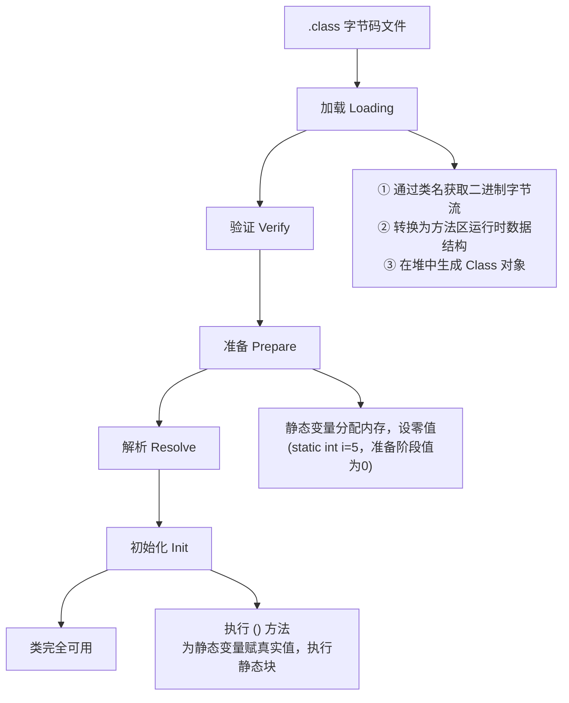

###### 1. 类加载的过程是什么？

[[../../../20_JavaKnowledge/04_JVM/02、类加载机制#一、类的生命周期|📖]]
类加载经历**加载 → 链接（验证、准备、解析）→ 初始化**五个阶段：


```mermaid
flowchart TD
    A[.class 字节码文件] --> B[加载 Loading]
    B --> C1[验证 Verify]
    C1 --> C2[准备 Prepare]
    C2 --> C3[解析 Resolve]
    C3 --> D[初始化 Init]
    D --> E[类完全可用]
    B --> B1["① 通过类名获取二进制字节流\n② 转换为方法区运行时数据结构\n③ 在堆中生成 Class 对象"]
    C2 --> C2a["静态变量分配内存，设零值\n(static int i=5，准备阶段值为0)"]
    D --> D1["执行 <clinit>() 方法\n为静态变量赋真实值，执行静态块"]

```

**加载**：通过类的全限定名拿到字节流，解析到方法区，在堆里创建对应的 Class 对象。这步可控性最强，可以自定义类加载器来控制字节流来源（网络、加密文件等）。

**验证**：确保加载进来的字节码文件合法、安全，不会危害 JVM。包括文件格式验证（魔数 `0xCAFEBABE`、版本号）、元数据语义验证、字节码指令合法性验证、符号引用验证四步。

**准备**：为**类变量（static 字段）**分配内存并设**零值**（int→0，boolean→false，引用→null）。注意：这里不是赋真实值，`static int i = 5` 在准备阶段后 i 是 0，不是 5。`static final` 常量在编译时就确定值了，这里可以直接赋真实值。

**解析**：把常量池里的符号引用（一组描述性字符串）替换成直接引用（内存指针或偏移量），这样后续执行时能直接定位到目标。

**初始化**：真正执行类中的 Java 代码，主要是执行 `<clinit>()` 方法——编译器把所有静态变量的赋值动作和静态代码块合并成这个方法。JVM 保证父类的 `<clinit>()` 先于子类执行。这是整个类加载过程中唯一真正执行用户 Java 代码的阶段。

###### 2. 什么是类加载器？有哪些类型？

[[../../../20_JavaKnowledge/04_JVM/02、类加载机制#二、各阶段详解|📖]]
类加载器是完成"加载"动作的模块，JVM 提供了三层内置类加载器：

**启动类加载器（Bootstrap ClassLoader）**：用 C++ 实现，是 JVM 自身的一部分（不是 Java 类），负责加载 JDK 核心类库（`rt.jar`里的 `java.*` 包）。在 Java 代码里获取它的引用返回 null。

**扩展类加载器（Extension ClassLoader）**：Java 实现（`sun.misc.Launcher$ExtClassLoader`），负责加载 `%JAVA_HOME%/jre/lib/ext` 目录下的类库，或通过 `java.ext.dirs` 系统变量指定路径的类库。父加载器是启动类加载器。

**应用程序类加载器（Application ClassLoader）**：Java 实现（`sun.misc.Launcher$AppClassLoader`），是**程序默认的类加载器**，负责加载用户类路径（classpath）上的类。`ClassLoader.getSystemClassLoader()` 返回的就是它。父加载器是扩展类加载器。

**自定义类加载器**：继承 `ClassLoader` 类，重写 `findClass()` 方法，用于实现特殊的加载逻辑（从网络、加密文件、数据库加载字节码等）。

###### 3. 什么是双亲委派模型？

[[../../../20_JavaKnowledge/04_JVM/02、类加载机制#三、类加载器|📖]]
**双亲委派模型**是类加载器处理加载请求的工作规则：

当一个类加载器收到加载请求时，它**不会自己先去加载**，而是把这个请求**委托给父加载器**去尝试。父加载器同样先委托给它的父加载器，如此递归，直到传到最顶层的启动类加载器。只有当父加载器**搜索范围内找不到这个类**，无法完成加载时，子加载器才自己尝试加载。

这就像办事要逐级上报，只有上级搞不定才自己处理。

###### 4. 为什么要使用双亲委派模型？

[[../../../20_JavaKnowledge/04_JVM/02、类加载机制#三、类加载器|📖]]
**安全性**：防止核心 API 被篡改。假设有人写了个 `java.lang.Object` 类，由于双亲委派，加载请求最终会到启动类加载器，它加载的是 `rt.jar` 里的真 Object，用户自定义的那个压根就不会被加载，核心类库得到了保护。

**唯一性**：保证同一个类在 JVM 中只被加载一次。一旦父加载器加载了某个类，子加载器就不会重复加载，避免了类的重复定义。

**稳定性**：整个类加载体系有了清晰的层次结构，不同层级的类加载器各司其职，职责边界明确。

###### 5. 如何打破双亲委派模型？

[[../../../20_JavaKnowledge/04_JVM/02、类加载机制#四、破坏双亲委派模型|📖]]
双亲委派并非强制规定，有几个经典的破坏场景：

**SPI 机制**：标准 SPI 接口（如 JDBC 的 `java.sql.Driver`）在核心库里，由启动类加载器加载，但接口的实现类（如 MySQL Driver）在应用 classpath 里，启动类加载器根本"看不到"它们。Java 引入了**线程上下文类加载器**解决这个问题——启动类加载器委托线程上下文类加载器（通常是应用类加载器）来加载 SPI 实现，这是一种反向委托，打破了双亲委派。

**Tomcat 的 Web 应用隔离**：Tomcat 给每个 Web 应用提供独立的类加载器（WebAppClassLoader），优先加载自己 `/WEB-INF/classes` 和 `/WEB-INF/lib` 下的类，而不是先委托给父加载器。这样不同 Web 应用可以使用不同版本的同名类，实现应用隔离。

**OSGi 模块化**：OSGi 框架有更复杂的网状委托关系，模块间的依赖通过特定协议解决，完全抛弃了树状的双亲委派。

###### 6. 什么是类的初始化？

[[../../../20_JavaKnowledge/04_JVM/02、类加载机制#五、自定义类加载器|📖]]
类的初始化是执行类构造器 `<clinit>()` 方法的过程，这才是真正执行 Java 代码给静态变量赋值、执行静态代码块的时刻。

JVM 规范规定，**有且仅有六种情况**（主动使用）会触发类的初始化：见下题。

###### 7. 类初始化的时机有哪些？

[[../../../20_JavaKnowledge/04_JVM/02、类加载机制#六、类的唯一性|📖]]
以下六种情况会触发初始化（主动使用）：

1. **new / getstatic / putstatic / invokestatic**：new 一个对象、读取或设置一个类的静态字段（final 常量除外）、调用一个类的静态方法
2. **反射**：用 `java.lang.reflect` 包的方法对类型进行反射调用
3. **父类未初始化**：初始化一个类时，如果其父类还未初始化，先初始化父类
4. **main 方法所在类**：JVM 启动时，先初始化包含 `main()` 方法的那个类
5. **MethodHandle 解析结果为特定类型时**（JDK 7+）
6. **接口有 default 方法，且实现类发生初始化时**（JDK 8+），该接口也要先初始化

###### 8. 什么是类的被动引用？

[[../../../20_JavaKnowledge/04_JVM/02、类加载机制#二、各阶段详解|📖]]
**被动引用不触发类的初始化**，常见的被动引用场景：

- **通过子类访问父类静态字段**：只有父类会被初始化，子类不会
- **通过数组引用类**：`MyClass[] arr = new MyClass[10]` 不会触发 MyClass 的初始化，只会触发 `[LMyClass` 这个数组类的初始化
- **访问类的编译期常量**：`static final int VALUE = 100` 在编译期就被内联到调用方的字节码里了，运行时根本不需要加载那个类

###### 9. Class.forName() 和 ClassLoader.loadClass() 的区别？

[[../../../20_JavaKnowledge/04_JVM/02、类加载机制#一、类的生命周期|📖]]
两者都能加载类，关键区别是**会不会触发初始化**：

`Class.forName("className")` 默认会触发类的**完整加载 + 链接 + 初始化**，也就是说静态代码块会执行，静态变量会赋真实值。JDBC 加载驱动就用这个方法：`Class.forName("com.mysql.jdbc.Driver")`，需要 Driver 类的静态块来注册自己。

`ClassLoader.loadClass("className")` 只完成**加载**阶段，不会触发链接和初始化，是一种懒加载行为。适合只想把类字节码读进来，但暂时不想执行它的静态初始化的场景。

###### 10. 什么是自定义类加载器？如何实现？

[[../../../20_JavaKnowledge/04_JVM/02、类加载机制#一、类的生命周期|📖]]
实现自定义类加载器需要**继承 ClassLoader，重写 `findClass()` 方法**（推荐重写 findClass 而不是 loadClass，这样能保留双亲委派逻辑）：

```java
public class MyClassLoader extends ClassLoader {
    private String classPath;
    
    @Override
    protected Class<?> findClass(String name) throws ClassNotFoundException {
        // 1. 根据类名从自定义来源（文件、网络、加密资源）读取字节码
        byte[] classBytes = loadClassBytes(name);
        if (classBytes == null) {
            throw new ClassNotFoundException(name);
        }
        // 2. 调用父类的 defineClass 把字节数组转成 Class 对象
        return defineClass(name, classBytes, 0, classBytes.length);
    }
    
    private byte[] loadClassBytes(String name) {
        // 自定义加载逻辑：从文件、网络、解密后的资源中读取字节码
        // ...
        return null;
    }
}
```

自定义类加载器的典型用途：**热部署**（不重启 JVM 更新类）、**代码加密**（字节码加密存储，加载时解密）、**模块隔离**（不同模块使用不同版本的类）。

###### 11. 什么是类的卸载？

[[../../../20_JavaKnowledge/04_JVM/02、类加载机制#一、类的生命周期|📖]]
类被加载后，它的 Class 对象会一直存在于内存中，和它的类加载器一起活着。只有满足以下三个**苛刻条件**，类才可能被卸载：

1. 该类的所有实例对象都已被 GC 回收
2. 加载这个类的 ClassLoader 实例本身已被 GC 回收
3. 该类对应的 `java.lang.Class` 对象没有任何地方引用它（无法通过反射访问）

由应用类加载器（AppClassLoader）加载的普通类，生命周期几乎和 JVM 一样长，基本不会卸载。**自定义类加载器加载的类**在模块热部署场景下可能卸载——当模块对应的类加载器实例可以被 GC 时，它加载的所有类也随之卸载，实现真正的热更新。

###### 12. 在什么情况下类会被卸载？

[[../../../20_JavaKnowledge/04_JVM/02、类加载机制#一、类的生命周期|📖]]
见上题，核心是类对应的 ClassLoader 实例被 GC 回收，三个条件同时满足时才会卸载。实际中只有 OSGi 模块、Tomcat 的 WebApp ClassLoader、CGLIB 动态生成类、JSP 热重载等场景会触发类卸载。

###### 13. 什么是热部署？

[[../../../20_JavaKnowledge/04_JVM/02、类加载机制#一、类的生命周期|📖]]
热部署是指在不重启 JVM 的情况下，动态更新（替换）已加载的类，让新的代码逻辑立即生效。

实现原理：**创建新的类加载器实例**来加载新版本的类，由于每个类加载器实例加载的类是独立的，即使类名相同，不同类加载器加载的也是不同的 Class 对象。旧的类加载器和它加载的旧类等待 GC 回收。

Spring Boot DevTools、JRebel 就是利用这个机制实现开发时热部署的。

###### 14. Tomcat 的类加载机制是怎样的？

[[../../../20_JavaKnowledge/04_JVM/02、类加载机制#一、类的生命周期|📖]]
Tomcat 有意**打破了双亲委派**，为了实现 Web 应用隔离和共享，设计了独立的类加载器层次：

**Bootstrap + System（底层）**：加载 JVM 核心类和 Tomcat 自身运行需要的类。

**Common ClassLoader**：加载 Tomcat 本身和所有 Web 应用都可以共用的类（如 JNDI、Servlet API）。

**WebApp ClassLoader**：每个 Web 应用独有一个，**优先**加载 `/WEB-INF/classes` 和 `/WEB-INF/lib` 下的类，只有这里找不到才委托给父加载器。不同 Web 应用之间互相隔离，可以使用不同版本的同名类。

**JasperLoader**：每个 JSP 文件一个实例，支持 JSP 修改后无需重启重新编译加载（热重载）。

###### 15. 什么是 SPI 机制？与类加载的关系？

[[../../../20_JavaKnowledge/04_JVM/02、类加载机制#一、类的生命周期|📖]]
SPI（Service Provider Interface）是 Java 的标准扩展机制。接口在 JDK 核心库里定义，具体实现由第三方提供，通过 `META-INF/services/` 目录下的配置文件声明实现类。

SPI 与类加载的关系：接口（如 `java.sql.Driver`）由启动类加载器加载，实现类（如 MySQL Driver）在应用 classpath 里，启动类加载器根本找不到。为了解决这个问题，Java 引入了**线程上下文类加载器**，启动类加载器通过 `Thread.currentThread().getContextClassLoader()` 拿到应用类加载器，委托它来加载 SPI 实现类，这就是对双亲委派的一次"反向委托"破坏。
