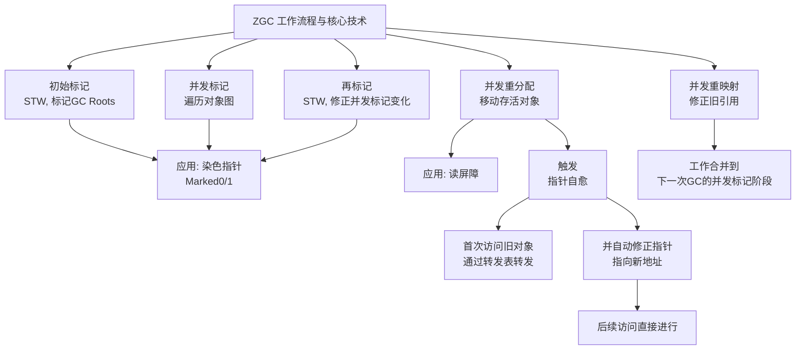
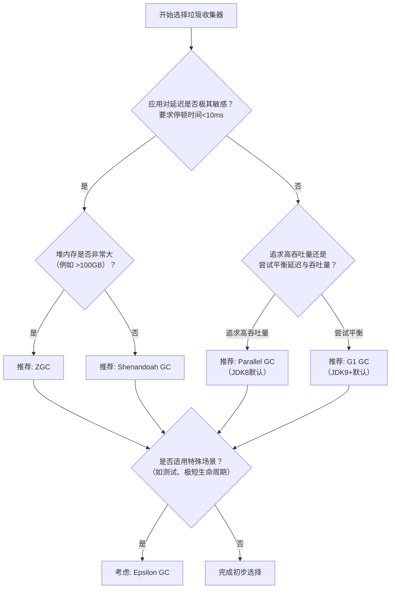

###### 1. 什么是 ZGC？
ZGC（Z Garbage Collector）是一款自**JDK 15**起正式生产可用的**低延迟垃圾收集器**，其设计目标是实现**亚毫秒级（<1ms）的最大停顿时间**，并且停顿时间不会随着堆内存的增大而增加。它能够管理从几百MB到数TB大小的堆内存。
ZGC实现低延迟的核心依赖于几项关键技术，其工作流程也围绕这些技术展开。下面的流程图直观展示了ZGC的工作阶段、核心技术及应用，以及关键的“指针自愈”特性：

###### 2. ZGC 的特点和优势？
- **染色指针**：这是ZGC的标志性技术。它**将额外的元数据信息（如标记状态、重映射状态）直接存储在64位对象指针的高几位中**。这意味着ZGC的标记过程是在指针上而非对象本身上进行的，从而无需为了查看或更新标记位而访问对象，减少了内存访问开销。
- **指针自愈**：得益于染色指针，当应用程序线程试图访问一个已被移动到新位置的对象时，ZGC的**读屏障**会被触发。读屏障能通过转发表将访问**自动转发到新地址**，并**同时将指针中的值更新为新的直接引用**。这个过程就是“自愈”，此后对该指针的访问将直接定位到新对象，无需再次转发。
此外，ZGC还采用**内存多重映射**将不同的虚拟内存地址范围映射到相同的物理内存区域，以支持染色指针在特定硬件平台上的工作。ZGC的收集过程大多阶段是**并发**的，只有初始标记和再标记阶段会有极短的STW停顿。
###### 3. 什么是 Shenandoah GC？
Shenandoah GC 也是一款以低延迟为目标的设计
###### 4. Shenandoah 和 ZGC 的区别？
| 特性        | ZGC                              | Shenandoah GC                             |
| --------- | -------------------------------- | ----------------------------------------- |
| **核心技术**​ | **染色指针**，标记信息存储在指针自身。            | **Brooks指针**，在对象前增加一个间接引用层。               |
| **屏障类型**​ | **读屏障**。用于在读取引用时检查指针状态并可能触发“自愈”。 | **写屏障**。用于在更新对象引用时跟踪引用变化。                 |
| **内存开销**​ | 相对较低，元数据内嵌在指针中。                  | 稍高，因为每个对象需要额外的Brooks指针开销。                 |
| **指针自愈**​ | **支持**。一旦自愈，后续访问无额外开销。           | **不支持**。每次对象访问都可能需要经过Brooks指针，理论上会有持续的开销。 |
| **主要目标**​ | 极致的低停顿时间，适用于对延迟极其敏感的场景。          | 在保持低延迟的同时，更注重吞吐量的平衡。                      |

**核心区别总结**：ZGC和Shenandoah GC的关键区别在于**实现低延迟并发整理的机制不同**。ZGC通过**染色指针和读屏障**实现，而Shenandoah GC通过**Brooks指针和写屏障**实现。ZGC的“指针自愈”特性可能使其在访问频率高的场景中具有性能优势。
###### 5. 什么是 Epsilon GC？
Epsilon GC 是一个特殊的“无操作”垃圾收集器。它**只负责内存分配，完全不进行垃圾回收**。当堆内存耗尽时，JVM会因`OutOfMemoryError`而终止。
它的应用场景非常特定：
- **超短生命周期应用**：如某些命令行工具，运行时间极短，在内存耗尽前就会退出，垃圾回收没有意义。
- **性能测试与控制实验**：用于排除GC本身对性能测试结果的影响，或者用于测试应用的内存分配上限。
- **已知内存分配精确且有限的应用**：在某些极端情况下，开发者能精确知道内存使用不会超过某个阈值。
使用Epsilon GC需要在启动参数中指定 `-XX:+UnlockExperimentalVMOptions -XX:+UseEpsilonGC`。
###### 6. 如何选择合适的垃圾收集器？
选择合适的垃圾收集器需要综合考虑应用的需求和特点。下面的决策流程图可以为您提供一个清晰的选型思路：

以上流程图提供了初步方向。在实际决策时，还需要结合一些具体考量：
- **ZGC**：如果你的应用对**延迟有极其苛刻的要求**（如金融交易系统、实时游戏服务器），并且堆内存可能非常大，ZGC通常是首选。它提供了最一致的响应时间。
- **Shenandoah GC**：同样适用于对延迟敏感的应用，尤其在**堆内存不是特别巨大**时，它提供了与ZGC类似的低停顿特性，可能更容易在较早的JDK版本中使用。
- **G1 GC**：从JDK 9开始是服务端模式的默认收集器。它在**延迟和吞吐量之间提供了一个良好的平衡**，适用于大多数不需要极致低延迟的应用。如果你的应用停顿时间要求可能在几十到几百毫秒之间，G1是一个稳健的选择。
- **Parallel GC**（吞吐量收集器）：如果你的应用是**后台计算、批处理任务**，对吞吐量有极高要求，而对停顿时间不敏感（几分钟的停顿都可以接受），那么Parallel GC可能提供最高的吞吐量。
- **Epsilon GC**：仅用于**非常特殊的场景**，如性能测试、已知内存分配确切且生命周期极短的应用。
**最佳实践**：理论是基础，但**最终一定要在模拟生产环境的压力测试下进行验证**，通过GC日志分析实际表现。
###### 7. 什么是并发标记和并发清除？
- **并发标记与并发清除**：
    - **并发标记**：垃圾收集器在**应用程序线程运行的同时**，遍历对象图来标记哪些对象是存活的。这大大减少了为了标记所需的总停顿时间。
    - **并发清除**：在标记完成后，**并发地**回收垃圾对象占用的内存空间。对于ZGC和Shenandoah，更关键的是“并发整理”，即在回收的同时移动存活对象以压缩堆空间。
###### 8. 什么是三色标记法？
- **三色标记法**：这是一种用于在并发标记期间抽象和跟踪对象状态的理论模型。
    - **白色**：表示对象尚未被垃圾收集器访问到（初始状态）。
    - **灰色**：表示对象本身已被垃圾收集器访问到，但它引用的其他对象还没有被完全扫描。
    - **黑色**：表示对象本身及其直接引用的对象都已被扫描完毕。
        并发标记的目标就是将所有的存活对象从白色标记为黑色。这个过程需要解决“对象消失”问题，写屏障就是解决方案的一部分。
###### 9. 什么是写屏障和读屏障？
**写屏障与读屏障**：
- **写屏障**：可以看作是JVM在**更新对象引用字段操作（如`objA.fieldB = objC`）前后插入的一小段代码**。它用于记录引用关系的变化，是G1和Shenandoah等收集器实现并发标记的关键。
- **读屏障**：可以看作是JVM在**读取对象引用操作（如`Object o = objA.fieldB`）前后插入的一小段代码**。ZGC主要依赖读屏障来实现其并发重映射和指针自愈特性。
###### 10. 什么是 SATB 和增量更新？
**SATB 与增量更新**：这是两种解决并发标记期间“对象消失”问题的技术。
- **SATB**：G1收集器采用此策略。其核心思想是**保留在并发标记开始时那一刻的对象图快照**。任何在并发标记期间新产生的引用关系变化，写屏障会记录下来，确保标记过程中新插入的引用不会被遗漏。
- **增量更新**：CMS收集器主要采用此策略。它关注的是**引用的更新操作**。如果一个黑色对象被修改，从而指向了一个白色对象（即建立了新的引用），写屏障会记录下来，将这个黑色对象“推回”为灰色，以便垃圾收集器重新扫描它。这确保了新建立的引用关系不会被遗漏。