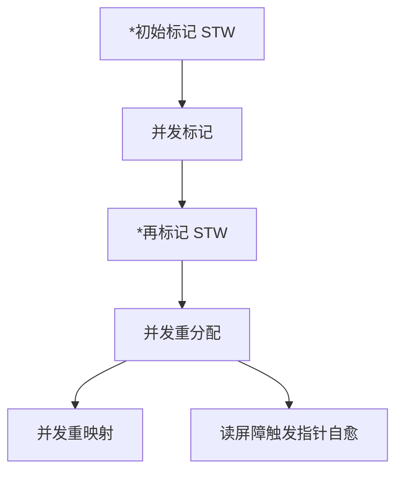
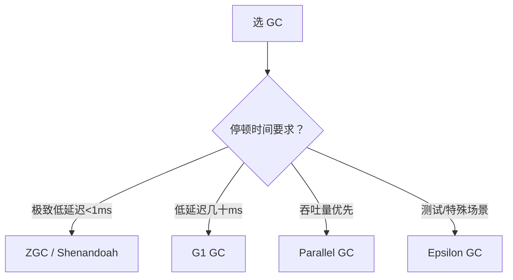

###### 1. 什么是 ZGC？

[[../../../20_JavaKnowledge/04_JVM/08、ZGC与Shenandoah#二、ZGC（Z Garbage Collector）|📖]]
ZGC（Z Garbage Collector）是 JDK 11 引入（JDK 15 正式生产可用）的**低延迟垃圾收集器**，设计目标极其激进：**停顿时间始终不超过1毫秒（亚毫秒级），并且停顿时间不随堆内存增大而增加**。它能管理从几百 MB 到数 TB 的堆内存。

ZGC 实现低延迟的核心技术：
- **染色指针（Colored Pointer）**：把 GC 标记状态、重映射状态等元数据直接存在64位指针的高位（利用 Linux 只用48位地址的特性）。标记时操作指针而不用访问对象本身，减少内存访问。
- **读屏障（Load Barrier）**：在读取对象引用时插入一小段检查代码，发现对象已经被移动就自动修正指针（"指针自愈"），让并发移动成为可能。
- **并发整理**：几乎所有阶段都和用户线程并发，只有初始标记和再标记需要极短的 STW。

###### 2. ZGC 的特点和优势？

[[../../../20_JavaKnowledge/04_JVM/08、ZGC与Shenandoah#二、ZGC（Z Garbage Collector）|📖]]
**染色指针**是 ZGC 的标志性创新。把标记信息直接存在指针高位，标记过程不需要访问对象内存，减少了大量内存访问开销。同时支持**指针自愈**：当程序线程读到一个已被移动的对象的旧指针时，读屏障被触发，自动通过转发表找到新地址，同时把指针本身更新为新地址。下次再访问同一个指针，就直接是正确的新地址了，不需要再走转发逻辑。

ZGC 的工作阶段（只有带 * 的有 STW）：
1. *初始标记（极短 STW）
2. 并发标记
3. *再标记（极短 STW）
4. 并发重分配（移动对象）
5. 并发重映射（修正旧引用，可以合并到下次 GC 的并发标记阶段）

```mermaid
flowchart TD
    B1["*初始标记 STW"] --> B2[并发标记]
    B2 --> B3["*再标记 STW"]
    B3 --> B4[并发重分配]
    B4 --> B5[并发重映射]
    B4 --> C[读屏障触发指针自愈]
```

###### 3. 什么是 Shenandoah GC？

[[../../../20_JavaKnowledge/04_JVM/08、ZGC与Shenandoah#三、Shenandoah GC（Red Hat）|📖]]
Shenandoah 是 RedHat 主导开发的低延迟 GC，从 JDK 12 起合并进 OpenJDK。和 ZGC 目标类似，都是低停顿，但实现路径不同。

Shenandoah 采用 **Brooks 指针**技术：在每个对象头前增加一个额外的间接引用（forwarding pointer），对象被移动后，这个指针指向新位置，读写对象时先检查这个指针。它用**写屏障**（而不是 ZGC 的读屏障）来跟踪引用变化。

###### 4. Shenandoah 和 ZGC 的区别？

[[../../../20_JavaKnowledge/04_JVM/08、ZGC与Shenandoah#四、三者对比：ZGC vs Shenandoah vs G1|📖]]
**核心技术不同**：ZGC 用**染色指针 + 读屏障**；Shenandoah 用 **Brooks指针 + 写屏障**。

**指针自愈**：ZGC 支持，一旦自愈后续访问无额外开销；Shenandoah 不支持，每次对象访问都要经过 Brooks 指针这一层间接，理论上有持续的轻微开销。

**内存开销**：ZGC 把元数据存在指针高位，对象本身不需要额外字段；Shenandoah 每个对象多一个 Brooks 指针字段，内存开销稍高。

**适用场景**：ZGC 适合对延迟极其敏感的场景（金融交易、实时系统），尤其是超大堆；Shenandoah 在吞吐量和低延迟之间更均衡，且在较早的 JDK 版本（JDK 8+）就有支持。

**总结**：两者都是低延迟的优秀收集器，技术路线不同但目标相近。大多数场景 ZGC 性能更极致，Shenandoah 在兼容性上略占优。

###### 5. 什么是 Epsilon GC？

[[../../../20_JavaKnowledge/04_JVM/08、ZGC与Shenandoah#二、ZGC（Z Garbage Collector）|📖]]
Epsilon GC 是 JDK 11 引入的**"无操作"垃圾收集器**，它只负责内存分配，**完全不做任何垃圾回收**。内存用完直接 OOM，JVM 退出。

用途非常特殊：
- **性能测试**：排除 GC 对性能测试结果的干扰，精确测量纯业务代码的性能
- **极短生命周期应用**：命令行工具、Serverless 函数，运行几十毫秒就结束，根本用不上 GC
- **验证内存分配上限**：测试应用的内存需求上限

启用方式：`-XX:+UnlockExperimentalVMOptions -XX:+UseEpsilonGC`

生产环境绝对不要用，只用于特定测试场景。

###### 6. 如何选择合适的垃圾收集器？

[[../../../20_JavaKnowledge/04_JVM/08、ZGC与Shenandoah#五、选型建议|📖]]
按场景选：

**对停顿时间极其敏感（<1ms）**：用 **ZGC**（JDK 15+），停顿时间最短且不随堆增大而增加。堆内存不是很大时也可以考虑 Shenandoah。

**需要低停顿但不极端（几十ms可接受）**：用 **G1**（JDK 9+ 默认），停顿时间可控，吞吐量也不差，是大多数生产应用的好选择。

**后台计算、批处理，不在乎停顿只追求吞吐量**：用 **Parallel GC**（JDK 8 默认），最大化 CPU 利用效率。

**性能测试、极短生命周期应用**：考虑 **Epsilon GC**。

```mermaid
flowchart TD
    A[选 GC] --> B{停顿时间要求？}
    B --> |极致低延迟<1ms| C[ZGC / Shenandoah]
    B --> |低延迟几十ms| D[G1 GC]
    B --> |吞吐量优先| E[Parallel GC]
    B --> |测试/特殊场景| F[Epsilon GC]
```

**最佳实践**：不要只靠理论选，要在压测环境下跑真实负载，分析 GC 日志，用数据说话。

###### 7. 什么是并发标记和并发清除？

[[../../../20_JavaKnowledge/04_JVM/07、G1收集器深度解析#三、G1 的 GC 模式|📖]]
**并发标记**：GC 线程在**用户线程正常运行的同时**，遍历对象引用图，标记哪些对象存活、哪些是垃圾。这是低停顿 GC（CMS、G1、ZGC）的关键技术，把原本要 STW 才能做的事情变成了可以并发做，大大减少了停顿时间。

**并发清除（并发整理）**：标记完成后，并发地回收垃圾对象的内存。对 ZGC 和 Shenandoah 更关键的是**并发整理**：在移动存活对象的同时，用户线程还在运行，通过读屏障/写屏障保证对象访问的正确性。

###### 8. 什么是三色标记法？

[[../../../20_JavaKnowledge/04_JVM/05、垃圾回收算法#六、三色标记算法|📖]]
三色标记是并发标记阶段用于抽象对象状态的模型：

- **白色**：尚未被 GC 访问到（初始状态）。标记结束后仍是白色的对象就是垃圾。
- **灰色**：对象本身已被 GC 访问，但它引用的某些对象还没扫描完。灰色对象是"待处理"的边界。
- **黑色**：对象本身及其直接引用的所有对象都已扫描完毕。黑色对象不会被 GC 误回收。

并发标记的目标：把所有可达对象从白色标记为黑色，剩余的白色对象就是垃圾。

并发标记的难题是**"对象消失"问题**：用户线程可能在 GC 标记的同时修改引用关系，导致一个本该存活的对象被误标为垃圾（白色）。写屏障和 SATB/增量更新是解决方案。

###### 9. 什么是写屏障和读屏障？

[[../../../20_JavaKnowledge/04_JVM/08、ZGC与Shenandoah#二、ZGC（Z Garbage Collector）|📖]]
**写屏障**：JVM 在**对象引用字段的写操作（如 `a.field = b`）前后**插入的额外代码，用于记录引用关系的变化，让 GC 能及时感知并发标记期间的引用修改。G1 和 Shenandoah 主要用写屏障。

**读屏障**：JVM 在**对象引用的读操作（如 `Object o = a.field`）前后**插入的额外代码，用于在读取旧指针时检查对象是否已被移动，并自动修正。ZGC 主要用读屏障实现指针自愈和并发重映射。

###### 10. 什么是 SATB 和增量更新？

[[../../../20_JavaKnowledge/04_JVM/07、G1收集器深度解析#三、G1 的 GC 模式|📖]]
这两个是解决并发标记期间"对象消失"问题的不同策略：

**SATB（Snapshot At The Beginning，初始快照）**：G1 使用。核心思想是**保留并发标记开始时那一刻的对象图快照**，任何在并发标记期间被删除的引用都会被记录下来，确保标记结束时这些对象不会被漏掉（宁可多标，不要漏标）。

**增量更新（Incremental Update）**：CMS 使用。关注的是**引用新建的操作**：如果一个黑色对象在并发标记期间被修改，新增了对白色对象的引用，写屏障会把这个黑色对象重新标记为灰色，让 GC 重新扫描它，确保新建引用不被遗漏。
