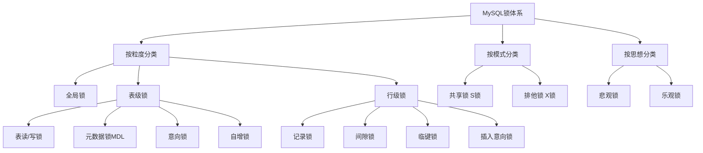

###### 1. MySQL 有哪些锁类型？

MySQL的锁机制非常复杂，可以从多个维度进行分类。
- **按粒度划分**：主要包括**表级锁**、**行级锁**和**页级锁**。其中，InnoDB存储引擎支持行级锁和表级锁，默认为行级锁；MyISAM存储引擎采用表级锁；BDB存储引擎支持页级锁或表级锁，默认为页级锁。
- **按属性划分**：主要包括**共享锁（S锁）**​ 和**排他锁（X锁）**。
- **按加锁机制划分**：可分为**悲观锁**和**乐观锁**。
- **InnoDB的行级锁进一步细分**：包括记录锁（Record Locks）、间隙锁（Gap Locks）、临键锁（Next-Key Locks）、插入意向锁（Insert Intention Locks）等。
###### 2. 什么是共享锁（S锁）和排他锁（X锁）？
这是MySQL中最基本的两种锁属性。
- **共享锁（S锁/读锁）**：允许多个事务同时获取同一资源的共享锁，用于读取操作。持有共享锁的事务只能读取数据，不能修改数据。它阻塞其他事务获取排他锁，但不阻塞其他事务获取共享锁（即“读读共享”）。可以通过`SELECT ... LOCK IN SHARE MODE;`（或MySQL 8.0的`FOR SHARE`）显式加锁。
- **排他锁（X锁/写锁）**：只允许一个事务获取资源的排他锁，用于写入操作。持有排他锁的事务可以读取和修改数据，并阻止其他事务获取该资源的任何锁（共享锁或排他锁），即“写独占”。DML操作（INSERT, UPDATE, DELETE）会自动加排他锁，也可通过`SELECT ... FOR UPDATE;`显式加锁。
###### 3. 什么是表锁、行锁、页锁？
这三种锁是根据锁定粒度进行的划分。
- **表级锁**：锁定整张表。优点是开销小、加锁快、不会出现死锁；缺点是锁定粒度大，发生锁冲突的概率最高，并发度最低。MyISAM和InnoDB等引擎支持。
- **行级锁**：锁定单行记录。优点是锁定粒度最小，发生锁冲突的概率最低，并发度最高；缺点是开销大、加锁慢，会出现死锁。InnoDB支持。
- **页级锁**：锁定相邻的一组记录（一页）。锁定粒度、开销和并发度介于表锁和行锁之间。BDB引擎支持。
###### 4. 什么是意向锁（Intention Lock）？
意向锁是**表级锁**，由InnoDB存储引擎自动添加，用于支持多粒度锁定。
- **作用**：表示一个事务**意图**对表中的某些行加共享锁或排他锁，是一种“意向声明”。其主要目的是为了简化对表级锁请求的判断。例如，当需要给整个表加表锁时，数据库只需检查表上是否存在与之冲突的意向锁，而无需逐行检查是否有行锁，提高了效率。
- **类型**：
    - **意向共享锁（IS）**：表示事务有意向对表中的某些行加共享锁（S锁）。
    - **意向排他锁（IX）**：表示事务有意向对表中的某些行加排他锁（X锁）。
- **兼容性**：意向锁之间通常是兼容的（例如，IS和IX可以共存），但它们与表级的S锁和X锁存在特定的兼容关系。
**工作流程**：
1. 事务要获取行锁前，必须先获取对应的意向锁
2. 意向锁之间是兼容的，但意向锁与表级读写锁存在兼容约束
3. 其他事务通过检查意向锁来判断是否可以获取表锁
###### 5. 什么是记录锁（Record Lock）？
记录锁属于行级锁，它锁定的是**单个索引记录**。例如，`SELECT * FROM users WHERE id = 1 FOR UPDATE;`会在id为1的索引记录上加记录锁，防止其他事务修改或删除这行数据。
###### 6. 什么是间隙锁（Gap Lock）？
间隙锁也属于行级锁，它锁定的是**索引记录之间的区间**，或者说是一个范围，但**不包含索引记录本身**。其主要目的是防止其他事务在这个区间内插入新的数据，从而解决幻读问题。例如，`SELECT * FROM users WHERE id BETWEEN 5 AND 10 FOR UPDATE;`可能会锁定id在(5, 10)这个开区间范围，阻止插入id为6,7,8,9的新记录。间隙锁在**读已提交（Read Committed）隔离级别下会失效。
###### 7. 什么是临键锁（Next-Key Lock）？
临键锁是InnoDB行级锁的一种算法，它是**记录锁（Record Lock）和间隙锁（Gap Lock）的结合，锁定的是一个**左开右闭的区间**。它是InnoDB在**可重复读（Repeatable Read）隔离级别下默认使用的锁算法，其主要目的也是为了防止幻读。例如，如果表中有id为1,4,7,10的记录，那么临键锁可能锁定的区间有 (-∞, 1], (1, 4], (4, 7], (7, 10], (10, +∞)。
###### 8. 什么是插入意向锁（Insert Intention Lock）？
插入意向锁是一种特殊的**间隙锁，专为INSERT操作设置。当多个事务想要在同一个间隙中插入数据，但插入的位置不冲突时，它们可以同时获取到插入意向锁，而无需相互等待，这提高了插入操作的并发性。
###### 9. 什么是自增锁（AUTO-INC Lock）？
自增锁是一种特殊的**表级锁**，专门用于在事务中为具有AUTO_INCREMENT属性的列生成连续的自增数值。当一个事务正在向表里插入数据时，其他事务的插入操作必须等待，以保证生成的主键值是连续的。
###### 10. 行锁是如何实现的？
todo
###### 11. 什么情况下行锁会升级为表锁？
todo
###### 12. 乐观锁和悲观锁的区别？MySQL 如何实现？
这是两种不同的并发控制思想。
- **悲观锁**：认为数据并发冲突的概率很大，因此在访问数据前就先加锁（如行锁、表锁）。在MySQL中，通常依靠数据库自身的锁机制实现，例如使用`SELECT ... FOR UPDATE`来加排他锁。适用于写操作频繁的场景。
- **乐观锁**：认为数据并发冲突的概率较小，因此在访问数据时不加锁，而是在更新数据时通过版本号（version）或时间戳来判断数据在此期间是否被其他事务修改过。通常需要在数据表中增加一个版本号字段，更新时通过`UPDATE table SET column = new_value, version = version + 1 WHERE id = ? AND version = old_version`来实现。适用于读多写少的场景。
###### 13. 什么是死锁？如何避免死锁？
**死锁**：指两个或两个以上的事务在执行过程中，因争夺锁资源而造成的一种相互等待的现象，若无外力干预，这些事务都无法继续执行。InnoDB的死锁与行级锁（或页级锁）有关，因为MyISAM的表锁不会产生死锁。
**避免死锁的常见方法**：
1. 保持事务短小精悍，尽快提交。
2. 多个程序访问多个表时，尽量约定以相同的顺序访问表。
3. 在事务中，尽量一次锁定所需要的所有资源。
4. 为查询条件创建合适的索引，避免全表扫描导致锁表。
5. 在并发较高的场景下，可以考虑使用乐观锁。
6. 如果业务允许，适当降低事务隔离级别（如从RR降到RC）。
###### 14. MySQL 如何检测和处理死锁？
根据搜索结果，InnoDB存储引擎通常能够自动检测到死锁的发生。当检测到死锁时，InnoDB会选择其中一个事务（通常被认为是回滚代价较小的事务）进行回滚，从而让另一个事务能够继续执行。关于MySQL进行死锁检测的具体算法（如等待图 Wait-for Graph）的详细细节，现有搜索结果未能提供。
###### 15. SELECT ... FOR UPDATE 的作用是什么？
SELECT ... FOR UPDATE的作用是给查询结果集加上排他锁（X锁）。这会使被选中的行（在可重复读隔离级别下可能还包括间隙）像被更新一样被锁定，防止其他事务在当前事务结束前修改、删除这些行，或者也对这些行加排他锁（其他事务的SELECT ... FOR UPDATE会被阻塞）。它通常用于在事务中先锁定需要修改的数据，确保数据的一致性。此语句还可以使用WAIT n、NOWAIT、SKIP LOCKED等选项来控制锁等待行为。
###### 16. SELECT ... LOCK IN SHARE MODE 的作用是什么？
`SELECT ... LOCK IN SHARE MODE`的作用是给查询结果集加上**共享锁（S锁）**。它允许其他事务也加共享锁来读取数据，但会阻塞其他事务获取这些行的排他锁（即阻止其他事务修改数据），直到当前事务释放锁。适用于需要确保在事务期间读取的数据不被更改，但又允许其他事务并发读取的场景。