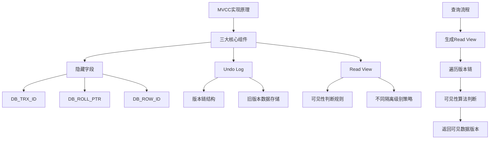

###### 1. 什么是 MVCC？
**MVCC**（Multi-Version Concurrency Control，多版本并发控制）是MySQL InnoDB存储引擎实现的一种**并发控制机制**。其核心思想是**通过维护数据行的多个历史版本，使得读写操作可以并发执行而无需相互加锁阻塞**，从而大幅提升数据库在高并发场景下的性能。
从Java应用开发的视角看，你可以将MVCC理解为一种**乐观锁**思想的实现。它使得在`READ COMMITTED`和`REPEATABLE READ`隔离级别下，普通的`SELECT`查询（即**快照读**）无需获取锁就能进行，读取的是数据在某个时间点的**一致性快照**，而非当前的最新数据。这有效解决了**读-写冲突**，但**写-写冲突**仍需通过锁机制（如行锁）来解决。
###### 2. MVCC 的实现原理是什么？
MVCC的实现依赖于三个核心组件的协同工作，其基本原理和交互流程可以通过下图清晰地展示：

具体来说：
- **隐藏字段**：InnoDB为每行数据添加了三个隐藏字段，用于追踪版本信息。
- **Undo Log**：用于存储数据修改前的旧版本，并通过回滚指针（`DB_ROLL_PTR`）将这些版本连接成一个链表，即**版本链**。当需要回滚或构建历史快照时，就是通过遍历这个链表来找到合适的版本。
- **Read View**：这是事务进行**快照读**时产生的数据结构，决定了当前事务能够"看到"哪些数据版本。它遵循一套严格的**可见性算法**来进行判断。
当一个事务执行查询时，InnoDB会获取该事务的Read View，然后从数据行最新的版本开始，沿着Undo Log形成的版本链进行遍历。对于链上的每一个版本，都会通过Read View的可见性算法进行判断，直到找到第一个对当前事务可见的数据版本。
###### 3. 什么是隐藏字段？包括哪些？
InnoDB存储引擎在**每行数据的末尾**自动添加了三个系统隐藏字段，这些字段对用户不可见，但却是MVCC的基石。

|字段名|大小|含义与作用|
|---|---|---|
|**`DB_TRX_ID`**​|6字节|**最近修改事务ID**。记录最后一次插入或更新该行数据的事务ID。DELETE操作在InnoDB内部也被视为一种特殊的UPDATE。|
|**`DB_ROLL_PTR`**​|7字节|**回滚指针**。指向该行数据**上一个历史版本在Undo Log中的存储位置**，是构成版本链的关键指针。|
|**`DB_ROW_ID`**​|6字节|**隐含自增行ID**。如果表**没有显式定义主键**，InnoDB会自动生成该字段并以其创建聚簇索引。如果表有主键，该字段可能不存在或被优化掉。|
###### 4. 什么是 Undo Log？它的作用是什么？
**Undo Log**（回滚日志）是一种**逻辑日志**，主要用于记录数据被修改前的状态信息。
它的核心作用包括：
- **事务回滚**：当事务执行`ROLLBACK`时，可以利用Undo Log中记录的逻辑信息，将数据恢复到事务开始前的状态，从而保证事务的**原子性**。
- **实现MVCC**：这是Undo Log在MVCC中的关键作用。它存储了数据行的历史版本，为其他事务的**快照读**提供了基础。
Undo Log主要分为两种类型：
1. **Insert Undo Log**：由`INSERT`操作产生。该日志**仅在事务回滚时需要**，一旦事务提交，就可以立即被清除。
2. **Update Undo Log**：由`UPDATE`和`DELETE`操作产生。该日志不仅用于事务回滚，还用于MVCC机制。因此，**即使在事务提交后，也不能立即删除**，必须确保不再被任何活跃事务的Read View需要时，才能由后台的Purge线程进行清理。
###### 5. 什么是 Read View（读视图）？
**Read View**（读视图）是事务在执行**快照读**操作时生成的一个**一致性视图**。它可以理解为数据库在某个时间点的数据快照，主要用于解决**行的可见性问题**，即决定版本链中的哪个版本对当前事务是可见的。
Read View的核心结构包含以下四个关键字段：

|字段|描述|
|---|---|
|**`m_ids`**​ (或 `trx_ids`)|生成Read View时，系统中所有**活跃**（已开始但未提交）事务ID的集合。|
|**`min_trx_id`**​ (或 `up_limit_id`)|活跃事务列表`m_ids`中**最小的事务ID**。|
|**`max_trx_id`**​ (或 `low_limit_id`)|生成Read View时，系统**即将分配的下一个事务ID**（即当前最大事务ID+1）。|
|**`creator_trx_id`**​|**创建该Read View的事务自身的ID**。对于只读事务，该值可能为0。|
###### 6. Read View 在不同隔离级别下的生成时机？
MVCC主要在`READ COMMITTED`（读已提交，RC）和`REPEATABLE READ`（可重复读，RR）这两个隔离级别下工作，其核心区别在于Read View的生成和复用策略不同。

|隔离级别|Read View生成策略|产生的影响与效果|
|---|---|---|
|**READ COMMITTED (RC)**​|**每次**执行快照读（普通SELECT）时都会**生成一个新的Read View**。|事务每次查询都能看到**最新已经提交的数据**。这可能导致**不可重复读**问题，即同一事务内两次相同的查询可能看到不同的结果。|
|**REPEATABLE READ (RR)**​|**仅在事务中第一次**执行快照读时生成Read View，后续**所有快照读操作都复用这同一个Read View**。|事务在整个生命周期内都"看到"同一个数据快照，从而保证了**可重复读**，即同一事务内多次查询结果一致。|

**注意**：`READ UNCOMMITTED`隔离级别允许读取未提交的数据，因此不使用Read View；`SERIALIZABLE`隔离级别则通过加锁使事务串行化执行，通常也无需使用Read View。
###### 7. MVCC 如何判断数据的可见性？
当事务需要读取一行数据时，会**从该行数据最新的版本开始**，沿着Undo Log构成的版本链，使用Read View并遵循以下算法进行可见性判断。这个过程会一直持续，直到找到对当前事务可见的版本。
设当前数据版本的`trx_id`为`T`，Read View的相关字段为`min_trx_id`、`max_trx_id`、`m_ids`、`creator_trx_id`，判断逻辑如下：
1. **检查自身修改**：如果 `T == creator_trx_id`，说明当前事务修改了这个版本，**该版本可见**。
2. **检查已提交的旧事务**：如果 `T < min_trx_id`，说明生成该版本的事务在创建当前Read View时**已经提交**，**该版本可见**。
3. **检查未来的新事务**：如果 `T >= max_trx_id`，说明生成该版本的事务在创建当前Read View**之后才开启**，**该版本不可见**。
4. **检查活跃事务**：如果 `min_trx_id <= T < max_trx_id`，则需要进一步判断事务`T`在当前Read View创建时是否仍处于活跃状态：
    - 如果 `T`在 `m_ids`（活跃事务列表）中，说明创建Read View时，修改该版本的事务**尚未提交**，**该版本不可见**。
    - 如果 `T`不在 `m_ids`中，说明创建Read View时，修改该版本的事务**已经提交**，**该版本可见**。
如果当前版本不可见，则通过`DB_ROLL_PTR`找到版本链中的上一个版本，重复上述判断流程，直到找到可见的版本或版本链遍历完毕。
###### 8. 版本链是如何形成的？
**版本链**是MVCC的"多版本"载体，它通过`DB_ROLL_PTR`指针将数据行的各个历史版本串联成一个**单向链表**。链表的**头节点是数据的最新版本**，尾节点是最早的版本。
其形成过程如下：
1. 当**事务A**首次插入一行数据时，会生成一个数据版本V1，其`DB_TRX_ID`为A的ID，`DB_ROLL_PTR`初始为空（或指向一个特殊的空值）。
2. 之后**事务B**来更新这行数据时：
    - InnoDB会**先将当前版本（V1）完整拷贝到Undo Log中**作为旧版本记录。
    - 然后**在原数据页上直接修改**数据，形成新版本V2，并更新该行的`DB_TRX_ID`为事务B的ID。
    - 同时，将V2的`DB_ROLL_PTR`**指向**刚刚存入Undo Log的V1版本。
3. 后续**事务C**再来更新，会重复此过程：拷贝V2到Undo Log，修改数据产生V3，并将V3的`DB_ROLL_PTR`指向V2。以此类推，最终形成`V3 → V2 → V1`的版本链。
###### 9. MVCC 解决了哪些并发问题？
MVCC主要旨在解决数据库并发访问中的**读-写冲突**，从而在一定程度上缓解或解决某些并发问题，但其能力与隔离级别密切相关。

|并发问题|MVCC的作用效果|
|---|---|
|**脏读**​|**可以解决**。因为MVCC的快照读只能看到在Read View创建前**已经提交的事务**所做的修改，读不到未提交的数据。|
|**不可重复读**​|**在RR隔离级别下可以解决**。因为RR级别下，一个事务复用同一个Read View，每次读到的都是同一个历史快照。**在RC隔离级别下无法解决**，因为每次读都会生成新的Read View，可能看到其他事务提交的新数据。|
|**幻读**​|**MVCC本身无法完全解决幻读**。|
||* **对于快照读**：在RR级别下，由于复用同一个Read View，事务不会看到新插入的数据，因此**避免了幻读**。|
||* **对于当前读**（如`SELECT ... FOR UPDATE`）：MVCC不发挥作用，需要依赖InnoDB的**临键锁**来防止其他事务在范围内插入新记录，从而**防止幻读**。|
**重要提示**：MVCC**只处理读-写冲突**，**写-写冲突**（如两个事务同时更新同一行）仍然需要通过**加锁**（行锁、间隙锁等）来解决。
###### 10. MVCC 的优缺点是什么？
**优点**：
- **高并发性能**：**读不阻塞写，写也不阻塞读**，大幅提升了数据库的并发处理能力，特别适合读多写少的应用场景。
- **降低死锁风险**：由于读操作通常无需加锁，减少了事务间因争抢锁资源而导致死锁的概率。
- **保证读写一致性**：为查询提供一致性的数据快照，便于生成可靠的报表或进行数据分析。
**缺点**：
- **维护开销**：需要为数据维护多个版本，会占用额外的**存储空间**（主要是Undo Log），并增加版本管理的CPU开销。
- **清理机制**：需要**Purge线程**定期清理不再需要的旧版本数据，如果长事务存在，可能导致旧数据无法及时清理，引发**表空间膨胀**。
- **幻读处理**：如前所述，无法单独解决所有情况下的幻读问题，需要锁机制辅助。