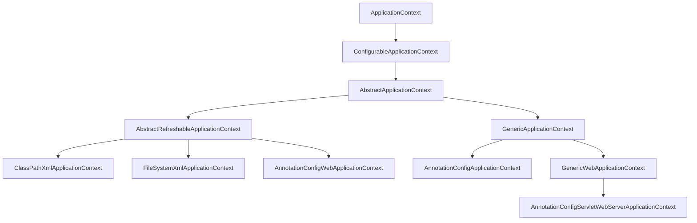
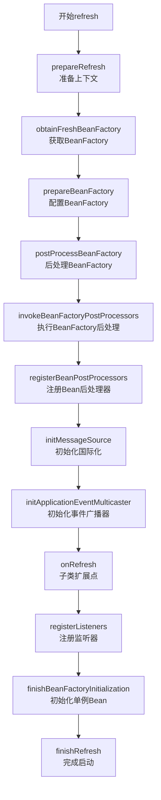

###### 1. 什么是 ApplicationContext？
**ApplicationContext**是Spring框架的核心接口，作为高级IoC容器，它不仅是BeanFactory的扩展，提供了完整的依赖注入和控制反转功能，还集成了企业级服务如事件发布、国际化、资源加载等。
**核心功能与源码设计**：
- **Bean生命周期管理**：ApplicationContext在启动时预实例化所有单例Bean（非懒加载），而基础的BeanFactory采用按需加载策略。其底层通过`DefaultListableBeanFactory`的`beanDefinitionMap`（ConcurrentHashMap结构）存储Bean定义，并在`refresh()`方法的`finishBeanFactoryInitialization()`阶段触发单例Bean的实例化。
- **事件驱动模型**：基于观察者模式实现，通过`ApplicationEventPublisher`发布事件，`ApplicationListener`消费事件。内置事件如`ContextRefreshedEvent`在容器刷新完成后发布，可通过`SimpleApplicationEventMulticaster`进行同步或异步的事件广播。
- **国际化支持**：通过`MessageSource`接口实现，支持层次化消息解析。例如`ResourceBundleMessageSource`可加载不同Locale的properties文件，并通过`getMessage()`方法获取本地化消息。
- **资源抽象**：通过`ResourceLoader`接口统一处理不同来源的资源（如类路径、文件系统、URL）。支持Ant风格路径匹配，如`classpath*:com/**/config.xml`可加载所有匹配的配置文件。
**与BeanFactory的关键差异**：

|**特性**​|**ApplicationContext**​|**BeanFactory**​|
|---|---|---|
|**Bean加载时机**​|容器启动时预实例化单例Bean|延迟加载，首次请求时实例化|
|**企业级功能**​|内置事件、国际化、资源加载等|需手动扩展或编码实现|
|**集成便利性**​|与Spring生态（AOP、事务等）无缝集成|仅提供基础DI功能|
###### 2. ApplicationContext 有哪些常见的实现类？
Spring为不同应用场景提供了多种ApplicationContext实现，其核心继承体系如下图所示：


**常用实现类详解**：
- **ClassPathXmlApplicationContext**：从类路径加载XML配置文件的经典实现。示例：`new ClassPathXmlApplicationContext("applicationContext.xml")`。
- **FileSystemXmlApplicationContext**：从文件系统路径加载XML配置。示例：`new FileSystemXmlApplicationContext("C:/config/app.xml")`。
- **AnnotationConfigApplicationContext**：基于Java配置类的现代实现，支持`@Configuration`、`@ComponentScan`等注解。构造时可传入配置类：`new AnnotationConfigApplicationContext(AppConfig.class)`，或直接指定扫描包路径。
- **AnnotationConfigServletWebServerApplicationContext**：Spring Boot中用于Web应用的实现，内嵌Web服务器并支持自动配置。这是Spring Boot默认的应用上下文类型。
**设计理念**：这些实现类虽然配置方式不同，但都通过统一的`refresh()`方法初始化容器，体现了**模板方法模式**的设计思想。
###### 3. Spring 容器的启动流程是怎样的？
Spring容器的启动核心是`AbstractApplicationContext.refresh()`方法，该方法定义了12个标准步骤，其完整流程如下：


**关键步骤源码解析**：
1. **prepareRefresh()**：初始化环境变量，校验必需属性，设置启动时间戳和活跃状态。
2. **obtainFreshBeanFactory()**：获取或刷新底层BeanFactory（默认`DefaultListableBeanFactory`）。在`GenericApplicationContext`中会创建新的BeanFactory，而`AbstractRefreshableApplicationContext`的子类会重置BeanFactory。
3. **invokeBeanFactoryPostProcessors()**：执行`BeanFactoryPostProcessor`，这是修改BeanDefinition的关键扩展点。特别注意`ConfigurationClassPostProcessor`，它负责解析`@Configuration`类、处理`@ComponentScan`扫描、解析`@Import`等，是注解驱动的核心。
4. **registerBeanPostProcessors()**：注册`BeanPostProcessor`到BeanFactory中。这些处理器在Bean实例化过程中介入，如`AutowiredAnnotationBeanPostProcessor`处理`@Autowired`注入，`CommonAnnotationBeanPostProcessor`处理`@PostConstruct`等生命周期注解。
5. **finishBeanFactoryInitialization()**：初始化所有非懒加载的单例Bean。核心逻辑在`DefaultListableBeanFactory.preInstantiateSingletons()`中，通过`getBean()`方法触发Bean的创建、依赖注入和初始化。
**设计模式**：整个流程体现了**模板方法模式**（`refresh()`定义骨架）、**观察者模式**（事件监听）和**工厂模式**（Bean创建）的综合应用。
###### 4. 什么是 BeanDefinition？
**BeanDefinition**是Spring框架中定义Bean创建蓝图的接口，它包含了实例化Bean所需的所有元数据，如类名、作用域、属性值、依赖关系等，但并非Bean实例本身。
**核心实现类与元数据**：

|**实现类**​|**适用场景**​|**关键特性**​|
|---|---|---|
|**GenericBeanDefinition**​|通用场景，现代Spring默认|灵活，支持parent定义|
|**RootBeanDefinition**​|合并后的最终定义|表示完整的Bean配置，用于实例化|
|**ScannedGenericBeanDefinition**​|组件扫描（@Component）|携带注解元数据（AnnotationMetadata）|
|**ConfigurationClassBeanDefinition**​|@Bean方法配置|包含工厂方法信息（factoryBeanName等）|
**BeanDefinition的关键元数据**包括：
- **类信息**：Bean的全限定类名（`getBeanClassName()`）
- **作用域**：Singleton（默认）、Prototype、Request、Session等（`getScope()`）
- **懒加载**：是否延迟初始化（`isLazyInit()`）
- **依赖关系**：通过构造器参数（`ConstructorArgumentValues`）和属性值（`PropertyValues`）定义
- **初始化/销毁方法**：自定义生命周期方法（`getInitMethodName()`）
- **工厂信息**：如为工厂Bean，包含工厂Bean名和方法名
**注册过程**：BeanDefinition通过`BeanDefinitionRegistry`接口注册到容器中（通常实现为`DefaultListableBeanFactory`）。注册器内部使用`ConcurrentHashMap`（`beanDefinitionMap`）存储BeanDefinition，以beanName为键。
###### 5. 什么是 BeanFactoryPostProcessor？
**BeanFactoryPostProcessor**是Spring重要的扩展接口，允许在Bean实例化之前读取和修改BeanDefinition。其执行时机在BeanFactory准备完成后，Bean实例化之前。
**典型应用**：
1. **属性占位符处理**：`PropertySourcesPlaceholderConfigurer`替换`${...}`占位符为实际值。
2. **配置类处理**：`ConfigurationClassPostProcessor`解析`@Configuration`类，处理`@ComponentScan`、`@Import`等注解。
3. **自定义修改**：实现`BeanFactoryPostProcessor`接口，可编程式修改BeanDefinition。
**源码示例**：
```java
@Component
public class CustomBeanFactoryPostProcessor implements BeanFactoryPostProcessor {
    @Override
    public void postProcessBeanFactory(ConfigurableListableBeanFactory beanFactory) {
        BeanDefinition bd = beanFactory.getBeanDefinition("myService");
        bd.getPropertyValues().add("timeout", 5000); // 修改属性值
        bd.setScope(BeanDefinition.SCOPE_PROTOTYPE); // 修改作用域
    }
}
```
**执行顺序**：`BeanFactoryPostProcessor`按优先级顺序执行，可实现`PriorityOrdered`或`Ordered`接口控制顺序。特别注意，与`BeanPostProcessor`不同，`BeanFactoryPostProcessor`操作的是BeanDefinition而非Bean实例。
###### 6. 什么是 BeanPostProcessor？
**BeanPostProcessor**是Spring容器的一个核心扩展点，用于在Bean实例化、依赖注入完成后，在初始化回调（如`@PostConstruct`、`afterPropertiesSet`）执行前后介入Bean的创建过程。每个Bean在创建时都会经过所有已注册的BeanPostProcessor处理。
**内置处理器及作用**：

|**处理器**​|**功能**​|**介入时机**​|
|---|---|---|
|**AutowiredAnnotationBeanPostProcessor**​|处理`@Autowired`、`@Value`注入|实例化后，依赖注入阶段|
|**CommonAnnotationBeanPostProcessor**​|处理JSR-250注解（`@PostConstruct`等）|初始化回调前后|
|**ApplicationContextAwareProcessor**​|注入ApplicationContext等Aware对象|初始化前|
**工作原理**：BeanPostProcessor定义了兩個方法：
- `postProcessBeforeInitialization()`：在Bean初始化方法（如`@PostConstruct`）前调用
- `postProcessAfterInitialization()`：在Bean初始化方法后调用，通常用于创建代理（如AOP）
**AOP代理创建**：Spring AOP通过`AnnotationAwareAspectJAutoProxyCreator`（BeanPostProcessor的实现）在`postProcessAfterInitialization()`中为匹配的Bean创建代理对象，这是AOP能够无缝集成的关键技术。
###### 7. FactoryBean 和 BeanFactory 的区别是什么？
**BeanFactory**是Spring容器的基础接口，负责Bean的创建、配置和管理。而**FactoryBean**是一个特殊的Bean，用于创建复杂对象，它本身由BeanFactory管理，但通过它获取的对象是其`getObject()`方法返回的对象，而非FactoryBean实例本身。
**核心区别**：

|**维度**​|**BeanFactory**​|**FactoryBean**​|
|---|---|---|
|**角色**​|容器基础架构，管理所有Bean|特殊的Bean，用于创建复杂对象|
|**获取对象**​|`getBean("beanName")`返回实际Bean|`getBean("&beanName")`返回FactoryBean本身  <br>`getBean("beanName")`返回`getObject()`的结果|
|**使用场景**​|所有Bean管理的核心接口|MyBatis的`SqlSessionFactoryBean`、集成连接工厂等|
**FactoryBean源码示例**：
```java
@Component("myComplexObject")
public class CustomFactoryBean implements FactoryBean<ComplexObject> {
    @Override
    public ComplexObject getObject() {
        return new ComplexObject(); // 返回实际需要的复杂对象
    }
    
    @Override
    public Class<?> getObjectType() {
        return ComplexObject.class;
    }
    
    @Override
    public boolean isSingleton() {
        return true;
    }
}
```
**设计价值**：FactoryBean封装了复杂对象的创建逻辑，使配置简化，且能更好地集成到Spring容器的生命周期中。
###### 8. 如何在 Spring 容器中获取 Bean？
**获取方式**：
1. **直接通过ApplicationContext**：
```java
    ApplicationContext ctx = new AnnotationConfigApplicationContext(AppConfig.class);
    MyService service = ctx.getBean(MyService.class); // 按类型获取
    MyService service = ctx.getBean("myService", MyService.class); // 按名称和类型获取
```
2. **依赖注入**（推荐）：通过`@Autowired`或`@Resource`注解让容器自动注入依赖。
3. **实现ApplicationContextAware**：使Bean能获取到所属的ApplicationContext引用。
**获取时机与推荐实践**：
- **容器启动阶段**：通过在配置类上添加`@ComponentScan`或`@Bean`方法定义Bean。
- **运行时获取**：优先使用依赖注入，避免直接调用`getBean()`以减少对容器API的依赖。
- **注意点**：直接通过ApplicationContext获取Bean需谨慎处理可能出现的`NoSuchBeanDefinitionException`。
###### 9. ApplicationContextAware 接口的作用是什么？
**ApplicationContextAware**是一个回调接口，Bean实现此接口后，Spring容器会在Bean初始化过程中将ApplicationContext引用注入到Bean中。
**源码机制**：在`ApplicationContextAwareProcessor`（BeanPostProcessor的实现）的`postProcessBeforeInitialization()`方法中，检查Bean是否实现了`ApplicationContextAware`接口，如果是则调用`setApplicationContext()`方法注入当前ApplicationContext。
**典型应用场景**：
1. **编程式获取Bean**：当需要动态决定获取哪个Bean时。
2. **发布事件**：Bean内部需要发布Spring事件。
3. **访问环境属性**：通过ApplicationContext获取Environment，读取配置属性。
**使用示例**：
```java
@Component
public class ServiceLocator implements ApplicationContextAware {
    private static ApplicationContext context;
    
    @Override
    public void setApplicationContext(ApplicationContext applicationContext) {
        context = applicationContext;
    }
    
    public static <T> T getBean(Class<T> beanType) {
        return context.getBean(beanType);
    }
}
```
**设计考量**：虽然`ApplicationContextAware`提供了灵活性，但应谨慎使用，因为它会使Bean与Spring API耦合。在大多数场景下，依赖注入是更清洁的选择。