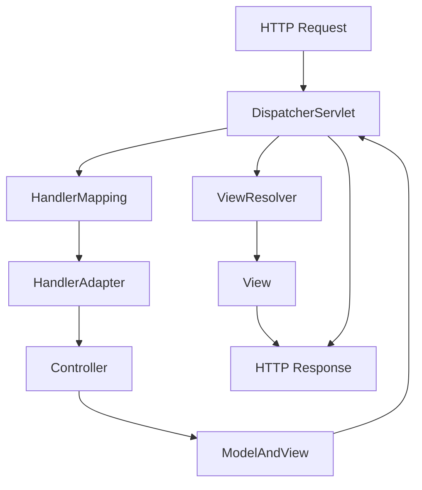

###### 1. 什么是 SpringMVC?
SpringMVC是Spring框架的一个模块，是一个基于**MVC（Model-View-Controller）设计模式**的轻量级Web框架，用于构建Web应用程序。它通过一套注解和配置，简化了基于Servlet的Web开发。
**核心定位与设计理念：**
- **MVC架构实现**：严格遵循MVC模式，将应用程序分为模型（Model，负责业务逻辑和数据）、视图（View，负责UI展示）和控制器（Controller，负责请求处理）。
- **请求驱动型框架**：其核心 `DispatcherServlet`作为前端控制器，统一拦截HTTP请求，并协调后续处理流程。
- **与Spring框架无缝集成**：作为Spring家族的一员，可充分利用Spring的IoC（控制反转）和AOP（面向切面编程）等核心功能，便于管理Controller和其他业务组件。
SpringMVC通过**DispatcherServlet**作为前端控制器，提供了灵活的URL映射、数据绑定、视图解析等功能，大大简化了传统Servlet开发中的重复代码。
###### 2. SpringMVC 的核心组件有哪些?
SpringMVC的核心架构建立在几个分工明确的组件协同工作上，其处理流程的核心交互关系如下图所示：

以下是各核心组件的详细说明：
1. **DispatcherServlet（前端控制器）**
    - **角色**：整个流程的**调度中心**，是SpringMVC的“心脏”。它统一接收所有HTTP请求，并负责协调各个组件共同完成请求处理。
    - **源码接口**：`org.springframework.web.servlet.DispatcherServlet`，它本质上是一个`HttpServlet`。其核心入口方法是`doService()`，而实际的请求分发逻辑在`doDispatch()`方法中实现。
2. **HandlerMapping（处理器映射器）**
    - **角色**：根据请求的URL（如`/users`）、HTTP方法（GET、POST等）等信息，找到对应的**处理器（Handler）**。在现代注解驱动的开发中，处理器通常就是`@Controller`中被`@RequestMapping`标注的方法。
    - **常用实现**：`RequestMappingHandlerMapping`，负责解析`@RequestMapping`等注解，建立请求与控制器方法之间的映射关系。
3. **HandlerAdapter（处理器适配器）**
    - **角色**：作为一个**适配层**，使`DispatcherServlet`能够以统一的方式调用各种不同类型的处理器（如基于`@Controller`注解的处理器、实现`Controller`接口的处理器等）。它负责实际调用处理器方法，并将其返回值封装为`ModelAndView`对象。
    - **常用实现**：`RequestMappingHandlerAdapter`，它是处理`@Controller`注解风格的核心适配器。
4. **ViewResolver（视图解析器）**
    - **角色**：将控制器返回的**逻辑视图名**（如`"userDetails"`）解析为具体的**视图对象**（如一个JSP页面`/WEB-INF/views/userDetails.jsp`或一个Thymeleaf模板）。
    - **常用实现**：`InternalResourceViewResolver`用于解析JSP视图。配置时通常需要指定`prefix`（前缀）和`suffix`（后缀）属性。
5. **View（视图）**
    - **角色**：负责**渲染模型数据**，将处理结果生成最终的HTTP响应内容（如HTML、JSON、XML等）。SpringMVC支持多种视图技术，如JSP、Thymeleaf、FreeMarker等。
6. **HandlerInterceptor（处理器拦截器）**
    - **角色**：提供**拦截机制**，可以在处理器执行的前后（`preHandle`、`postHandle`）以及请求完成之后（`afterCompletion`）插入自定义逻辑，用于实现如权限验证、日志记录、全局数据处理等横切关注点。
###### 3. SpringMVC 的优点有哪些?
SpringMVC相较于其他MVC框架（如Struts2），具有以下显著优点：
1. **与Spring生态系统无缝集成**
    - 作为Spring家族的一员，可以轻松使用Spring的**依赖注入（DI）**、**声明式事务管理**、**AOP**等所有企业级服务，实现Bean的统一管理和配置。
2. **灵活且非侵入式的设计**
    - 开发Controller时，只需使用`@Controller`等注解，无需实现或继承任何特定框架接口，代码**POJO（Plain Old Java Object）化**，耦合度低，易于测试。
3. **强大的数据绑定和验证**
    - 提供自动、智能的**数据绑定**功能，能将请求参数（包括复杂POJO、集合等）自动绑定到控制器方法的参数上。同时，无缝集成**JSR-303/JSR-349 Bean Validation**标准，通过`@Valid`注解即可实现数据验证。
4. **卓越的RESTful支持**
    - 通过`@RequestMapping`、`@GetMapping`、`@PostMapping`、`@PathVariable`、`@ResponseBody`等一系列注解，可以非常简洁地构建符合REST风格的Web API。
5. **可插拔的视图技术**
    - 视图层与控制器层**高度解耦**。开发者可以根据项目需求自由选择视图技术（JSP, Thymeleaf, FreeMarker, JSON序列化等），只需配置相应的`ViewResolver`即可。
6. **强大而灵活的配置选项**
    - 支持**纯XML配置**、**注解驱动**（`@Configuration`, `@EnableWebMvc`）以及**混合模式**，适应不同项目和团队的开发习惯。
7. **可扩展性**
    - 框架的每个核心组件几乎都是**接口驱动**的。用户可以通过实现自定义的`HandlerMapping`、`HandlerAdapter`、`ViewResolver`等接口，轻松扩展框架行为，满足特定业务需求。
###### 4. SpringMVC 的工作原理是什么?
SpringMVC处理一个HTTP请求的完整工作流程，其核心流程的源码级细节如下：
1. **HTTP请求到达与拦截**
    - 用户发起请求，被Web容器（如Tomcat）转发给配置在`web.xml`或通过`WebApplicationInitializer`动态注册的`DispatcherServlet`。
2. **寻找处理器（HandlerMapping）**
    - `DispatcherServlet`调用`getHandler()`方法，遍历所有已注册的`HandlerMapping`，询问它们是否能处理当前请求。
    - `RequestMappingHandlerMapping`会根据请求的URL和HTTP方法，找到匹配的`@RequestMapping`方法，并封装成一个`HandlerExecutionChain`对象（该对象包含目标处理器方法和可能配置的`HandlerInterceptor`集合）。
3. **获取处理器适配器（HandlerAdapter）**
    - `DispatcherServlet`通过`getHandlerAdapter()`方法，根据上一步找到的处理器类型，查找能够支持该处理器的`HandlerAdapter`（例如，对于`@Controller`，返回的是`RequestMappingHandlerAdapter`）。
4. **执行拦截器前置处理（Interceptor.preHandle）**
    - 在真正执行处理器方法之前，`DispatcherServlet`会按顺序调用`HandlerExecutionChain`中所有`HandlerInterceptor`的`preHandle()`方法。如果某个拦截器返回`false`，则流程中断，请求被拒绝。
5. **适配器调用处理器（HandlerAdapter.handle）**
    - `HandlerAdapter`开始工作，它是实际调用控制器方法的核心。`RequestMappingHandlerAdapter`的执行流程尤为复杂：
        - **数据绑定**：通过`WebDataBinder`将请求参数（包括查询参数、路径变量、表单数据等）绑定到控制器方法的参数上，并进行类型转换。
        - **调用方法**：通过Java反射机制调用控制器方法。
        - **处理返回值**：将方法返回值封装成`ModelAndView`对象。如果方法标注了`@ResponseBody`，则适配器会使用`HttpMessageConverter`将返回值直接写入响应体。
6. **执行拦截器后置处理（Interceptor.postHandle）**
    - 控制器方法执行完毕后，`DispatcherServlet`会逆序调用所有`HandlerInterceptor`的`postHandle()`方法，允许对模型和视图进行最终修改。
7. **处理视图（ViewResolver & View）**
    - 如果返回的`ModelAndView`包含逻辑视图名，`DispatcherServlet`会调用`resolveViewName()`方法，遍历所有已注册的`ViewResolver`，将逻辑视图名解析为具体的`View`对象。
    - `DispatcherServlet`然后调用`View`对象的`render()`方法，将模型数据合并到视图中，生成最终的响应内容（如HTML）。
8. **执行拦截器完成处理（Interceptor.afterCompletion）**
    - 无论请求处理成功与否，在视图渲染完成后，`DispatcherServlet`都会逆序调用所有`HandlerInterceptor`的`afterCompletion()`方法，进行资源清理等工作。
9. **返回响应**
    - 将渲染结果作为HTTP响应返回给客户端浏览器。