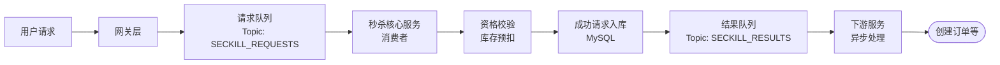

###### 1. 消息中间件在微服务中的典型应用场景有哪些？
消息中间件在微服务架构中扮演着“神经系统”的角色，其核心应用场景可归纳为以下几类：

|应用场景|核心目标|关键实现要点|
|---|---|---|
|**服务解耦**​|降低微服务间的直接依赖，使服务能够独立开发、部署和扩展。|通过**发布-订阅模型**，上游服务发布事件，下游服务订阅感兴趣的事件，无需知晓对方存在。|
|**异步处理**​|将非核心、耗时的操作异步化，提升主流程的响应速度。|主服务处理完核心逻辑后，发送消息到MQ即可返回，由专门的服务异步消费处理（如发送通知、更新统计）。|
|**流量削峰**​|应对突发流量，保护后端系统不被冲垮，平滑系统负载。|将瞬时涌入的请求放入消息队列，后端服务以其最大处理能力从队列中匀速消费，起到“缓冲”作用。|
|**最终一致性**​|在分布式系统中，以一种柔性、异步的方式实现数据的一致性。|通过**事务消息**或**本地事务表+消息**的模式，确保多个服务间的数据操作最终一致。|
|**消息驱动/事件驱动**​|构建响应式系统，服务通过事件进行通信和状态更新。|微服务将状态变更作为事件发布，其他服务监听这些事件并更新自己的数据或触发后续流程。|
###### 2. 如何使用消息队列实现异步解耦？
实现异步解耦的核心在于将**同步的直接服务调用**转变为**基于事件的异步通信模型**。
**传统同步调用的痛点**：在订单创建后需调用库存服务、积分服务、短信服务的场景下，如果使用同步RPC调用，会形成一条长长的调用链。任何一个下游服务延迟或宕机，都会导致整个上游操作失败，用户体验极差，且系统脆弱。
**基于消息队列的解决方案**：
1. **订单服务**在完成订单入库后，不再是直接调用其他服务，而是向消息队列的特定Topic（如 `ORDER_CREATED`）发送一条订单创建成功的消息，然后立即返回给用户。
2. **库存服务**、**积分服务**等订阅 `ORDER_CREATED`Topic。它们会从消息队列中拉取消息，并**独立地、异步地**处理自己的业务逻辑（扣减库存、增加积分）。
**源码与设计模式角度**：
- **Spring Cloud Stream框架**：该框架极大简化了这一过程。你只需定义一个绑定接口（`Source`, `Sink`, `Processor`），并通过注解如 `@EnableBinding`和 `@StreamListener`来声明消息通道和监听器。框架底层会与RabbitMQ或Kafka等中间件交互，开发者只需关注业务逻辑。
    ```java
    // 订单服务 (生产者)
    @Autowired
    private Source source;
    public void createOrder(Order order) {
        // ... 本地事务处理订单
        source.output().send(MessageBuilder.withPayload(order).build());
    }
    
    // 库存服务 (消费者)
    @StreamListener(Sink.INPUT)
    public void handleOrderCreated(Order order) {
        inventoryService.deductStock(order);
    }
    ```
- **事件驱动模式**：这实质上是**观察者模式**在分布式系统中的延伸。订单服务作为事件发布者，库存等服务作为事件订阅者，消息队列则充当了事件总线（Event Bus）的角色。
###### 3. 如何使用消息队列实现流量削峰？
流量削峰的本质是**控制速率**，将不规则的突发流量整形为匀速的平稳流量。
**秒杀系统为例**：
1. **洪峰接收，队列缓冲**：当秒杀开始瞬间，海量下单请求涌入系统。网关或前端将这些请求全部发送到消息队列（如Kafka或RocketMQ）。由于消息队列具有高吞吐量和持久化能力，它可以轻松承接这波洪流，避免请求直接压垮下单服务。
2. **匀速处理，能力控制**：下单服务作为消费者，以自身**最大且稳定的处理能力**（例如，1000 TPS）从消息队列中拉取请求进行处理。它不关心涌入的请求量有多大，只按自己的节奏消费。
3. **结果异步通知**：下单服务处理完一个请求后，会将结果（成功或失败）写入另一个消息队列或缓存，前端通过轮询或WebSocket获取最终结果。
**技术细节与考量**：
- **队列长度限制**：可以设置队列的最大容量，当积压消息超过阈值时，新来的请求可以直接被拒绝，返回“活动太火爆，请稍后重试”等提示，这是一种快速失败（Fail-Fast）的兜底策略。
- **顺序性与公平性**：在秒杀场景下，消息队列通常保证**FIFO（先进先出）**，这确保了先到请求的优先处理权，符合公平性原则。
###### 4. 什么是事件驱动架构（EDA）？消息队列如何支持？
**事件驱动架构（EDA） 是一种软件架构范式，其中系统的核心组件通过**事件的产生、检测、消费和反应**进行通信和协作。事件是对系统内某一时刻已发生事实的通知（例如，`OrderCreatedEvent`, `UserRegisteredEvent`）。
消息队列对EDA的支持**：
消息队列是实现EDA的**理想技术载体**，它充当了**事件总线（Event Bus）**​ 的角色。
1. **事件通知**：服务在完成一个业务操作后，发布一个**领域事件**到消息队列。这个事件是只读的，表示过去发生的一件事。
2. **事件消费**：其他服务订阅这些事件。一个事件可以被**零个、一个或多个**服务消费。订阅者根据事件内容更新自己的数据或触发新的业务流程，服务之间没有直接依赖。
**优势**：
- **松耦合与高内聚**：服务之间通过事件接口通信，实现技术、时间和空间上的解耦。
- **可扩展性**：可以轻松地添加新的事件订阅者来处理事件，而无需修改事件发布者的代码。例如，在用户注册事件后，可以很容易地添加一个新的审计服务来监听该事件。
- **最终一致性**：EDA天然支持数据最终一致性，每个服务异步地根据事件更新自身状态。
###### 5. 如何设计一个秒杀系统的消息队列方案？
一个健壮的秒杀系统消息队列方案需要多层设计，核心架构如下：

1. **前置校验与排队**：在请求进入消息队列前，先进行基础校验（如用户登录态、秒杀活动是否有效）。通过校验的请求被放入一个**请求Topic**（如 `seckill-requests`）。这一步的目的是将无效请求直接挡在外面，减轻消息队列的压力。
2. **核心逻辑异步处理**：**秒杀Worker服务**（多个实例）从请求Topic中消费消息。每个Worker处理一个请求，核心逻辑是：
    - **库存预扣**：在Redis中进行原子性的库存扣减（使用 `DECR`或 `Lua`脚本保证原子性）。如果库存不足，直接返回失败。
    - **防止重复购买**：检查用户是否已经参与过本次秒杀。
    - **生成秒杀令牌**：将成功的请求（用户ID，商品ID，秒杀令牌）写入数据库或缓存，表示用户获得了购买资格。
3. **结果通知与最终订单创建**：将秒杀结果（成功/失败）写入**结果Topic**。**订单服务**订阅成功的结果，通过**有限状态机**和**幂等性**保障，根据秒杀令牌创建最终的正式订单。即使订单服务因网络问题重复收到同一消息，也能因幂等性设计而避免创建重复订单。
**技术选型**：**RocketMQ**是此场景的优选，因为它支持**高吞吐量**、**低延迟**，并且提供**事务消息**，可以很好地保证“库存扣减”和“消息发送”这两个操作的最终一致性。
###### 6. 如何使用消息队列实现分布式日志收集？
这是消息队列（尤其是Kafka）的经典应用场景，旨在解决大量日志数据从各个应用节点汇集到中央存储（如Elasticsearch，HDFS）的难题。
**架构流程**：
1. **日志采集**：在各个应用服务器上部署轻量级的日志收集代理（如Filebeat, Flume Agent）。代理监控应用日志文件的变化。
2. **日志推送**：代理将新增的日志内容作为消息，批量发送到Kafka的指定Topic（例如，`app-logs`, `nginx-logs`）。Kafka的高吞吐量特性使其能够轻松应对所有应用服务器同时上报日志的压力。
3. **日志消费与处理**：下游的日志处理服务（如ELK栈中的Logstash，或Flink/Spark Streaming作业）作为消费者，从Kafka Topic中拉取日志消息。
4. **存储与分析**：处理服务对日志进行清洗、格式化、富化等操作，然后将其存储到Elasticsearch用于实时搜索和可视化，或到HDFS用于长期存储和离线批处理分析。
**Kafka的优势**：
- **解耦**：日志生产方和消费方分离，即使日志存储系统（如ES）需要维护或升级，也不会影响前端应用的日志上报。
- **缓冲**：在消费方处理能力不足时，Kafka可以持久化积压的日志，避免数据丢失。
- **高吞吐**：为大数据管道提供极高的带宽。
###### 7. 如何使用消息队列实现数据同步？
数据同步主要用于**数据库之间的数据复制**、**缓存数据同步**或**搜索索引构建**。
**以同步MySQL数据到Elasticsearch为例**：
1. **捕获数据变更**：这是最关键的一步。有几种方式：
    - **应用层双写**：在业务代码中，在写入MySQL后，同步或异步地发送一条消息到MQ。这种方式简单但可能因应用崩溃导致数据不一致。
    - **基于数据库日志的捕获（推荐）**：使用Canal或Debezium等工具，伪扮成MySQL的从库，读取其binlog（二进制日志）。这些工具能够解析binlog中的增删改事件，并将其转换为结构化的消息发送到Kafka。这是**侵入性最低、可靠性最高**的方式，能保证数据变更被精确捕获。
2. **消息路由**：将不同表的数据变更事件发送到不同的Kafka Topic，例如 `user-table-changes`, `order-table-changes`。
3. **数据消费与同步**：Elasticsearch的索引服务消费这些Topic中的消息，根据消息类型（insert, update, delete）在ES中执行相应的文档操作，从而保持ES索引与MySQL数据库的最终一致性。
###### 8. 消息队列在大数据处理中的应用场景有哪些？
在大数据领域，消息队列（特别是Kafka）已成为**数据管道**的基石。
- **数据采集与接入**：作为大数据平台的数据入口，汇集来自各种数据源（前端埋点、应用日志、数据库变更、物联网传感器数据）的海量数据。
- **流处理（Stream Processing）**：流处理框架（如Flink, Spark Streaming, Kafka Streams）直接消费Kafka中的消息，进行实时计算。例如：
    - **实时指标统计**：实时计算网站PV/UV、交易金额等。
    - **实时风控**：实时分析用户行为流，检测异常操作。
    - **实时推荐**：根据用户实时点击行为，快速更新推荐模型。
- **Lambda/Kappa架构**：在Lambda架构中，Kafka同时服务于**速度层（实时流处理）​ 和**批处理层。在更现代的Kappa架构中，所有数据都作为流处理，Kafka是唯一的数据源和可靠的数据存储层。