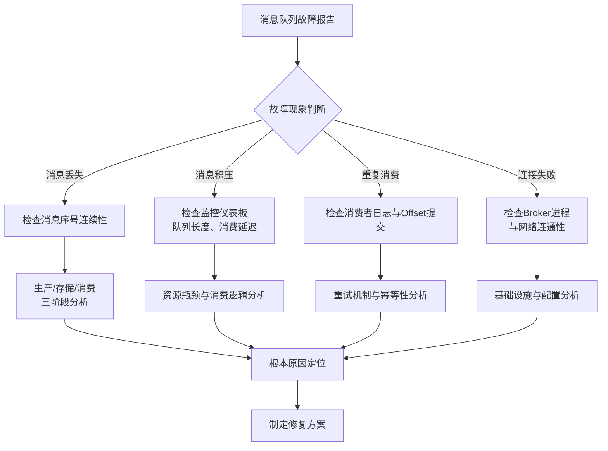
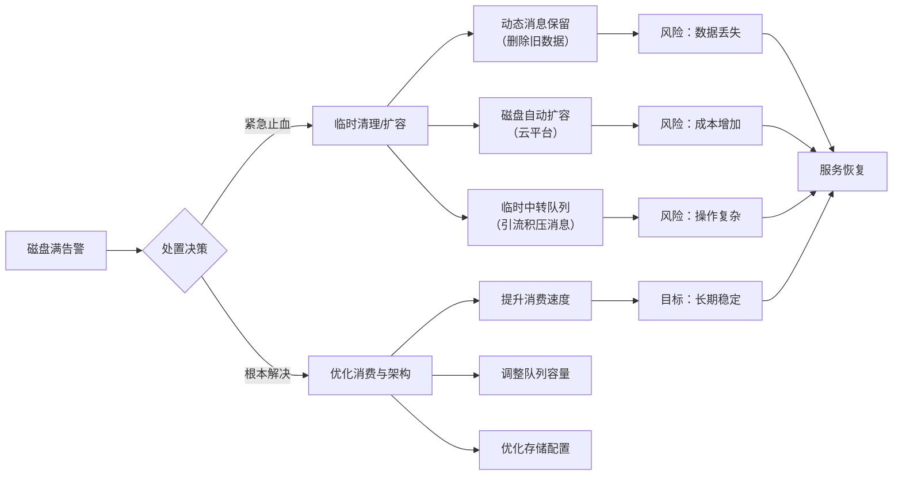

###### 1. 消息队列常见的故障有哪些？如何排查？
消息队列常见故障可分为消息生命周期故障和系统基础设施故障两大类，排查需要系统化的方法。
**常见故障类型及根源分析**
- **消息丢失**：最严重的故障，可能发生在**生产阶段**（网络故障、Broker未返回ACK确认）、**存储阶段**（Broker宕机且未配置持久化或集群复制）、**消费阶段**（消费者自动提交ACK但业务逻辑实际处理失败）。例如，Kafka生产者若未正确配置`acks=all`，可能在Leader副本接收消息但未同步至Follower副本时宕机导致消息丢失。
- **消息重复消费**：通常由于**网络重试**（生产者未收到ACK触发重试）或**消费者重平衡**（消费者处理消息后、提交Offset前崩溃，消息被重新分配给其他消费者）引起。消息队列的服务质量（QoS）多为`At least once`，重复消息不可避免。
- **消息积压**：因**消费速度持续低于生产速度**导致。可能由于消费者出现性能瓶颈（如数据库慢查询、Full GC）、消费者实例宕机或业务流量突发。
- **队列/集群不可用**：包括Broker进程异常退出、磁盘写满、网络分区导致集群脑裂，以及ZooKeeper等协调组件故障。
**系统化排查方法论**
排查时可参照以下流程图，从外部表现切入，逐步定位根本原因：

具体排查步骤：
1. **检查核心监控指标**：通过Prometheus、Grafana等工具查看**消息堆积量（Backlog/Lag）**、**生产/消费TPS**、**Broker节点CPU/内存/磁盘IO**、**GC情况**。Lag持续增长表明消费能力不足。
2. **审查客户端日志**：在生产者和消费者端的关键逻辑点（如消息发送前/后、业务处理前/后）添加详细日志，尤其注意异常捕获。Kafka生产者可启用DEBUG日志查看网络交互细节。
3. **核查服务端日志**：Broker日志（如Kafka的`server.log`、RocketMQ的`broker.log`）常包含错误根源信息，如磁盘错误、副本同步失败、权限问题等。
4. **验证配置参数**：确认关键配置，如Kafka生产者的`acks`、`retries`，消费者的`enable.auto.commit`、`session.timeout.ms`、`max.poll.records`；RabbitMQ的持久化设置、确认模式等。
5. **模拟与测试**：在隔离的测试环境中，模拟故障场景（如断网、杀进程）以验证系统行为。
###### 2. 如何处理消息队列的磁盘满问题？
磁盘满属高危故障，需快速响应并有一套清晰的处置流程：

**紧急恢复操作**
- **启用动态消息保留策略**：对于CKafka等云服务，可开启此功能。当磁盘使用率达到阈值（如75%），Broker会自动向前调整消息保留时间（如缩短），删除最早的历史数据以释放空间。这是**最快但会丢失数据**的恢复方法。
- **磁盘自动扩容**：云平台消息队列（如CKafka专业版）支持配置磁盘自动扩容策略。磁盘使用率达阈值后自动按步长（如100GB）扩容。此方法**不丢数据但可能增加成本**。
- **紧急日志清理**：若业务允许，可手动删除某些非核心Topic的旧数据。**风险极高，需严格评估**。
- **临时队列中转（推荐）**：这是对业务影响较小的方案。
    1. 新建一个具有更大磁盘空间的临时Topic（例如，为积压的Topic分配20个分区）。
    2. 编写一个**临时的、不处理业务逻辑的消费者程序**，从原积压Topic快速消费消息，直接转发至新的临时Topic。此程序目标仅是**搬运数据**。
    3. 临时Topic下启动**多个消费者实例**（可与分区数匹配）并发处理消息。
    4. 待积压消息处理完毕，将生产端流量逐步切回原Topic，或直接改用新Topic。
**根本解决与预防**
- **优先处理消息积压**：根本原因常是消费过慢。需按前述积压处理方法，优化消费者逻辑或扩容。
- **容量规划与监控**：根据业务量合理规划磁盘空间，并设置**磁盘使用率监控告警**（如达到80%即报警），为处理预留时间窗口。
- **设置消息TTL**：对非关键数据，配置合理的消息过期时间，避免无限堆积。
###### 3. 如何进行消息队列的容量规划？
科学的容量规划是系统稳定的基石，需综合考量多个维度。以下公式提供了核心资源的估算思路：
- **内存需求估算**：`内存需求(GB) ≈ 并发连接数 × 0.5MB + 队列数量 × 每条消息平均大小 × 副本数 × 2`
- **磁盘需求估算**：`磁盘需求(GB) ≈ 日均消息量 × 每条消息平均大小 × 保留天数 × 副本数 × 1.5`（1.5为安全系数）
**核心规划维度**
1. **消息体量与吞吐量**：
    - **消息大小**：评估平均大小和峰值大小（如包含大附件）。
    - **生产/消费速率（TPS）**：评估日均、高峰时段（如大促）和未来增长预期的消息量。
    - **数据保留策略**：消息需在队列中保存多久（如数小时用于实时处理，数天用于审计）。
2. **系统资源配置**：
    - **磁盘空间与IOPS**：基于消息总量和保留周期计算。需考虑磁盘类型（SSD性能远优于HDD）。Kafka重度依赖PageCache，但刷盘性能仍受磁盘IOPS限制。
    - **内存**：主要供Broker缓存消息（PageCache）和客户端缓存。RabbitMQ的Erlang VM也需足够内存。
    - **CPU与网络**：高吞吐场景下，消息的序列化/反序列化、压缩/解压缩会消耗CPU。网络带宽需大于总消息流量。
3. **高可用与数据可靠性要求**：
    - **副本因子（Replication Factor）**：Kafka中设置`replication.factor`（通常为3）。副本数增加会显著提升磁盘和网络开销。
    - **集群模式**：RabbitMQ的镜像队列、Kafka的副本同步机制都会占用额外资源。
**规划流程与示例**
- **需求调研**：与业务方沟通，明确性能指标（如延迟要求、吞吐量目标、数据可靠性等级）。
- **容量计算**：使用上述公式估算初步资源。例如，一个日均1亿条消息（每条2KB）、保留3天、3副本的Kafka集群，磁盘需求约为：`100,000,000 × 0.002MB × 3 × 3 × 1.5 ≈ 2.7TB`。
- **基准压测**：在预生产环境，使用`kafka-producer-perf-test`等工具模拟真实流量进行压测，验证理论值并发现瓶颈。
- **制定架构**：根据压测结果确定节点数、分区数等。Kafka分区数制约并发度，但非越多越好（每个分区都是一个目录，文件句柄和内存开销会增加）。
- **持续监控与调整**：上线后持续监控资源使用率、队列深度、消费延迟等指标，建立弹性扩容机制。
###### 4. 消息队列的备份与恢复策略是什么？
备份恢复是消息队列数据安全的最后防线，目标是保障数据的完整性和可用性。
**备份策略**
- **数据备份**：
    - **ZooKeeper元数据备份**：对于Kafka，定期备份ZooKeeper中存储的集群元数据（Topic、分区、分配方案等）至关重要。可使用其自带的`zookeeper-shell.sh`脚本导出`/brokers`等路径数据，或使用第三方工具。
    - **消息数据备份**：
        - **快照备份**：对Broker的数据目录（`log.dirs`）进行存储级快照（如LVM snapshot、云磁盘快照）。需确保在一致性时间点进行（如优雅关闭Broker或暂停服务）。
        - **逻辑备份**：通过**镜像消费**实现。创建一个专用的备份消费者组，持续消费所有Topic的消息并存入廉价对象存储（如S3、HDFS）。工具如Kafka的MirrorMaker 2.0或Uber的uReplicator。
    - **配置备份**：将Broker配置文件、客户端配置、Topic定义脚本纳入版本控制系统（如Git）。
- **备份周期与保留**：采用**全量+增量**结合策略。元数据和配置变更不频，可每日全量。消息数据根据量和重要性，可实时或近实时镜像，并保留多份（如日备份保留7天，周备份保留1月）。
**恢复策略**
- **灾难恢复流程**：
    1. **环境准备**：在新集群或修复后的集群上，确保基础环境就绪。
    2. **元数据恢复**：从备份恢复ZooKeeper数据。然后根据元数据重新创建Topic（此时为空）。
    3. **消息数据恢复**：
        - **快照恢复**：将快照数据拷贝回Broker数据目录，然后启动Broker。
        - **逻辑备份回灌**：编写回灌工具，从对象存储读取备份消息，重新发回Kafka集群。可控制回灌速率避免冲击。
    4. **验证与切换**：使用验证工具对比备份点和恢复点数据差异。确认无误后，将客户端连接切换至恢复集群。
- **恢复时间目标（RTO）与恢复点目标（RPO）**：RTO取决于数据量和恢复方式（快照恢复快于逻辑回灌），RPO由备份频率决定（实时镜像RPO近0）。
###### 5. 如何进行消息队列的版本升级？
版本升级需谨慎，以兼容性为核心考量。
- **升级类型**：
    - **补丁版本升级**（如Kafka 3.6.0 -> 3.6.1）：通常只含Bug修复，API和协议完全兼容。风险较低，可滚动重启。
    - **次要版本升级**（如Kafka 3.5.x -> 3.6.0）：可能引入新特性、不改变协议的API调整。需仔细阅读Release Notes，关注弃用（Deprecated）的API或配置。建议滚动升级，并测试新特性。
    - **主要版本升级**（如Kafka 2.8.x -> 3.0.0）：可能包含协议不兼容、API重大变更、架构调整。风险高，需详尽规划和测试。
- **升级流程（以Kafka滚动升级为例）**：
    1. **评估与规划**：查阅官方升级文档，明确变更点、升级步骤、已知问题。制定详细回滚方案
    2. **备份**：对全量数据和配置进行备份。
    3. **预发布环境验证**：在仿真环境完整执行升级流程，并运行兼容性测试、压力测试、故障演练。
    4. **生产环境分阶段实施**：
        a. **一次滚动重启**：通过`kafka-configs.sh`动态设置日志清理策略、禁用非必要后台任务。按顺序逐台优雅停止Broker（`kafka-server-stop.sh`）、更新软件版本、启动Broker（`kafka-server-start.sh`），并监控集群状态。
        b. **客户端升级**：待集群稳定后，按计划升级生产者/消费者客户端版本。确保新旧客户端兼容。
    5. **验证与监控**：升级后全面检查各项功能、性能和监控指标，确保无误。
    6. **回滚预案**：若升级后出现不可预见的严重问题，立即触发回滚流程。
**注意事项**：关注**互联协议版本**（如`inter.broker.protocol.version`）、**日志格式版本**（`log.message.format.version`）的配置。对于大版本升级，可能需多次滚动重启来逐步启用新特性
###### 6. 消息队列的安全性如何保障？（认证、授权、加密）
保障消息队列安全需构建一个包含身份认证、访问授权、传输加密和审计的纵深防御体系。
- **身份认证（Authentication）**：解决"你是谁"的问题。
    - **SSL/TLS证书认证**：为每个Broker和客户端颁发证书，实现双向认证。最安全的方式之一。在Kafka中配置`security.protocol=SSL`，并指定信任库（`ssl.truststore.location`）和密钥库（`ssl.keystore.location`）。
    - **SASL（简单认证和安全层）框架**：
        - **SASL/PLAIN**：使用用户名/密码。密码以明文存储，需结合TLS使用。
        - **SASL/SCRAM**：基于挑战-响应机制，密码在服务端亦为加盐哈希存储，更安全。
        - **SASL/GSSAPI**：用于Kerberos认证，常见于大型企业内部集成。
    - **访问密钥/Token**：一些云服务商提供基于AccessKey/SecretKey的认证方式。
- **授权（Authorization）**：解决"你能做什么"的问题。
    - **ACL（访问控制列表）**：定义精细的操作权限。例如，Kafka可配置`Principal User:Alice has READ operation on Topic:MyTopic`。可通过`kafka-acls.sh`管理。RBAC（基于角色的访问控制）模型更易管理，将权限分配给角色，用户再归属角色。
    - **超级用户权限**：谨慎分配，仅限管理员。
- **传输加密与静态加密**：
    - **传输加密**：使用TLS加密Broker之间、客户端与Broker之间的网络通信。配置`security.protocol=SASL_SSL`。
    - **静态加密**：对存储在磁盘上的消息日志进行加密。可利用操作系统或云平台的加密功能（如Linux LUKS、AWS EBS Encryption）。对极端敏感数据，可在客户端侧先加密再发送。
- **审计（Audit）**：记录安全事件以供追溯。启用审计日志，记录所有用户登录尝试、ACL权限检查成功/失败、Topic的创建/删除等关键操作。将审计日志发送至安全的SIEM系统集中分析。
- **网络层安全**：使用安全组、防火墙规则限制Broker端口的访问来源（如仅允许应用服务器IP段访问9092端口）。在VPC网络内部部署，避免直接暴露在公网。