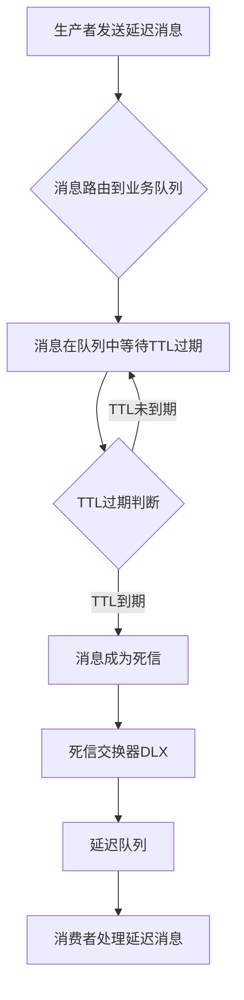

###### 1. RabbitMQ 的死信队列是什么？使用场景是什么？
**死信队列（Dead Letter Queue, DLQ）是RabbitMQ中用于处理失败或无法正常消费的消息的机制。当消息在队列中满足特定条件时，会被标记为"死信"并被重新路由到专门的死信交换器，最终进入死信队列。
核心工作原理**：
- 死信队列本身是普通队列，只是专门用于接收死信消息
- 需要配置死信交换器作为中转站
- 消息成为死信后会被重新路由，不占用原队列资源
**主要使用场景**：

|场景|说明|业务示例|
|---|---|---|
|**异常消息处理**​|收集处理失败的消息，避免消息丢失|支付失败订单、格式错误消息|
|**延迟消息投递**​|通过TTL+死信队列实现延迟效果|订单超时取消、定时通知|
|**重试机制**​|实现消息的重试逻辑|网络异常后的消息重投|
|**系统监控**​|监控死信数量分析系统健康度|业务异常告警、性能监控|
|**流量控制**​|处理超出系统处理能力的消息|秒杀系统峰值流量控制|
###### 2. 导致死信的几种原因？
消息成为死信主要有三种情况，在RabbitMQ内部有相应的检测机制：
**1. 消息被拒绝且不重新入队**
```java
// 消息被拒绝且requeue=false时成为死信
channel.basicReject(deliveryTag, false);  // 单条拒绝
channel.basicNack(deliveryTag, false, false);  // 批量拒绝，multiple=false
```
_源码角度_：在`AMQChannel`类中，处理`basicReject`命令时，如果`requeue=false`，会将消息投递到死信交换器。
**2. 消息TTL过期**
- 队列TTL：整个队列的消息统一过期时间
- 消息TTL：单个消息的独立过期时间
    _实现机制_：RabbitMQ通过定时器扫描过期消息，到期后移动到死信队列。
**3. 队列达到最大长度**
当队列消息数量超过`x-max-length`限制时，新消息或队列头部的老消息会成为死信。
**阿里云RabbitMQ扩展原因**：
- 消息重试次数超过16次（云消息队列特有）
- 消费者超时未应答
###### 3. 如何配置死信交换器（DLX）？
DLX配置需要通过队列参数实现，以下是完整的Spring Boot配置示例：
```java
@Configuration
public class DeadLetterConfig {
    
    // 定义交换机队列常量
    public static final String BUSINESS_EXCHANGE = "business.exchange";
    public static final String BUSINESS_QUEUE = "business.queue";
    public static final String DLX_EXCHANGE = "dlx.exchange";
    public static final String DLX_QUEUE = "dlx.queue";
    public static final String BUSINESS_ROUTING_KEY = "business.key";
    public static final String DLX_ROUTING_KEY = "dlx.key";

    // 声明业务交换机
    @Bean
    public DirectExchange businessExchange() {
        return new DirectExchange(BUSINESS_EXCHANGE, true, false);
    }

    // 声明死信交换机
    @Bean
    public DirectExchange dlxExchange() {
        return new DirectExchange(DLX_EXCHANGE, true, false);
    }

    // 声明业务队列并绑定死信交换机
    @Bean
    public Queue businessQueue() {
        Map<String, Object> args = new HashMap<>();
        // 设置死信交换机
        args.put("x-dead-letter-exchange", DLX_EXCHANGE);
        // 设置死信路由键
        args.put("x-dead-letter-routing-key", DLX_ROUTING_KEY);
        // 设置队列消息TTL（可选）
        args.put("x-message-ttl", 60000);
        // 设置队列最大长度（可选）
        args.put("x-max-length", 1000);
        
        return new Queue(BUSINESS_QUEUE, true, false, false, args);
    }

    // 声明死信队列
    @Bean  
    public Queue dlxQueue() {
        return new Queue(DLX_QUEUE, true, false, false);
    }

    // 业务绑定
    @Bean
    public Binding businessBinding() {
        return BindingBuilder.bind(businessQueue())
               .to(businessExchange()).with(BUSINESS_ROUTING_KEY);
    }

    // 死信绑定
    @Bean
    public Binding dlxBinding() {
        return BindingBuilder.bind(dlxQueue())
               .to(dlxExchange()).with(DLX_ROUTING_KEY);
    }
}
```
**关键配置参数解析**：
- `x-dead-letter-exchange`：指定死信交换器名称
- `x-dead-letter-routing-key`：死信消息的新路由键（可选）
- `x-message-ttl`：队列级别TTL（毫秒）
- `x-max-length`：队列最大消息数量
###### 4. RabbitMQ 怎么实现延迟消息队列？
RabbitMQ通过**TTL+死信队列**组合实现延迟消息，具体架构如下：

**具体实现代码**：
```java
@Component
public class DelayMessageProducer {
    
    @Autowired
    private RabbitTemplate rabbitTemplate;
    
    public void sendDelayMessage(String message, int delayTime) {
        // 设置消息属性，包括延迟时间
        MessagePostProcessor processor = new MessagePostProcessor() {
            @Override
            public Message postProcessMessage(Message message) throws AmqpException {
                // 设置消息过期时间
                message.getMessageProperties().setExpiration(String.valueOf(delayTime));
                return message;
            }
        };
        
        // 发送到业务队列，等待TTL过期后转到延迟队列
        rabbitTemplate.convertAndSend("business.exchange", "business.key", 
                                   message, processor);
    }
}

@Component
public class DelayMessageConsumer {
    
    @RabbitListener(queues = "dlx.queue")
    public void handleDelayMessage(String message) {
        System.out.println("收到延迟消息: " + message + ", 时间: " + new Date());
        // 处理延迟业务逻辑
    }
}
```
**工作流程**：
1. 生产者发送消息到业务队列，设置TTL
2. 消息在业务队列中等待TTL过期
3. TTL到期后，消息被转移到死信交换器
4. 死信交换器将消息路由到延迟队列
5. 消费者从延迟队列获取消息处理
###### 5. 延迟队列的实现方案有哪些？
**方案一：TTL+死信队列（原生支持）**
- **优点**：无需插件，兼容性好
- **缺点**：定时精度不高，大规模延迟消息性能差
- **适用场景**：延迟时间不敏感、消息量不大的场景
**方案二：rabbitmq_delayed_message_exchange插件**
- **优点**：精确延迟，使用简单
- **缺点**：需要安装插件，集群环境配置复杂
- **适用场景**：需要精确延迟控制的业务
**方案三：外部调度器+消息队列**
- **优点**：延迟精度高，可扩展性好
- **缺点**：系统复杂度高，需要维护调度器
- **适用场景**：大规模、高精度的延迟需求
**对比总结**：

|方案|精度|性能|复杂度|适用场景|
|---|---|---|---|---|
|TTL+DLQ|一般|中等|低|普通延迟需求|
|延迟插件|高|高|中|精确延迟需求|
|外部调度器|最高|可扩展|高|大规模延迟系统|
###### 6. rabbitmq_delayed_message_exchange 插件的原理是什么？
**插件核心原理**：
延迟消息插件通过自定义交换机类型实现，消息在交换机端延迟而非队列端。
**工作流程**：
1. 生产者发送消息到延迟交换机，设置`x-delay`头部
2. 交换机将消息持久化到Mnesia数据库
3. 插件内置定时器监控消息延迟时间
4. 延迟到期后，消息被路由到目标队列
5. 消费者从队列获取消息
**Java代码示例**：
```java
@Configuration
public class DelayedExchangeConfig {
    
    @Bean
    public CustomExchange delayedExchange() {
        Map<String, Object> args = new HashMap<>();
        args.put("x-delayed-type", "direct");
        return new CustomExchange("delayed.exchange", "x-delayed-message", 
                                true, false, args);
    }
    
    @Bean  
    public Queue delayedQueue() {
        return new Queue("delayed.queue");
    }
    
    @Bean
    public Binding delayedBinding() {
        return BindingBuilder.bind(delayedQueue())
                           .to(delayedExchange()).with("delayed.key").noargs();
    }
}

// 发送延迟消息
public void sendDelayedMessage(String message, int delayMillis) {
    rabbitTemplate.convertAndSend("delayed.exchange", "delayed.key", 
        message, new MessagePostProcessor() {
            @Override
            public Message postProcessMessage(Message message) {
                message.getMessageProperties().setHeader("x-delay", delayMillis);
                return message;
            }
        });
}
```
**插件优势**：
- 精确延迟控制，避免TTL方案的定时扫描开销
- 支持任意延迟时间，不受队列限制
- 消息在交换机端延迟，减少队列压力
###### 7. TTL（Time To Live）是什么？如何设置？
TTL表示消息在队列中的最大存活时间，过期后会被删除或成为死信。
**TTL设置方式**：
**1. 队列级别TTL**
```java
Map<String, Object> args = new HashMap<>();
args.put("x-message-ttl", 60000); // 60秒

return new Queue("ttl.queue", true, false, false, args);
```
_特点_：队列中所有消息共享相同的TTL值。
**2. 消息级别TTL**
```java
public void sendMessageWithTTL(String message, int ttl) {
    MessagePostProcessor processor = new MessagePostProcessor() {
        @Override
        public Message postProcessMessage(Message message) {
            message.getMessageProperties().setExpiration(String.valueOf(ttl));
            return message;
        }
    };
    rabbitTemplate.convertAndSend("exchange", "routingKey", message, processor);
}
```
_特点_：每条消息可以设置独立的TTL。
**3. 策略设置（阿里云）**
在云平台可以通过策略设置TTL：
```bash
rabbitmqctl set_policy TTL ".*" '{"message-ttl":60000}' --apply-to queues
```
###### 8. 队列 TTL 和消息 TTL 有什么区别？
**核心区别对比**：

|特性|队列TTL|消息TTL|
|---|---|---|
|**设置级别**​|队列维度|消息维度|
|**控制粒度**​|粗粒度，影响所有消息|细粒度，按消息控制|
|**优先级**​|优先级低，消息TTL优先|优先级高，两者共存时取小值|
|**性能影响**​|开销小，统一管理|开销大，每条消息单独处理|
|**使用场景**​|统一过期策略|灵活过期需求|
**源码层面的差异**：
在RabbitMQ的`rabbit_queue_index`模块中，队列TTL通过队列属性统一管理，而消息TTL需要在消息持久化时记录单独的过期时间戳。
**特殊情况处理**：
- 当队列TTL和消息TTL同时设置时，取较小值生效
- TTL=0表示立即过期，但可能因系统负载有微小延迟
- 过期消息不会立即删除，而是等待下次队列扫描