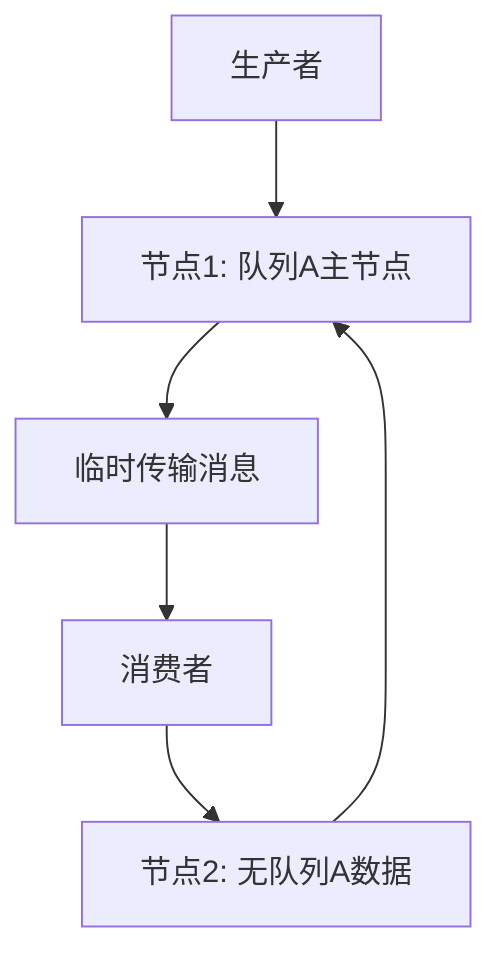

###### 1. 如何保证 RabbitMQ 消息队列的高可用？
保证RabbitMQ高可用需要构建一个多层次、冗余的架构体系，核心是通过**集群部署**、**数据复制**和**故障自动转移**三大机制来实现。
**高可用架构的核心组件**：

|组件|作用|实现方式|
|---|---|---|
|**RabbitMQ集群**​|提供节点级冗余，避免单点故障|多节点部署，元数据同步|
|**镜像队列/仲裁队列**​|提供消息级冗余，保证数据高可用|消息在多个节点间复制|
|**负载均衡器**​|实现客户端连接的智能分发和故障转移|HAProxy、Nginx或云负载均衡器|
|**持久化机制**​|防止服务器重启导致消息丢失|队列、消息均设置为持久化|
**完整的高可用方案**：
```java
// Java客户端连接高可用集群示例
public class RabbitMQHAConfig {
    public Connection createHAConnection() throws Exception {
        ConnectionFactory factory = new ConnectionFactory();
        
        // 设置多个集群节点地址
        Address[] addresses = {
            new Address("rabbitmq-node1", 5672),
            new Address("rabbitmq-node2", 5672), 
            new Address("rabbitmq-node3", 5672)
        };
        
        factory.setUsername("guest");
        factory.setPassword("guest");
        factory.setAutomaticRecoveryEnabled(true); // 启用自动重连
        factory.setNetworkRecoveryInterval(5000); // 网络恢复间隔5秒
        
        return factory.newConnection(addresses);
    }
}
```
**生产环境部署要点**：
- 至少部署**3个节点**，且至少有一个磁盘节点
- 使用**仲裁队列**（RabbitMQ 3.8+）替代传统镜像队列
- 配置合理的**内存和磁盘警报阈值**​
- 设置**客户端自动重连机制**​
###### 2. 集群中的节点类型有哪些？
RabbitMQ集群中有两种核心节点类型，它们在数据存储和处理上有重要区别：

|节点类型|数据存储方式|特点|适用场景|
|---|---|---|---|
|**磁盘节点**​|元数据存储在磁盘中|重启后不丢失配置信息，可靠性高|生产环境必选，至少一个|
|**内存节点**​|元数据存储在内存中|读写速度快，但重启后配置丢失|用于扩展吞吐量，非必须|
**节点类型配置示例**：
```bash
# 将节点加入集群并指定为内存节点
rabbitmqctl stop_app
rabbitmqctl join_cluster --ram rabbit@disk-node1
rabbitmqctl start_app
```
**设计原则**：
- 集群中**必须至少有一个磁盘节点**，否则所有内存节点崩溃后将无法恢复元数据
- 内存节点可以提供更好的性能，但不要将全部节点都设为内存节点
- 在大型集群中，通常采用**1-2个磁盘节点 + 多个内存节点**的混合架构
###### 3. 什么是普通集群？
普通集群（默认集群模式）是RabbitMQ最基本的集群形式，它只在节点间同步元数据，而**消息数据仅存储在创建队列的节点上**。
**工作原理**：
- **元数据同步**：交换机、队列定义、绑定关系等在所有节点间同步
- **消息数据局部性**：消息实体只存在于创建队列的节点上
- **跨节点访问**：当消费者连接到非队列所在节点时，该节点会从队列主节点拉取消息
**局限性分析**：


- **非真正高可用**：如果队列所在节点宕机，该队列无法使用，即使消息已持久化
- **性能瓶颈**：所有针对该队列的请求最终都要路由到主节点
- **网络开销**：跨节点访问增加网络传输
**适用场景**：主要用于提高系统吞吐量，而非高可用性需求 。
###### 4. 什么是镜像队列？如何配置？
镜像队列是RabbitMQ实现高可用的传统方案，通过在多个节点间**完整复制队列数据和状态**来提供故障转移能力。
**配置方式**：
**1. 通过管理界面配置**
- 访问RabbitMQ管理控制台
- 进入Admin > Policies > Add policy
- 设置Name、Pattern（如`^ha\.`匹配ha开头的队列）
- Definition选择ha-mode，设置为all
**2. 通过命令行配置**
```bash
# 将队列镜像到所有节点
rabbitmqctl set_policy ha-all "^ha\." '{"ha-mode":"all"}'

# 将队列镜像到指定数量的节点
rabbitmqctl set_policy ha-two "^ha\." '{"ha-mode":"exactly","ha-params":2}'

# 将队列镜像到特定节点
rabbitmqctl set_policy ha-nodes "^ha\." '{"ha-mode":"nodes","ha-params":["rabbit@node1","rabbit@node2"]}'
```
**3. Java客户端配置**
```java
Map<String, Object> queueArgs = new HashMap<>();
queueArgs.put("x-ha-policy", "all"); // 镜像到所有节点

channel.queueDeclare("ha.queue", true, false, false, queueArgs);
```
**同步模式配置**：
- **手动同步**：`ha-sync-mode: manual`- 新节点加入时不自动同步
- **自动同步**：`ha-sync-mode: automatic`- 新节点加入时自动同步（推荐）
###### 5. 镜像队列的同步模式有哪些？
像队列支持三种同步模式，通过`ha-mode`参数控制：

|模式|参数设置|工作原理|适用场景|
|---|---|---|---|
|**全部节点**​|`ha-mode: all`|队列镜像到集群中所有节点|小集群（≤5节点），数据一致性要求极高|
|**精确数量**​|`ha-mode: exactly`+ `ha-params: N`|队列镜像到N个节点|平衡可靠性和性能|
|**特定节点**​|`ha-mode: nodes`+ `ha-params: ["node1","node2"]`|队列镜像到指定节点|需要控制数据分布位置|
**配置示例**：
```bash
# 精确数量模式：镜像到2个节点
rabbitmqctl set_policy ha-exactly "^" '{"ha-mode":"exactly","ha-params":2,"ha-sync-mode":"automatic"}'
```
**同步策略选择考虑**：
- **数据安全性 vs 性能**：镜像节点越多，数据越安全，但性能和网络开销越大
- **集群规模**：大型集群避免使用`all`模式，防止过度复制
- **资源分配**：根据队列重要性采用不同的镜像策略
###### 6. 什么是仲裁队列（Quorum Queue）？
仲裁队列是RabbitMQ 3.8.0版本引入的**新一代高可用队列**，基于Raft共识算法实现，旨在解决传统镜像队列的诸多问题。
**核心特性**：
- **基于Raft协议**：提供强一致性保证，自动选举Leader
- **自动故障转移**：Leader节点故障时自动切换，无需人工干预
- **易于运维**：简化了镜像队列的复杂配置和监控
**Java客户端创建仲裁队列**：
```java
Map<String, Object> args = new HashMap<>();
args.put("x-queue-type", "quorum"); // 指定队列类型为quorum

channel.queueDeclare("quorum.queue", true, false, false, args);
```
**仲裁队列的优势**：
1. **强一致性**：基于Raft协议，数据复制更可靠
2. **简化配置**：无需复杂的策略配置
3. **更好的故障处理**：自动处理网络分区和节点故障
**性能考量**：仲裁队列的吞吐量比普通集群模式低约40%-50%，延迟高40-50%，这是实现强一致性的代价 。
###### 7. 镜像队列和仲裁队列有什么区别？
RabbitMQ集群支持动态扩容，但需要谨慎操作以避免服务中断。
**扩容步骤**：
**1. 准备新节点**
```bash
# 在新服务器上安装RabbitMQ
# 确保Erlang版本与现有集群一致
# 复制.erlang.cookie文件保证认证一致 [7](@ref)
scp /var/lib/rabbitmq/.erlang.cookie new-node:/var/lib/rabbitmq/
```
**2. 加入集群**
```bash
# 在新节点上执行
rabbitmqctl stop_app
rabbitmqctl join_cluster rabbit@existing-node-1
rabbitmqctl start_app
```
**3. 配置队列复制**（针对镜像队列）
```bash
# 更新策略，使队列复制到新节点
rabbitmqctl set_policy ha-all "^" '{"ha-mode":"all"}'
```
**4. 负载均衡配置更新**
```bash
# 更新HAProxy配置，添加新节点
server rabbitmq-new new-node-ip:5672 check inter 5000 rise 2 fall 3
```
**扩容注意事项**：
- **业务低峰期操作**：避免影响生产流量
- **逐节点添加**：一次添加一个节点，观察稳定后再添加下一个
- **监控同步状态**：确保队列数据正确同步到新节点
- **客户端更新**：确保客户端能够发现并使用新节点
###### 8. RabbitMQ 集群如何进行节点扩容？
RabbitMQ集群支持动态扩容，但需要谨慎操作以避免服务中断。
**扩容步骤**：
**1. 准备新节点**
```bash
# 在新服务器上安装RabbitMQ
# 确保Erlang版本与现有集群一致
# 复制.erlang.cookie文件保证认证一致 [7](@ref)
scp /var/lib/rabbitmq/.erlang.cookie new-node:/var/lib/rabbitmq/
```
**2. 加入集群**
```bash
# 在新节点上执行
rabbitmqctl stop_app
rabbitmqctl join_cluster rabbit@existing-node-1
rabbitmqctl start_app
```
**3. 配置队列复制**（针对镜像队列）
```bash
# 更新策略，使队列复制到新节点
rabbitmqctl set_policy ha-all "^" '{"ha-mode":"all"}'
```
**4. 负载均衡配置更新**
```bash
# 更新HAProxy配置，添加新节点
server rabbitmq-new new-node-ip:5672 check inter 5000 rise 2 fall 3
```
**扩容注意事项**：
- **业务低峰期操作**：避免影响生产流量
- **逐节点添加**：一次添加一个节点，观察稳定后再添加下一个
- **监控同步状态**：确保队列数据正确同步到新节点
- **客户端更新**：确保客户端能够发现并使用新节点
###### 9. 如何监控 RabbitMQ 集群状态？
有效的监控是保证高可用的关键环节，需要多维度监控集群健康状态。
**关键监控指标**：

|监控类别|具体指标|监控工具|
|---|---|---|
|**节点状态**​|节点运行状态、内存使用、磁盘空间|rabbitmqctl、Prometheus|
|**队列状态**​|消息堆积数、消费速率、未确认消息数|Management UI、API接口|
|**网络状态**​|连接数、网络分区状态|集群监控API|
|**性能指标**​|消息吞吐量、响应延迟|Prometheus + Grafana|
**命令行监控示例**：
```bash
# 查看集群状态
rabbitmqctl cluster_status

# 查看队列状态
rabbitmqctl list_queues name messages_ready messages_unacknowledged

# 查看节点内存使用
rabbitmqctl status | grep memory
```
**自动化监控配置**：
```yaml
# Prometheus监控配置示例
scrape_configs:
  - job_name: 'rabbitmq'
    static_configs:
      - targets: ['rabbitmq-node1:15692', 'rabbitmq-node2:15692']
```
**告警阈值建议**：
- 内存使用率 > 80%
- 磁盘空间 < 20% 剩余
- 消息堆积数 > 10,000
- 节点间网络延迟 > 100ms
###### 10. 什么是网络分区（Network Partition）？如何处理？
网络分区是分布式系统中的严重故障，指集群节点间因网络问题导致**彼此无法通信**，形成多个独立子集群。
**网络分区的影响**：
- **脑裂现象**：多个子集群同时对外服务，数据可能不一致
- **服务不可用**：客户端连接可能被重定向到错误的子集群
- **数据不一致**：分区恢复后需要复杂的数据同步和冲突解决
**检测网络分区**：
```bash
# 查看集群状态，检测分区
rabbitmqctl cluster_status

# 监控日志中的分区警告
tail -f /var/log/rabbitmq/rabbitmq.log | grep partition
```
**处理策略**：
**1. 预防措施**
```bash
# 调整网络心跳检测参数
net_ticktime = 30  # 默认60秒，调整为30秒加快故障检测 [4](@ref)
```
**2. 自动处理策略**
在`rabbitmq.conf`中配置分区处理策略：
```bash
# 暂停少数派节点（推荐）
cluster_partition_handling = pause_minority

# 自动恢复模式
cluster_partition_handling = autoheal

# 忽略模式（默认，不推荐生产环境）
cluster_partition_handling = ignore
```
**3. 手动恢复步骤**
```bash
# 1. 确定获胜分区（拥有最多节点的分区）
# 2. 重启其他分区中的节点
rabbitmqctl stop_app
rabbitmqctl start_app

# 3. 监控同步状态
rabbitmqctl sync_queue queue_name
```
**最佳实践**：
- 使用**高质量的网络基础设施**减少分区概率
- 配置**合理的超时和重试机制**​
- 定期进行**网络分区恢复演练**​
- 对于重要数据，实现**客户端级别的去重和幂等性**保障