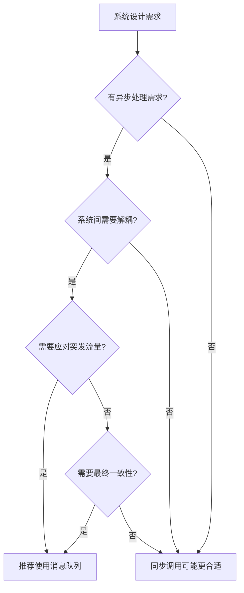
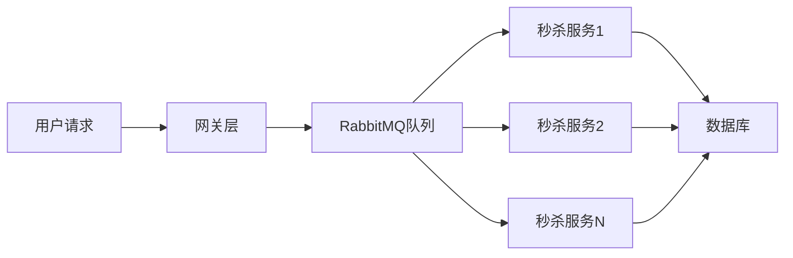

###### 1. RabbitMQ 有哪些使用场景？
RabbitMQ作为基于AMQP协议的开源消息代理软件，在分布式系统中主要解决**应用解耦、异步处理和流量削峰**三大核心问题。
**核心应用场景**包括：
- **异步处理**：将耗时操作（如邮件发送、短信通知、图像处理）异步化，提升主流程响应速度。例如用户注册后，主线程只需将欢迎邮件任务写入消息队列即可返回，邮件服务异步消费处理。
- **应用解耦**：在微服务架构中，通过消息队列连接服务，避免服务间直接依赖。电商系统中订单服务与库存、物流服务通过MQ通信，任一服务升级不影响其他。
- **流量削峰**：应对突发高并发场景（如秒杀活动），消息队列作为缓冲区平滑流量冲击，保护后端系统。请求先入队列，后端按处理能力消费。
- **日志收集**：分布式系统中多台服务器日志发送到RabbitMQ，由统一服务消费存储（常结合Fanout交换机）。
- **数据同步**：跨系统或跨数据中心的数据同步，如缓存更新、搜索索引构建。
- **分布式事务**：通过消息队列实现最终一致性，如基于本地事务表+消息表的事务方案。
###### 2. 什么时候使用消息队列？
引入消息队列需权衡其优势与复杂度，以下为关键决策点：
**推荐使用场景**：
- **系统间需要异步通信**，主流程响应时间要求高，次要操作可异步完成时
- **微服务架构需要解耦**，服务间存在直接依赖且变更频繁时
- **存在突发流量**，需要缓冲保护后端核心服务时（如秒杀、抢购）
- **需要实现最终一致性**的分布式事务场景
- **需要跨语言/平台集成**，RabbitMQ支持多语言客户端
**避免使用场景**：
- **对数据强一致性要求极高**（如金融交易核心系统）
- **系统复杂度低**，同步调用已满足需求，引入MQ反而增加维护成本
- **对消息延迟极其敏感**（微秒级要求）的场景
- **硬件资源严重受限**，MQ需要额外服务器资源
**决策流程图**：

###### 3. RabbitMQ 如何实现异步处理？
RabbitMQ通过**生产者-消费者模式**实现异步处理，核心是将耗时操作封装为消息放入队列，由后台工作者异步处理。
**Spring Boot实现示例**：
**生产者配置**：
```java
@Configuration
public class RabbitAsyncConfig {
    
    @Bean
    public Queue asyncTaskQueue() {
        return new Queue("async.task.queue", true); // 持久化队列
    }
}

@Service
public class AsyncTaskService {
    @Autowired
    private RabbitTemplate rabbitTemplate;
    
    public void sendWelcomeEmail(String userEmail, String userName) {
        // 立即返回，邮件发送异步处理
        EmailTask task = new EmailTask(userEmail, "欢迎注册", "尊敬的" + userName + "...");
        rabbitTemplate.convertAndSend("async.task.queue", task);
        
        // 可添加发送确认回调
        rabbitTemplate.setConfirmCallback((correlationData, ack, cause) -> {
            if (ack) {
                logger.info("邮件任务提交成功");
            } else {
                logger.error("邮件任务提交失败: " + cause);
            }
        });
    }
}
```
**消费者 worker**：
```java
@Component
public class EmailTaskConsumer {
    
    @RabbitListener(queues = "async.task.queue")
    public void handleEmailTask(EmailTask task) {
        try {
            // 模拟耗时操作
            Thread.sleep(1000);
            emailService.send(task.getTo(), task.getSubject(), task.getContent());
            logger.info("邮件发送成功: " + task.getTo());
        } catch (Exception e) {
            logger.error("邮件发送失败", e);
            // 可配置重试逻辑或进入死信队列
            throw new AmqpRejectAndDontRequeueException(e);
        }
    }
}
```
**异步处理架构优势**：
- **提升响应速度**：主流程无需等待耗时操作完成
    - **提高系统吞吐量**：异步工作者可水平扩展
    - **增强系统韧性**：单个任务失败不影响主流程
###### 4. RabbitMQ 如何实现应用解耦？
RabbitMQ通过**消息代理模式**在服务间建立抽象层，服务间不直接调用，而是通过消息通信。
**电商系统解耦实例**：
**传统紧耦合架构问题**：
```java
// 订单服务直接依赖多个下游服务
@Service
public class OrderService {
    @Autowired private InventoryService inventoryService;
    @Autowired private CouponService couponService;
    @Autowired private LogisticsService logisticsService;
    
    public void createOrder(Order order) {
        // 任何一个服务失败都会导致整个订单失败
        inventoryService.deductStock(order);    // 紧耦合
        couponService.useCoupon(order);        // 紧耦合
        logisticsService.createShipping(order); // 紧耦合
    }
}
```
**基于RabbitMQ的解耦方案**：
```java
@Configuration
public class OrderEventConfig {
    // 定义订单事件交换机
    @Bean
    public FanoutExchange orderEventExchange() {
        return new FanoutExchange("order.event.exchange");
    }
    
    // 定义各服务队列
    @Bean public Queue inventoryQueue() { return new Queue("inventory.queue"); }
    @Bean public Queue couponQueue() { return new Queue("coupon.queue"); }
    @Bean public Queue logisticsQueue() { return new Queue("logistics.queue"); }
    
    // 绑定队列到交换机
    @Bean public Binding inventoryBinding() { 
        return BindingBuilder.bind(inventoryQueue()).to(orderEventExchange());
    }
    // ... 类似绑定其他队列
}

// 订单服务发布事件，不关心谁处理
@Service
public class OrderService {
    @Autowired
    private RabbitTemplate rabbitTemplate;
    
    public void createOrder(Order order) {
        // 本地事务创建订单
        orderDao.save(order);
        
        // 发布领域事件，不等待处理结果
        OrderCreatedEvent event = new OrderCreatedEvent(order.getId(), order.getItems());
        rabbitTemplate.convertAndSend("order.event.exchange", "", event);
    }
}

// 库存服务独立处理事件
@Component
public class InventoryService {
    @RabbitListener(queues = "inventory.queue")
    public void handleOrderCreated(OrderCreatedEvent event) {
        inventoryDao.deductStock(event.getOrderId(), event.getItems());
    }
}
```
**解耦带来的优势**：
- **独立部署与扩展**：各服务可独立升级、扩缩容
- **故障隔离**：单个服务故障不影响主流程
- **技术异构**：不同服务可采用不同技术栈
###### 5. RabbitMQ 如何实现流量削峰？
RabbitMQ通过**消息缓冲**机制应对突发流量，核心原理是**存储-转发**模式。
**秒杀系统削峰架构**：


**具体实现代码**：
**队列配置（限制长度防内存溢出）**：
```java
@Configuration
public class SpikeConfig {
    @Bean
    public Queue spikeQueue() {
        Map<String, Object> args = new HashMap<>();
        args.put("x-max-length", 10000); // 限制队列最大长度
        args.put("x-overflow", "reject-publish"); // 队列满时拒绝新消息
        return new Queue("spike.queue", true, false, false, args);
    }
}
```
**生产者端（接收请求并入队）**：
```java
@RestController
public class SpikeController {
    @Autowired
    private RabbitTemplate rabbitTemplate;
    
    @PostMapping("/spike")
    public ResponseEntity<String> spike(@RequestBody SpikeRequest request) {
        if (!rateLimiter.tryAcquire()) { // 前置限流
            return ResponseEntity.status(429).body("请求过于频繁");
        }
        
        try {
            // 异步入队，快速响应
            rabbitTemplate.convertAndSend("spike.queue", request);
            return ResponseEntity.accepted().body("请求已接受，处理中");
        } catch (AmqpResourceNotAvailableException e) {
            // 队列已满，直接拒绝
            return ResponseEntity.status(503).body("系统繁忙，请稍后重试");
        }
    }
}
```
**消费者端（可控速度处理）**：
```java
@Component
public class SpikeConsumer {
    @RabbitListener(queues = "spike.queue")
    public void handleSpikeRequest(SpikeRequest request) {
        // 控制处理速率，防止压垮数据库
        rateLimiter.acquire();
        
        // 检查库存等业务逻辑
        if (inventoryService.deductStock(request.getItemId(), 1)) {
            orderService.createOrder(request.getUserId(), request.getItemId());
        }
    }
}
```
**流量削峰关键配置**：
- **QoS预取限制**：`channel.basicQos(100)`控制每个消费者未确认消息数
- **队列长度监控**：设置报警阈值，及时扩容消费者
- **死信队列**：处理超时或失败的消息
###### 6. RabbitMQ 在分布式事务中如何应用？
RabbitMQ通过**最终一致性**模式解决分布式事务问题，常用**本地事务表+消息表**方案。
**基于本地事务的可靠消息方案**：
**数据库设计**：
```sql
-- 本地事务表
CREATE TABLE transaction_log (
    id BIGINT PRIMARY KEY AUTO_INCREMENT,
    business_type VARCHAR(50) NOT NULL,
    business_id VARCHAR(100) NOT NULL,
    status VARCHAR(20) NOT NULL, -- INIT,SUCCESS,FAILURE
    create_time DATETIME DEFAULT CURRENT_TIMESTAMP
);

-- 待发送消息表
CREATE TABLE pending_message (
    id BIGINT PRIMARY KEY AUTO_INCREMENT,
    transaction_id BIGINT NOT NULL,
    exchange VARCHAR(255) NOT NULL,
    routing_key VARCHAR(255) NOT NULL,
    message_body TEXT NOT NULL,
    retry_count INT DEFAULT 0,
    status VARCHAR(20) NOT NULL, -- PENDING,SENT
    next_retry_time DATETIME
);
```
**事务性消息发送**：
```java
@Service
@Transactional
public class OrderServiceWithTransaction {
    
    @Autowired
    private JdbcTemplate jdbcTemplate;
    
    @Autowired
    private RabbitTemplate rabbitTemplate;
    
    public void createOrderWithEvent(Order order) {
        // 1. 业务数据持久化
        orderDao.save(order);
        
        // 2. 记录事务日志
        Long txId = logTransaction("ORDER_CREATED", order.getId());
        
        // 3. 记录待发送消息（与业务在同一事务）
        logPendingMessage(txId, "order.event.exchange", 
                         "order.created", serialize(order));
        
        // 4. 事务提交后，消息才真正发送
    }
    
    @TransactionalEventListener(phase = TransactionPhase.AFTER_COMMIT)
    public void afterTransactionCompletion(TransactionCommittedEvent event) {
        // 事务提交后发送消息
        List<PendingMessage> messages = getPendingMessages(event.getTransactionId());
        for (PendingMessage msg : messages) {
            rabbitTemplate.convertAndSend(msg.getExchange(), 
                                        msg.getRoutingKey(), 
                                        msg.getMessageBody());
            markMessageSent(msg.getId());
        }
    }
}
```
**消息可靠性保障**：
- **生产者确认模式**：确保消息到达Broker
- **消费者手动ACK**：处理完成才确认消息
- **重试与死信队列**：处理失败的消息
###### 7. 如何设计合理的交换器和队列？
合理的交换器和队列设计是RabbitMQ性能优化的关键。
**交换器选择策略**：

|交换器类型|适用场景|示例|注意事项|
|---|---|---|---|
|**Direct**​|点对点精确路由|按日志级别路由到不同队列|路由键完全匹配|
|**Fanout**​|广播消息|新用户注册通知多个系统|忽略路由键，性能最好|
|**Topic**​|模式匹配路由|设备数据按区域和类型路由|支持*和#通配符|
|**Headers**​|多条件匹配|根据消息头复杂属性路由|性能较差，少用|
**队列设计最佳实践**：
**队列属性配置**：
```java
@Configuration
public class QueueDesignConfig {
    
    @Bean
    public Queue businessQueue() {
        Map<String, Object> args = new HashMap<>();
        // 持久化
        args.put("x-queue-type", "quorum"); // 仲裁队列，RabbitMQ 3.8+
        // 或 args.put("x-queue-mode", "lazy"); // 惰性队列，消息直接存磁盘
        
        // 限制资源
        args.put("x-max-length", 100000); // 最大消息数
        args.put("x-max-length-bytes", 100000000); // 最大容量
        args.put("x-message-ttl", 86400000); // 消息TTL(24小时)
        
        // 死信设置
        args.put("x-dead-letter-exchange", "dlx.exchange");
        args.put("x-dead-letter-routing-key", "dlx.key");
        
        return new Queue("business.queue", true, false, false, args);
    }
}
```
**绑定关系设计**：
```java
@Configuration
public class BindingDesign {
    
    // 业务场景：用户行为跟踪 - 不同行为路由到不同队列
    @Bean
    public TopicExchange userBehaviorExchange() {
        return new TopicExchange("user.behavior");
    }
    
    @Bean public Queue pageViewQueue() { return new Queue("user.behavior.pageview"); }
    @Bean public Queue clickQueue() { return new Queue("user.behavior.click"); }
    @Bean public Queue purchaseQueue() { return new Queue("user.behavior.purchase"); }
    
    @Bean
    public Binding pageViewBinding() {
        // user.behavior.* 匹配 user.behavior.pageview 等
        return BindingBuilder.bind(pageViewQueue())
               .to(userBehaviorExchange()).with("user.behavior.*");
    }
}
```
###### 8. 生产环境中如何配置 RabbitMQ？
生产环境配置需考虑**高可用、性能、安全、监控**等多个维度。
**高可用集群配置**：
```yaml
# docker-compose.yml 三节点集群
version: '3.8'
services:
  rabbitmq1:
    image: rabbitmq:3.12-management
    environment:
      - RABBITMQ_ERLANG_COOKIE=secret_cookie
      - RABBITMQ_NODENAME=rabbit@rabbitmq1
    ports: ["5672:5672", "15672:15672"]
    
  rabbitmq2:
    image: rabbitmq:3.12-management
    environment:
      - RABBITMQ_ERLANG_COOKIE=secret_cookie
      - RABBITMQ_NODENAME=rabbit@rabbitmq2
    depends_on: [rabbitmq1]
    command: >
      bash -c "sleep 10 &&
              rabbitmqctl stop_app &&
              rabbitmqctl join_cluster rabbit@rabbitmq1 &&
              rabbitmqctl start_app"
```
**Spring Boot生产配置**：
```yaml
# application-prod.yml
spring:
  rabbitmq:
    # 集群配置
    addresses: rabbitmq1:5672,rabbitmq2:5672,rabbitmq3:5672
    username: prod_user
    password: ${RABBITMQ_PASSWORD}
    virtual-host: /
    
    # 连接池
    connection-timeout: 5000
    cache:
      channel.size: 50
      connection.mode: connection
    
    # 可靠性配置
    publisher-confirm-type: correlated
    publisher-returns: true
    template:
      mandatory: true
    
  # 消费者配置
  listener:
    simple:
      acknowledge-mode: manual
      prefetch: 100
      concurrency: 5
      max-concurrency: 10
      retry:
        enabled: true
        max-attempts: 3
```
**监控与告警配置**：
```java
@Component
public class RabbitMQMonitor {
    
    @EventListener
    public void handleBlockedEvent(BlockedEvent event) {
        // 内存或磁盘告警，触发扩容或清理
        alertService.sendAlert("RabbitMQ连接阻塞: " + event.getReason());
    }
    
    @Scheduled(fixedRate = 30000)
    public void monitorQueueMetrics() {
        // 监控队列积压情况
        Queue[] queues = rabbitAdmin.getQueueInfo();
        for (Queue queue : queues) {
            if (queue.getMessageCount() > 10000) {
                alertService.sendAlert("队列积压警告: " + queue.getName());
            }
        }
    }
}
```
**安全配置**：
```bash
# 创建生产用户
rabbitmqctl add_user prod_user secure_password
rabbitmqctl set_user_tags prod_user administrator
rabbitmqctl set_permissions -p / prod_user ".*" ".*" ".*"

# 启用SSL
spring:
  rabbitmq:
    ssl:
      enabled: true
      key-store: file:/path/to/keystore
      key-store-password: store_password
```