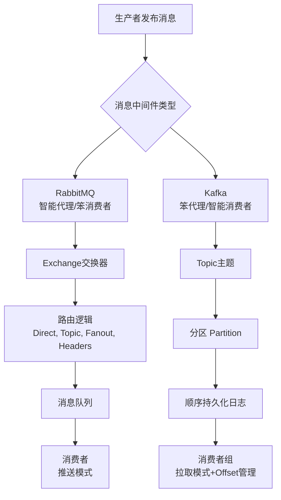

###### 1. RabbitMQ 和 Kafka 有什么区别？
RabbitMQ和Kafka是两种设计哲学截然不同的消息中间件，其区别根源在于架构模型。下面的流程图直观展示了两者的核心工作模型差异，后续表格将深入解析其背后的细节。

基于上述模型，两者的深度对比如下：

|维度|RabbitMQ (企业级消息代理)|Apache Kafka (分布式流平台)|深度解析与源码视角|
|---|---|---|---|
|**核心模型**​|**交换器-队列 (Exchange-Queue)**​ 模型。生产者发消息到Exchange，Exchange根据类型和Binding规则路由到一个或多个队列，消费者从队列消费。|**分布式提交日志 (Distributed Commit Log)**​ 模型。消息按Topic分类，每个Topic分为多个Partition（分区），每个Partition是一个有序、不可变的消息序列。|RabbitMQ像**智能的邮局**，负责分拣和投递；Kafka像**只能追加的日志文件**，提供数据流。在Kafka源码中，`Partition`对象的核心是一个追加写入的日志文件，通过顺序I/O和零拷贝技术实现高性能。|
|**设计哲学**​|**智能Broker，笨Consumer**。Broker（RabbitMQ服务）负责消息的路由、队列管理、状态跟踪（ACK）。|**笨Broker，智能Consumer**。Broker（Kafka集群）只做简单的消息存储和分发，消费状态（Offset）、路由逻辑等由Consumer客户端控制。|RabbitMQ通过Erlang的Actor模型实现高并发处理。Kafka的Consumer需要自己管理`offset`（通过`consumer.commitSync()`提交），具备极大的灵活性，但也增加了客户端复杂度。|
|**消息传递**​|**Push模型 (推)**。Broker主动将消息推送给消费者。|**Pull模型 (拉)**。消费者主动向Broker拉取消息。|Push模型容易导致消费者过载（需设置`prefetchCount`流控）。Pull模型允许消费者按自身能力消费，但可能带来延迟（可通过长轮询优化）。Kafka的`KafkaConsumer.poll(Duration)`实现了阻塞式拉取。|
|**消息生命周期**​|消费后（收到ACK）**默认从队列删除**。是典型的“消息处理”模式。|消息持久化存储一段时间（可配置），**与消费与否无关**。消费者可重置offset重新消费。是“流数据”模式。|RabbitMQ的`basic_ack`后，消息会被标记为可删除。Kafka的日志有保留策略（`log.retention.hours`），到期后由日志清理任务删除，与消费无关。|
|**消息顺序**​|单个队列内FIFO，但多个消费者并发消费同一队列时，**无法保证顺序**（因消息可能重入队）。|**单个Partition内严格保证消息顺序**。|要保证RabbitMQ的顺序，必须使用单消费者+单队列。Kafka通过将需要顺序的消息指定相同的Key，使其进入同一Partition来保证顺序。|
|**路由灵活性**​|**极其强大**。支持Direct、Topic、Fanout、Headers四种Exchange类型，实现复杂、灵活的路由逻辑。|**相对简单**。主要基于Topic和Partition。可通过Stream API进行过滤和路由，但更重。|RabbitMQ的Topic Exchange支持通配符匹配，Headers Exchange可基于消息头路由。Kafka需通过`ProducerRecord`指定Topic和Key，或使用Kafka Streams进行流处理再输出到新Topic。|
|**吞吐量**​|万级到十万级TPS。性能稳定，但受持久化、ACK机制影响较大。|**十万级到百万级TPS**。超高吞吐，得益于顺序I/O、批处理、零拷贝等技术。|Kafka为高吞吐优化，生产者积累消息批量发送（`linger.ms`），消费者批量拉取。RabbitMQ更侧重于消息的即时性和可靠性。|
|**延迟**​|微秒级到毫秒级，**延迟更低**。|毫秒级，通常高于RabbitMQ。|RabbitMQ消息到达即推，延迟低。Kafka的批处理机制会引入微小延迟（`linger.ms`），以换取高吞吐。|
|**主要应用场景**​|对**消息可靠性、复杂路由、低延迟**要求高的业务系统。如：企业应用集成、任务队列、异步RPC、事务消息。|处理**海量数据流**的场景。如：用户活动追踪、日志聚合、流式处理（ETL）、事件溯源。|
###### 2. RabbitMQ 和 RocketMQ 有什么区别？
RocketMQ 在设计上融合了 RabbitMQ 和 Kafka 的一些理念，但在 Java 生态中尤其突出其金融级的可靠性。

|维度|RabbitMQ|RocketMQ|深度解析与源码视角|
|---|---|---|---|
|**开发语言/生态**​|Erlang 编写，跨语言支持极佳。|**Java 编写**，与 Java 技术栈（Spring Cloud Alibaba）无缝集成，对 Java 开发者更友好。|RocketMQ 的 Java 客户端 `rocketmq-client`实现更地道，问题排查和源码阅读对 Java 团队门槛更低。|
|**核心模型**​|经典的 Exchange-Queue 模型，路由能力强。|类似 Kafka 的 Topic-Partition 模型。核心概念为 Topic、MessageQueue（类似 Partition）、ConsumerGroup。|RocketMQ 的 `MessageQueue`是负载均衡单元。其提交日志（CommitLog）将所有 Topic 的消息**混合存储**在一个文件，通过 ConsumeQueue 索引，这是其高性能设计的关键。|
|**消息可靠性**​|支持持久化、生产者确认、消费者 ACK，可靠性高。|**金融级可靠性**。支持**同步刷盘**（`flushDiskType=SYNC_FLUSH`）、**主从同步复制**（`brokerRole=SYNC_MASTER`），确保消息不丢失。**经过阿里双11考验**。|RabbitMQ 的镜像队列提供高可用。RocketMQ 在 Broker 层面通过 HA 机制保证，数据一致性更强。|
|**特色功能**​|灵活的路由、优先级队列、TTL、死信队列。|**强大的分布式事务消息**、顺序消息、消息轨迹（Trace）、过滤（Tag/SQL92）。|RocketMQ 的**事务消息**是其王牌功能，通过“半消息”和事务状态回查机制，能很好地解决分布式事务问题，是 RabbitMQ 所不具备的。|
|**吞吐量**​|中等，适合常规业务负载。|**高吞吐**，设计上更接近 Kafka，适合大规模、高并发场景。|RocketMQ 在消息堆积能力上表现优异，不会像 RabbitMQ 那样因堆积导致性能急剧下降。|
|**主要应用场景**​|企业级应用、微服务解耦、需要复杂路由的场景。|**电商、金融等对事务一致性、可靠性、顺序性要求极高的互联网业务**。|例如：订单交易、资金扣款、积分清算等核心场景。|
###### 3. RabbitMQ 和 ActiveMQ 有什么区别？
ActiveMQ 是 JMS（Java Message Service）规范的“老牌”实现，而 RabbitMQ 是实现 AMQP 协议的“中生代”。

|维度|ActiveMQ (Classic)|RabbitMQ|深度解析|
|---|---|---|---|
|**协议与规范**​|遵循 **JMS**​ 规范，是 Java 领域的标准 API。|实现 **AMQP**​ 协议，是一个更通用的、跨语言的消息队列标准。|JMS 是 Java 的 API 规范，定义了接口。AMQP 是线级协议，定义了网络传输格式。这使 RabbitMQ 天生就是跨语言的。|
|**成熟度**​|**非常古老**，发展多年，稳定但架构略显陈旧。|成熟稳定，社区活跃，是当前最流行的开源消息队列之一。|ActiveMQ 代码历史包袱重。其下一代产品 **ActiveMQ Artemis**​ 支持 AMQP、MQTT、JMS 等多种协议，性能有极大提升，可与 RabbitMQ 竞争。|
|**性能与架构**​|早期版本（ActiveMQ Classic）在持久化、高并发下性能有瓶颈，易出现堆积问题。|基于 Erlang 的 Actor 模型，并发性能好，更稳定。|对于新项目，如果在 JMS 和 AMQP 间无偏好，通常更推荐 RabbitMQ 而非 ActiveMQ Classic。|
|**主要应用场景**​|传统的、基于 JMS 的 Java EE 项目或遗留系统集成。|需要高性能、高可靠性、跨语言通信的现代分布式系统或微服务架构。|ActiveMQ 在传统金融、电信等领域仍有大量应用。但对于新开发的系统，RabbitMQ 通常是更优选择。|
###### 4. 如何选择合适的消息队列？
选型没有银弹，需结合具体业务需求、技术栈和团队能力。以下是一个决策框架：

|选型考量因素|优选 RabbitMQ|优选 Kafka|优选 RocketMQ|说明|
|---|---|---|---|---|
|**业务类型**​|**业务系统（订单、用户、商品等）**，需要**异步解耦**、**任务队列**。|**数据流系统**（日志、监控、用户行为采集）、**大数据平台**、**流计算**。|**电商、金融等核心交易系统**，对**事务消息、顺序消息、可靠性**有严苛要求。|区分业务是“处理任务”还是“处理数据流”。|
|**消息可靠性**​|要求高，需要可靠的投递、ACK 机制。|要求高，但容忍少量重复（至少一次语义）。|要求**极高**，追求金融级的数据一致性。|RocketMQ 在可靠性方面机制最完善。|
|**吞吐量要求**​|万级到十万级 TPS。|**百万级 TPS**，海量数据。|十万级到百万级 TPS，高并发场景。|Kafka 为吞吐量而生。|
|**延迟要求**​|**低延迟**，毫秒级响应。|允许一定延迟（毫秒到秒），以换取高吞吐。|低延迟。|RabbitMQ 的 Push 模式在低延迟场景有优势。|
|**路由复杂性**​|**路由规则复杂**，需要根据消息内容动态路由到不同消费者。|路由简单，主要是 Topic 和 Key。|支持 Tag 过滤，比 Kafka 灵活，但不如 RabbitMQ 的 Exchange 强大。|RabbitMQ 的 Exchange 是路由领域的王者。|
|**技术栈**​|跨语言环境，微服务技术栈多样。|大数据生态（Hadoop、Spark、Flink）紧密集成。|**Java/阿里系技术栈**（Spring Cloud Alibaba）。|技术栈匹配能降低开发和运维成本。|
|**运维成本**​|中等，管理和监控界面完善。|**高**，依赖 ZooKeeper，集群运维复杂。|中等偏高，但国内文档和社区支持较好。|Kafka 的运维需要专业团队。|
**混合使用**：在大型系统中，常见组合是：**用 RabbitMQ 处理核心业务交易，用 Kafka 构建数据管道和日志流**。两者并非互斥，而是互补。
###### 5. RabbitMQ 的优缺点是什么？
**优点：**
1. **协议与生态支持**：原生支持 AMQP、STOMP、MQTT 等多种协议，跨语言支持和集成能力强。
2. **灵活的路由**：提供多种 Exchange 类型，支持极其复杂的消息路由策略，这是其核心优势之一。
3. **企业级可靠性**：提供消息持久化、生产者确认（Publisher Confirm）、消费者确认（Consumer ACK）、镜像队列等，保证消息不丢失。
4. **低延迟**：Push 模型和高效的内存管理使其能提供极低的消息延迟。
5. **管理界面友好**：自带一个功能强大的 Web 管理界面，便于监控和管理队列、连接、交换器等。
6. **灵活的集群模式**：支持多种集群模式，易于实现高可用。
**缺点：**
7. **吞吐量瓶颈**：相对于 Kafka 和 RocketMQ，其**峰值吞吐量较低**，在面对海量数据流时是瓶颈。
8. **消息堆积能力弱**：当队列中堆积大量消息时，性能会显著下降，因为所有消息默认存储在内存中（除非配置为惰性队列）。
9. **Erlang 技术栈**：核心用 Erlang 开发，对于主要使用 Java/Python/Go 的团队来说，**二次开发和深度定制门槛较高**。
10. **顺序保证复杂**：如前所述，在集群消费模式下无法保证全局顺序，需要牺牲并发性来保证。
11. **社区发展**：虽然稳定，但创新速度相较于云原生时代的新兴消息系统可能稍慢。