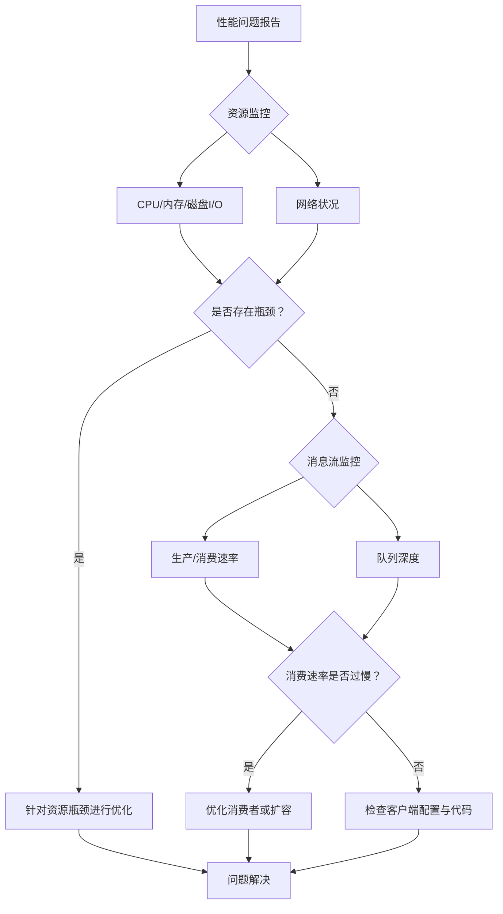

###### 1. RabbitMQ 如何进行备份和恢复？
RabbitMQ的数据备份与恢复需针对其两种核心数据类型采取不同策略：**元数据（Metadata）**​ 和 **消息数据（Message Store）**。
**元数据备份与恢复（动态，无需停服务）**
元数据包括用户、vhost、队列、交换器、绑定关系等拓扑结构。
- **备份操作**：使用`rabbitmqadmin`工具或HTTP API将元数据导出为JSON文件。命令示例：`rabbitmqadmin export backup_metadata.json`。此操作可在集群运行时执行，因为元数据存储在Mnesia数据库中，并在集群节点间同步 。
- **恢复操作**：将备份的JSON文件导入到新集群或现有集群。命令示例：`rabbitmqadmin import backup_metadata.json`。恢复前需确保目标集群的vhost等基础结构与备份源兼容 。
**消息数据备份与恢复（静态，必须停服务）**
消息数据是存储在磁盘上的消息实体。要获得一致性快照，**必须停止RabbitMQ服务**后进行文件级备份 
1. **确定数据目录**：执行`rabbitmqctl eval 'rabbit_mnesia:dir().'`获取路径，通常为`/var/lib/rabbitmq/mnesia/`。
2. **停止服务**：`systemctl stop rabbitmq-server`。
3. **备份目录**：使用`tar`命令打包整个数据目录或其下的节点特定目录（如`rabbit@hostname`）。
4. **恢复操作**：在目标服务器上停止服务，清空数据目录，解压备份文件，并确保文件权限正确（`chown -R rabbitmq:rabbitmq /var/lib/rabbitmq/`），最后启动服务 。
**完整迁移流程**
当进行服务器迁移（如A到B）时，推荐流程是：在B服务器部署同版本RabbitMQ后，先导入元数据JSON，再替换整个数据目录并启动 。**关键点**：若节点名（`rabbit@hostname`）变更，需在启动前使用`rabbitmqctl rename_cluster_node`命令更新Mnesia数据库中的节点记录，否则节点将无法启动 。
###### 2. 如何排查 RabbitMQ 性能问题？
RabbitMQ性能问题排查是一个系统化工程，需从资源、队列、消息流多个维度切入。
**核心监控指标与排查工具**
- **资源层面**：
    - **CPU**：使用`top`命令查看`beam.smp`（Erlang VM进程）的CPU使用率。持续高CPU可能源于高并发连接、复杂路由计算或频繁的持久化操作 。
    - **内存**：通过`rabbitmqctl status`查看内存明细。内存消耗主要来自：消息（若未持久化）、队列索引、连接、Erlang VM自身。设置内存水位线（如`vm_memory_high_watermark`）是防止内存耗尽的关键 。
    - **磁盘I/O**：消息持久化、队列索引操作依赖磁盘I/O。I/O延迟高会迅速降低整体吞吐。监控磁盘使用率和读写延迟。
- **消息流层面**：
    - **发布/消费速率**：在管理界面或通过API监控`publish`、`deliver`、`ack`的速率。若发布速率持续远高于消费速率，必然导致堆积 。
    - **队列深度**：`rabbitmqctl list_queues`查看各队列的`messages_ready`（待消费）和`messages_unacknowledged`（已投递未确认）数量。队列深度持续增长是消费能力不足的直接表现 。
- **网络层面**：网络延迟、丢包会导致生产者确认和消费者ACK变慢，使用`ping`、`tcpdump`排查 。
**性能问题排查流程**


**源码与配置视角的优化点**
- **生产者**：启用**Publisher Confirms**，使用批量发送减少网络往返。在Java客户端中，设置`channel.confirmSelect()`并添加确认监听器 。
- **消费者**：设置合理的**Prefetch Count**（`channel.basicQos`），避免单个消费者堆积过多未确认消息。对于CPU密集型任务，增加并发消费者数 。
- **队列**：对非关键数据可使用**惰性队列**，使消息直接存入磁盘，减轻内存压力 。
###### 3. 消息丢失了如何排查？
消息丢失排查需遵循消息生命周期：**生产 -> Broker存储 -> 消费**。
**1. 生产者端排查**
- **确认机制**：检查是否启用**Publisher Confirms**。如果未启用，生产者无法知晓消息是否已到达Broker。在Java中，需调用`channel.confirmSelect()`并处理`ConfirmCallback`。
- **路由失败**：检查**Mandatory参数**和**ReturnCallback**。如果消息无法路由到任何队列且`mandatory`为`false`，Broker会静默丢弃消息 。
- **网络与重试**：生产者在发送后、收到确认前发生网络故障或连接断开，可能导致消息实际已发出但生产者认为失败而触发重试，造成重复。需在业务层保证幂等性。
**2. Broker端排查**
- **持久化**：确认队列和消息是否持久化。队列需声明为`durable`，消息的`deliveryMode`需设置为`2`。非持久化的消息在Broker重启后会丢失 。
- **集群与镜像**：在集群中，若未配置**镜像队列**，且承载队列主副本的节点宕机，即使消息已持久化，该队列亦不可用。配置`ha-mode`为`all`或`nodes`可实现队列镜像，提供高可用 。
- **磁盘与内存**：磁盘写满或内存超过高水位线会导致Broker阻塞生产者，可能引发客户端异常或消息被拒绝。
**3. 消费者端排查**
- **确认机制**：检查ACK模式。若为**自动ACK**，消息一经推送即被Broker删除，若消费者处理失败，消息则丢失。**务必使用手动ACK**，在业务逻辑成功处理后调用`channel.basicAck`。
- **消费逻辑**：消费者在处理消息时崩溃，或因为异常导致`basicNack`且不重新入队（`requeue=false`），消息会进入死信或被丢弃。
**排查工具**：
- **消息追踪**：启用Firehose插件（`rabbitmqctl trace_on`），可以日志形式记录所有消息的流转，但性能损耗大，仅用于调试 。
- **管理界面与日志**：在管理界面查看队列消息数量变化，检查RabbitMQ日志（`/var/log/rabbitmq`）中的错误、警告信息 。
###### 4. 队列满了怎么办？
队列满通常由`x-max-length`或`x-max-length-bytes`触发，需立即从“疏导”和“开源”两方面处理。
**应急处理与根本解决**

|处理方向|具体措施|说明|
|---|---|---|
|**✅ 应急疏导（降级）**​|**调整溢出行为**​|将队列策略的`overflow`行为从默认`drop-head`（丢弃头部的老消息）改为`reject-publish`，拒绝新消息以保护队列中已有消息，并向生产者返回错误，使其具备重试逻辑 。|
||**设置消息TTL**​|为队列或消息设置生存时间（TTL），过期消息自动被删除或进入死信，快速释放空间 。|
|**🚀 根本解决（扩容）**​|**提升消费能力**​|这是最根本的方案。紧急增加消费者实例，优化消费者代码（如改异步、批处理），缩短消费耗时。|
||**调整队列容量**​|临时调大`x-max-length`或`x-max-length-bytes`值作为缓冲。命令示例：`rabbitmqctl set_policy my_policy "^my_queue$" '{"max-length": 5000}'`。|
|**🔁 容错设计**​|**使用死信队列**​|配置`x-dead-letter-exchange`，将因队列满而被拒绝或过期的消息路由到死信队列，供后续审计或手动处理 。|
||**监控与告警**​|对队列深度设置监控告警（如使用率达到80%时报警），以便在队列满之前提前干预 。|
###### 5. 如何查看 RabbitMQ 的日志？
RabbitMQ日志是故障排查的首要信息来源，主要分为两类：
- **Erlang VM运行日志**：通常为`/var/log/rabbitmq/rabbit@<hostname>.log`，记录Broker启动、关闭、连接、集群分区等核心事件。
- **Erlang SASL（系统应用支持库）日志**：通常为`/var/log/rabbitmq/rabbit@<hostname>-sasl.log`，包含更详细的内部状态和错误报告，对诊断复杂问题至关重要 。
**查看方法**：
- **命令行**：使用`tail`, `grep`, `less`等工具。例如，实时查看最新日志：`tail -f /var/log/rabbitmq/rabbit@$(hostname).log`。搜索错误：`grep -i error /var/log/rabbitmq/rabbit@*.log`。
- **系统日志服务**：在systemd管理的系统上，使用`journalctl -u rabbitmq-server`查看日志 。
- **管理界面**：Web管理控制台的“Log”页面可部分日志内容。
**日志级别**：可在`rabbitmq.conf`中配置日志级别（如`debug`, `info`, `warning`），生产环境通常用`info`，排查问题时可能需临时开启`debug`级别，但会产生大量日志。
###### 6. 如何处理消息堆积问题？
消息堆积的根本原因是**消费速度 < 生产速度**。解决方案需系统性优化。
**短期应急**：
- **扩容消费者**：最快的方式。水平扩展消费者应用实例，提升整体消费能力。确保实例数不超过队列分区数（对于Kafka）或合理设置并发数。
- **降级非核心逻辑**：临时简化消费者业务逻辑，跳过非关键步骤（如写详细日志、更新非核心缓存），先完成核心处理。
- **清理无用消息**：对于可丢弃的数据（如非关键监控日志），可通过`rabbitmqadmin purge queue`清空队列。
**长期优化**：
- **优化消费逻辑**：
    - **并发消费**：在Spring AMQP中，设置`concurrentConsumers`和`maxConcurrentConsumers`。
    - **批量处理**：消费者一次拉取多条消息（调整`prefetchCount`），进行批量数据库写入或计算，减少I/O开销。
    - **异步与非阻塞**：避免在消费者内部进行耗时的同步RPC调用。
- **控制生产源头**：识别并优化产生过快流量的生产者，必要时引入**限流**机制。
- **架构优化**：
    - **队列拆分**：按业务优先级拆分单一队列，避免慢业务阻塞快业务。
    - **使用惰性队列**：对于允许大量积压且对延迟不敏感的场景，将队列设为`lazy`模式，消息直接存盘，极大减轻内存压力 。
###### 7. RabbitMQ 的内存告警机制是什么？
RabbitMQ内置了一套**内存告警与流控机制**，防止Erlang VM因内存不足而崩溃。
- **水位线机制**：通过`vm_memory_high_watermark`参数设置相对内存阈值（如0.4表示40%的可用RAM），当RabbitMQ内存使用超过此阈值，即触发内存告警 。
- **告警行为**：一旦触发告警，Broker会**阻塞所有连接到该节点的生产者**，使其暂停发送消息，直到内存使用回落至水位线以下。这是保护Broker的自救行为 。
- **磁盘空间告警**：类似地，当磁盘剩余空间低于阈值（`disk_free_limit`）时，也会触发告警并阻塞生产者。
**处理与优化**：
- **监控**：在管理界面首页清晰显示节点状态（是否处于告警）。
- **根源**：内存告警通常因消息堆积（未ACK的消息常驻内存）或消息体过大导致。
- **解决方案**：
    1. **增加内存**或**优化内存使用**（如使用惰性队列）。
    2. **增加消费者**，加速消息消费和ACK，这是根本解决办法。
    3. **集群化**，将负载分布到多个节点。
###### 8. 如何设置消息的过期时间？
TTL可设置在**消息本身**或**整个队列**上，取二者中较小的值生效。
- **队列级别TTL**：在声明队列时通过参数`x-message-ttl`设置（单位毫秒）。该队列中所有消息都具有相同的TTL。
    ```java
    // Java示例
    Map<String, Object> args = new HashMap<>();
    args.put("x-message-ttl", 60000); // 60秒后过期
    channel.queueDeclare("my_queue", true, false, false, args);
    ```
    
    也可通过策略动态设置：`rabbitmqctl set_policy TTL ".*" '{"message-ttl":60000}'`。
- **消息级别TTL**：在发布每条消息时单独设置过期时间。
    ```java
    // Java示例
    AMQP.BasicProperties properties = new AMQP.BasicProperties.Builder()
        .expiration("5000") // 5秒后过期，值为String类型
        .build();
    channel.basicPublish("my_exchange", "routing_key", properties, messageBody);
    ```
**过期行为**：消息过期后并不会立即被移除，而是会在到达队列头部、即将被消费时才会被丢弃或死信。若要精确定时删除，需使用**延迟队列插件**或TTL+死信交换器的方式模拟。