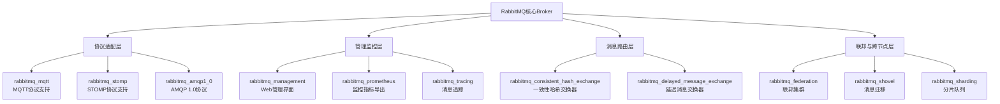

###### 1. RabbitMQ 有哪些常用插件？
RabbitMQ的插件生态系统采用**分层架构设计**，通过模块化方式扩展核心功能。以下是按照功能分类的核心插件及其架构原理 ：
**RabbitMQ插件体系架构**



**核心插件详细解析**​ ：

|插件类别|插件名称|核心功能|适用场景|架构原理|
|---|---|---|---|---|
|**管理监控**​|`rabbitmq_management`|提供REST API和Web管理界面，监控节点、队列、连接状态|生产环境必备，运维监控|基于Cowboy HTTP服务器，通过`rabbit_mgmt_app`启动管理应用|
|**协议扩展**​|`rabbitmq_mqtt`|支持MQTT 3.1/3.1.1协议，实现IoT设备连接|IoT场景，设备消息通信|实现MQTT协议解析，转换为AMQP 0-9-1内部表示|
|**协议扩展**​|`rabbitmq_stomp`|支持STOMP协议，Web应用消息推送|WebSocket实时通信|基于`ranch`套接字框架处理STOMP帧|
|**消息路由**​|`rabbitmq_delayed_message_exchange`|实现延迟消息功能，消息在指定时间后投递|定时任务，延迟处理|自定义交换器类型，内部使用Mnesia存储延迟消息|
|**消息路由**​|`rabbitmq_consistent_hash_exchange`|一致性哈希交换器，实现负载均衡|分布式缓存同步，负载均衡|基于哈希环算法分配消息到不同队列|
|**联邦跨节点**​|`rabbitmq_federation`|建立Broker间消息联邦，实现跨机房同步|多数据中心部署|上游/下游架构，通过AMQP连接同步消息|
|**消息迁移**​|`rabbitmq_shovel`|节点间消息迁移和动态路由|集群迁移，灾备恢复|静态或动态配置消息转发路径|
|**监控诊断**​|`rabbitmq_prometheus`|暴露Prometheus格式指标|容器化环境监控|实现`prometheus.erl`指标收集器|
**Erlang/OTP架构视角**：每个插件都是一个独立的Erlang/OTP应用，通过`application:start/1`生命周期管理。插件通过`rabbit`应用提供的行为模式（behaviour）接口集成到核心系统中 。
###### 2. 如何启用和禁用插件？
RabbitMQ插件管理通过`rabbitmq-plugins`命令行工具实现，其核心是维护一个**启用插件列表文件**，并解析**插件依赖关系**。
**插件管理命令源码级解析**​ ：
```bash
# 查看所有插件状态（显示启用状态和运行状态）
rabbitmq-plugins list
# 输出示例：[E*] rabbitmq_management 表示显式启用且运行中

# 启用插件（自动解析并启用依赖插件）
rabbitmq-plugins enable rabbitmq_management rabbitmq_mqtt

# 禁用插件（同时禁用依赖它的插件）
rabbitmq-plugins disable rabbitmq_shovel

# 设置精确的插件集合（禁用所有其他插件）
rabbitmq-plugins set rabbitmq_management rabbitmq_federation
```
**插件状态机原理**：
插件有**两种状态维度**：启用状态（显式E/隐式e/未启用）和运行状态（*运行/未运行）。`rabbitmq-plugins`工具通过修改`enabled_plugins`文件并通知Broker重新加载插件应用 。
**Java应用中的集成考量**：
启用插件后，Java客户端需要相应配置才能利用新功能。例如启用MQTT插件后，需要相应的MQTT客户端库：
```java
// 启用延迟消息插件后，Java客户端声明延迟交换器
Map<String, Object> args = new HashMap<>();
args.put("x-delayed-type", "direct");
channel.exchangeDeclare("delayed-exchange", "x-delayed-message", true, false, args);

// 发送延迟消息
AMQP.BasicProperties props = new AMQP.BasicProperties.Builder()
    .headers(new HashMap<String, Object>(){{ put("x-delay", 5000); }}) // 5秒延迟
    .build();
channel.basicPublish("delayed-exchange", "routing-key", props, message.getBytes());
```
**生产环境注意事项**​ ：
- **启用插件可能导致服务重启**：如`rabbitmq_mqtt`、`rabbitmq_web_mqtt`等插件启用时会重启keepalived进程，导致连接短暂中断
- **依赖管理**：插件启用时自动解析并启用依赖，禁用时也会级联禁用依赖插件
- **离线模式**：使用`--offline`参数可在Broker停止时修改插件配置，更改在下次启动时生效
###### 3. Management 插件的作用是什么？
`rabbitmq_management`插件是**生产环境必备的运维管理工具**，提供基于HTTP API和Web界面的完整监控管理能力。
**架构实现深度解析**​ ：
**核心组件架构**：
```erlang
%% Management插件启动流程（rabbit_mgmt_app.erl源码节选）
start(_Type, _StartArgs) ->
    % 启动监控数据库ETS表
    rabbit_mgmt_db:start(), 
    % 启动Cowboy HTTP服务器
    cowboy:start_clear(management_http, [
        {port, 15672}, 
        {num_acceptors, 100}
    ], #{
        env => #{dispatch => Dispatch}
    }).
```
**Web管理界面功能矩阵**：

|功能模块|技术实现|数据来源|Java集成示例|
|---|---|---|---|
|**节点监控**​|通过`rabbit_mgmt_db`收集Erlang VM指标|`rabbit_nodes`模块|使用`RestTemplate`调用`/api/nodes`|
|**队列管理**​|实时监控队列深度、消费状态|`rabbit_amqqueue`进程状态|自动发现队列积压并告警|
|**连接与会话**​|跟踪AMQP连接和信道状态|`rabbit_reader`和`rabbit_channel`|诊断客户端连接泄漏|
|**消息追踪**​|与`rabbitmq_tracing`插件集成|消息流日志|调试消息丢失问题|
**REST API安全架构**：
Management插件通过HTTP基本认证或JWT令牌验证身份，基于用户标签（tags）进行授权控制 ：
```java
// Java代码调用Management API监控队列深度
@Configuration
public class RabbitMQMonitor {
    
    @Scheduled(fixedRate = 30000)
    public void monitorQueueDepth() {
        RestTemplate restTemplate = new RestTemplate();
        restTemplate.getInterceptors().add(new BasicAuthenticationInterceptor("admin", "password"));
        
        // 获取队列信息
        String url = "http://rabbitmq-host:15672/api/queues/%2F/order-queue";
        ResponseEntity<Map> response = restTemplate.getForEntity(url, Map.class);
        
        Map<String, Object> queueInfo = response.getBody();
        Long messagesReady = (Long) queueInfo.get("messages_ready");
        
        if (messagesReady > 1000) {
            alertService.sendAlert("队列积压警告: " + messagesReady + " 条消息");
        }
    }
}
```
**性能影响**：Management插件会引入**约3-5%**​ 的性能开销，主要源于指标收集和ETS表维护。在高吞吐场景下建议单独部署监控节点 。
###### 4. Shovel 插件的作用是什么？
`rabbitmq_shovel`插件提供**可靠的消息迁移和跨节点路由**能力，用于解决集群间消息流转、数据迁移和灾备恢复场景。
**架构原理深度解析**​ ：
**Shovel工作引擎**：
```erlang
%% Shovel插件核心进程架构（简化版）
shovel_sup
    ├── shovel_manager_sup
    │   ├── shovel_manager (动态监控Shovel状态)
    │   └── shovel_worker_sup
    │       └── shovel_worker (执行消息转移)
    └── shovel_config_sup (管理Shovel配置)
```
**消息流转机制**：
1. **源端消费**：Shovel作为AMQP消费者从源队列拉取消息
2. **本地处理**：在内存中进行可选的消息转换
3. **目标端发布**：作为AMQP生产者向目标交换器重新发布消息
4. **确认中继**：收到目标端确认后，向源端发送ACK
**配置方式对比**：

|配置类型|声明方式|适用场景|示例|
|---|---|---|---|
|**静态配置**​|`rabbitmq.config`|持久化需求，集群启动即生效|固定数据同步管道|
|**动态配置**​|HTTP API/Policy|临时迁移，灵活启停|灾备切换时临时启用|
**静态配置示例**​ ：
```erlang
%% 在advanced.config中配置静态Shovel
{rabbitmq_shovel, [
    {shovels, [
        {order_sync, [
            {sources, [
                {protocols, [amqp10]},
                {uris, ["amqp://src-server:5672"]},
                {declarations, []}
            ]},
            {destinations, [
                {uris, ["amqp://dest-server:5672"]}
            ]},
            {queue, <<"orders">>},
            {ack_mode, on_confirm},
            {publish_fields, [{exchange, <<"">>}]}
        ]}
    ]}
]}
```
**Java应用集成场景**：
```java
// 通过Shovel实现跨数据中心消息同步
public class CrossDCMessageService {
    
    // 动态启用Shovel进行数据迁移
    public void enableMigrationShovel(String sourceUri, String targetUri) {
        Map<String, Object> shovelConfig = new HashMap<>();
        shovelConfig.put("src-uri", sourceUri);
        shovelConfig.put("src-queue", "orders");
        shovelConfig.put("dest-uri", targetUri);
        shovelConfig.put("dest-exchange", "orders.fanout");
        
        // 调用Management API动态创建Shovel
        restTemplate.put("/api/parameters/shovel/%2F/order-migration", shovelConfig);
    }
}
```
**可靠性保障**：Shovel通过**确认中继机制**和**重试策略**确保消息不丢失，支持事务模式和Publisher Confirm模式，提供**端到端的可靠交付**​ 。
###### 5. Federation 插件的作用是什么？
`rabbitmq_federation`插件实现**松散耦合的集群间消息联邦**，用于构建跨网络、跨地域的分布式消息系统。
**联邦架构核心概念**​ ：
**上游/下游关系**：
```
上游集群 (Upstream) → 联邦连接 → 下游集群 (Downstream)
     ↑                       ↓
  消息源                消息消费者
```
**Federation与Shovel的架构对比**：

|特性|Federation插件|Shovel插件|
|---|---|---|
|**耦合程度**​|松散耦合，下游主动拉取|紧耦合，静态配置数据流|
|**拓扑结构**​|支持复杂网络（星型、树型）|点对点简单连接|
|**故障恢复**​|自动重连，消息恢复|需手动干预|
|**使用场景**​|多数据中心同步，地理分布|数据迁移，简单桥接|
**Exchange联邦配置示例**：
```erlang
%% 配置Exchange级联邦
{federation, [
    {upstreams, [
        {us_upstream, [
            {uri, "amqp://us-rabbitmq:5672"},
            {expires, 3600000}
        ]}
    ]},
    {policies, [
        {federate_orders, [
            {apply-to, exchanges},
            {definition, [
                {federation-upstream, "us_upstream"}
            ]}
        ]}
    ]}
]}
```
**Java客户端优化策略**：
```java
@Component
public class FederatedMessageRouter {
    
    @Autowired
    private RabbitTemplate rabbitTemplate;
    
    public void sendOrder(Order order, String region) {
        // 根据消息属性选择上游集群
        String upstream = getUpstreamByRegion(region);
        
        // 设置消息头指示联邦路由
        MessageProperties props = MessagePropertiesBuilder.newInstance()
            .setHeader("federation_region", region)
            .build();
            
        rabbitTemplate.convertAndSend("orders.federated", "order.create", order, props);
    }
    
    // 监控联邦链路状态
    public void monitorFederationLinks() {
        ObjectNode result = restTemplate.getForObject(
            "/api/federation-links", ObjectNode.class);
        
        if (!result.path("status").asText().equals("running")) {
            alertService.notifyFederationBroken();
        }
    }
}
```
**网络分区处理**：Federation插件内置**智能重连机制**，在网络恢复后自动重新建立连接，并通过**消息去重**避免重复处理。联邦链路支持TLS加密，确保跨公网传输安全 。
**性能考量**：联邦连接会引入**单跳延迟**，但通过批量传输和连接复用，对整体吞吐量影响可控制在10%以内。建议为联邦链路配置专用网络连接 。