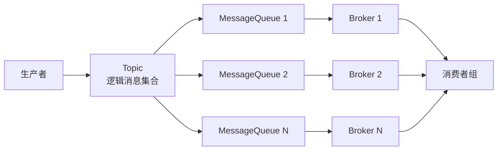

###### 1. RocketMQ 的核心组件有哪些？各自的作用是什么？
RocketMQ的架构遵循“**高内聚、低耦合**”的设计原则，其核心可抽象为四大组件：NameServer、Broker、Producer和Consumer。它们共同协作，构成了一个高性能、高可用的分布式消息处理系统。
**（1）NameServer：轻量级的路由中枢**
- **核心职责**：NameServer是RocketMQ的“**元数据管理中心**”，其设计目标是**轻量级、无状态、高可用**。它不持久化数据，所有路由信息（Topic、Broker、Queue映射关系）全量存储在内存中，通过HashMap实现O(1)复杂度的快速查询。
- **工作机制**：
    - **服务注册**：Broker节点在启动时，会与所有NameServer节点建立**长连接**，并每隔30秒发送一次心跳包，上报自身的路由信息（包括Broker地址、所有Topic配置、主从角色等）。
    - **故障剔除**：NameServer会启动一个定时任务（默认10秒一次），扫描Broker的心跳时间。如果某个Broker超过120秒未上报心跳，则判定其不可用，会立即从路由表中剔除。
    - **路由发现**：Producer和Consumer在启动时，会从NameServer集群（通过轮询方式）拉取完整的路由信息，从而知道消息应该发往哪个Broker，或者从哪个Broker拉取消息。
- **高可用设计**：NameServer集群节点间**互不通信**，每个节点都维护全量的元数据。这种去中心化设计使得集群具备极致的扩展性，只要有一个NameServer节点存活，整个系统就能正常提供服务。
**（2）Broker：消息存储与转发的核心**
Broker是RocketMQ的“心脏”，承担了消息的持久化、投递和高可用保障，是性能与可靠性的关键。
- **角色与架构**：
    - **主从模式**：Broker分为Master（主节点，负责写）和Slave（从节点，负责读和备份）。通过`brokerId`区分（0为Master，非0为Slave）。
    - **模块化设计**：
        - **通信层**：基于Netty实现高性能网络通信，处理客户端连接与请求。
        - **存储层**：这是RocketMQ性能的核心，采用**“顺序写磁盘+随机读内存”**的模型。其核心文件包括：
            - **CommitLog**：所有Topic的消息实体按顺序追加写入的文件。这种单一日志的设计最大限度地利用了磁盘的顺序I/O性能。
            - **ConsumeQueue**：作为消息消费的**逻辑队列索引文件**。每个Topic下的每个MessageQueue对应一个ConsumeQueue，它存储了消息在CommitLog中的物理偏移量、大小和Tag哈希码。消费者实际是通过读取ConsumeQueue来快速定位消息在CommitLog中的位置。
            - **IndexFile**：为消息Key建立的哈希索引文件，支持按Key或时间范围查询消息。
        - **复制层**：负责主从节点间的数据同步，支持**同步复制**（SYNC_MASTER，保证数据零丢失）和**异步复制**（ASYNC_MASTER，更高吞吐）两种模式。
**（3）Producer：消息生产者**
Producer的核心目标是高效、可靠地将消息发送到Broker。
- **核心组件**：
    - **DefaultMQProducer**：生产者的核心实现类，封装了连接管理、路由查找、消息发送等逻辑。
    - **负载均衡与故障规避**：Producer从NameServer获取到Topic的路由信息后，会感知到该Topic有哪些MessageQueue分布在哪些Broker上。发送消息时，它会通过**负载均衡策略**（如轮询、随机、一致性哈希）选择一个MessageQueue。同时，内置的**MQFaultStrategy**故障规避策略会记录Broker的发送延迟，避免向响应慢或故障的Broker发送消息。
    - **发送方式**：支持同步发送、异步发送（带回调）和单向发送（不关心结果）。
**（4）Consumer：消息消费者**
Consumer负责从Broker拉取消息并进行业务处理。
- **核心组件**：
    - **DefaultMQPushConsumer**：推模式消费者（实际是**长轮询拉取**的封装），服务端有消息时会主动推送给客户端，用户体验更接近实时。
    - **消费模式**：
        - **集群消费**：同一个Consumer Group下的多个Consumer实例共同消费一个Topic的消息，每条消息只会被组内的一个Consumer消费。这是默认的负载均衡模式。
        - **广播消费**：同一个Consumer Group下的每个Consumer实例都会消费全量的消息。
    - **重试与死信机制**：若消费失败，消息会进入**重试队列**（`%RETRY%`），默认重试16次。若所有重试均失败，消息会被投递到**死信队列**（`%DLQ%`），需人工干预。
###### 2. RocketMQ 中的 Topic 和 Queue 有什么区别？
Topic和Queue是RocketMQ消息模型中最核心的两个概念，它们分别从**逻辑分类**和**物理存储**两个维度对消息进行组织。理解其区别是掌握RocketMQ并行能力和扩展性的关键。
下面的流程图清晰地展示了一条消息从生产到消费的完整路径，以及Topic和Queue在其中扮演的角色：

|维度|Topic（主题）|Queue（消息队列）|
|---|---|---|
|**概念层级**​|**一级逻辑分类**，是消息的逻辑集合。|**物理分片单位**，是Topic在某个Broker上的物理分区，是**负载均衡和并行计算的基本单元**。|
|**设计目标**​|实现**发布/订阅**模式，解耦生产者和消费者。生产者只关心将消息发送到某个Topic，而无须关心有多少消费者。|实现**水平扩展**和**并行处理**。通过增加Queue的数量，可以将一个Topic的消息分布到多个Broker上，从而提升整个Topic的吞吐量。|
|**与消费者的关系**​|消费者以**组**为单位订阅一个Topic。|在**集群消费模式**下，一个Queue在同一时间只能被**同一个消费者组内的一个消费者**消费。一个消费者可以同时消费多个Queue。|
|**顺序性保证**​|Topic本身不保证消息的全局顺序。|**Queue内部**的消息是FIFO（先进先出）的，即**单个Queue能保证消息的顺序性**。要保证全局顺序，必须让一个Topic只包含一个Queue，但这会牺牲并发性能。|
|**数量与扩展**​|一个系统通常有有限数量的Topic。|一个Topic可以包含**大量**的Queue。**增加Queue的数量是提升Topic吞吐能力的主要手段**。|
**源码与设计视角**：
在源码层面，当生产者发送一条消息到`OrderTopic`时，`DefaultMQProducer`会通过`TopicPublishInfo`获取该Topic的所有MessageQueue列表，然后通过负载均衡策略（如`selectOneMessageQueue`方法）选择一个Queue，最终将消息发送到该Queue对应的Broker。正是这种**Topic是逻辑概念，Queue是物理实体**的设计，使得RocketMQ能够轻松实现横向扩展。
###### 3. 什么是 RocketMQ 的 Tag 和 Key？它们有什么用途？
Tag和Key是RocketMQ提供的**消息过滤**和**消息追踪**的辅助属性，它们使消息系统更加灵活和可控。

|特性|Tag（标签）|Key（业务键）|
|---|---|---|
|**本质**​|消息的**二级分类**，隶属于Topic。一条消息**有且仅有一个**Tag。|消息的**业务唯一标识符**，通常用于代表一条消息在业务上的唯一ID（如订单ID）。一条消息可以设置**多个**Key。|
|**主要用途**​|**在Broker端进行高效的消息过滤**。消费者可以只订阅其感兴趣的Tag的消息，Broker在投递时就会进行过滤，大大减少了网络传输的无用数据。|**快速查询和定位消息**。主要用于运维调试，例如通过RocketMQ提供的命令行工具或管理控制台，输入Key即可精准查询到某条消息的发送状态和消费状态。|
|**实现原理**​|Tag信息会随消息一起被写入ConsumeQueue索引文件。Broker过滤时**无需读取CommitLog中的消息体**，直接在ConsumeQueue中基于Tag的哈希值进行匹配，性能损耗极低。|Broker会为设置了Key的消息创建专门的**哈希索引文件**（IndexFile）。查询时通过Key进行哈希计算，快速定位到消息在CommitLog中的物理偏移量。|
|**使用示例**​|`Message msg = new Message("OrderTopic", "PaySuccess", ...);`|`message.setKeys("ORDER_20231027_001");`|
**高级过滤：SQL表达式**
除了Tag过滤，RocketMQ还支持功能更强大的**SQL92表达式过滤**。生产者可以在发送消息时通过`putUserProperty`方法设置自定义属性，消费者则可以使用SQL语法根据这些属性进行复杂条件过滤（如`a > 5 AND b = 'hello'`）。这为消息路由提供了极大的灵活性，但需要注意的是，此功能需要在Broker端配置开启，且由于需要解析SQL，性能开销略高于Tag过滤。
###### 4. RocketMQ 的消息模型是什么？支持哪些消费模式？
RocketMQ的消息模型是基于 **“发布/订阅”**​ 模式的延伸，通过**Topic + MessageQueue**的组合，实现了既支持一对多的广播，也支持多实例负载均衡的复杂场景。

**（1）消费模式**

|模式|机制|消费进度存储|适用场景|
|---|---|---|---|
|**集群模式**​|同一个Consumer Group下的所有Consumer实例**分摊**消费Topic下的所有MessageQueue，从而实现负载均衡。一条消息**最多**只能被组内的一个实例消费。|存储在Broker端。|适用于所有需要**横向扩展提升消费能力**的无状态服务，如订单处理、消息推送。|
|**广播模式**​|同一个Consumer Group下的**每一个**Consumer实例都会消费Topic下的**全部**消息。|存储在Consumer本地。|适用于需要**全量同步**的场景，如刷新本地缓存、更新全局配置。|
**（2）顺序消息**
RocketMQ支持**局部顺序消息**。要实现顺序消费，必须满足两个条件：
1. **生产者顺序发送**：将需要保证顺序的一批消息（如同一个订单的操作）设置**相同的MessageQueue选择键**，确保它们被发送到同一个MessageQueue中。
2. **消费者顺序消费**：消费者使用`MessageListenerOrderly`监听器，它会自动锁定当前正在消费的MessageQueue，在其消费完前不会消费该Queue的其他消息，从而保证顺序。
**（3）事务消息**
RocketMQ提供了**分布式事务消息**的解决方案，用于解决跨系统的数据最终一致性问题，其核心是“**半消息机制**”。
3. 生产者向Broker发送一条“**半消息**”，该消息对消费者不可见。
4. Broker返回半消息发送成功结果。
5. 生产者执行**本地事务**。
6. 根据本地事务执行结果，生产者向Broker发送**Commit**或**Rollback**指令。
7. 如果Broker长时间未收到确认指令，会向生产者发起**回查**，询问本地事务状态。这确保了在生产者宕机等异常情况下，事务的最终一致性。
###### 5. RocketMQ 与 Kafka 的区别是什么？各自的优势场景是什么？
尽管RocketMQ和Kafka都是优秀的分布式消息中间件，但它们在设计哲学、实现机制和生态侧重上存在显著差异，这也决定了它们各自的优势场景。

|维度|**Apache RocketMQ**​|**Apache Kafka**​|
|---|---|---|
|**设计哲学与定位**​|定位为**金融级、低延迟、高可靠**的**业务消息中间件**。|定位为**高吞吐、高性能**的**实时流数据平台**。|
|**架构模型**​|**主从架构**（Master-Slave），通过主从数据复制保证高可用。|**分片副本架构**（Partition-Replica），基于ZooKeeper进行元数据管理和控制器选举。|
|**消息存储**​|**混合存储**：所有Topic的消息统一顺序写入一个CommitLog文件，再为每个Queue异步构建ConsumeQueue索引。读操作近乎随机读，但利用PageCache优化。|**独立存储**：每个Topic的每个Partition都是独立的物理文件。顺序写，顺序读，性能极高。|
|**消息推拉模式**​|消费者端实现**长轮询**，模拟推模式（Push），延迟更低。|真正的**拉模式**（Pull），消费者主动从Broker拉取消息。|
|**消息追踪**​|原生支持完善的消息轨迹追踪功能，便于排查问题。|需依赖外部组件（如Zipkin）实现。|
|**生态与集成**​|与**Spring Cloud Alibaba**微服务套件无缝集成，对Java生态尤其是阿里系技术栈支持极佳。|与**大数据生态**（Hadoop, Spark, Flink）结合紧密，是实时流处理的事实标准。|
|**优势场景**​|**电商、金融等业务领域**。例如：订单交易、资金扣款、物流跟踪等对事务一致性、消息可靠性有高要求的场景。|**日志收集、流式数据处理、监控数据聚合**等大数据领域。例如：用户行为追踪、运营指标监控、ETL管道。|
**选型总结**：
- 如果您的核心需求是处理**业务事务**，需要**高可靠性、低延迟、分布式事务支持**，且技术栈以Java/微服务为主，**RocketMQ**是更优选择。
- 如果您的核心需求是处理**数据流**，追求**极高的吞吐量**，并需要与大数据生态进行深度集成，**Kafka**则是不二之选。