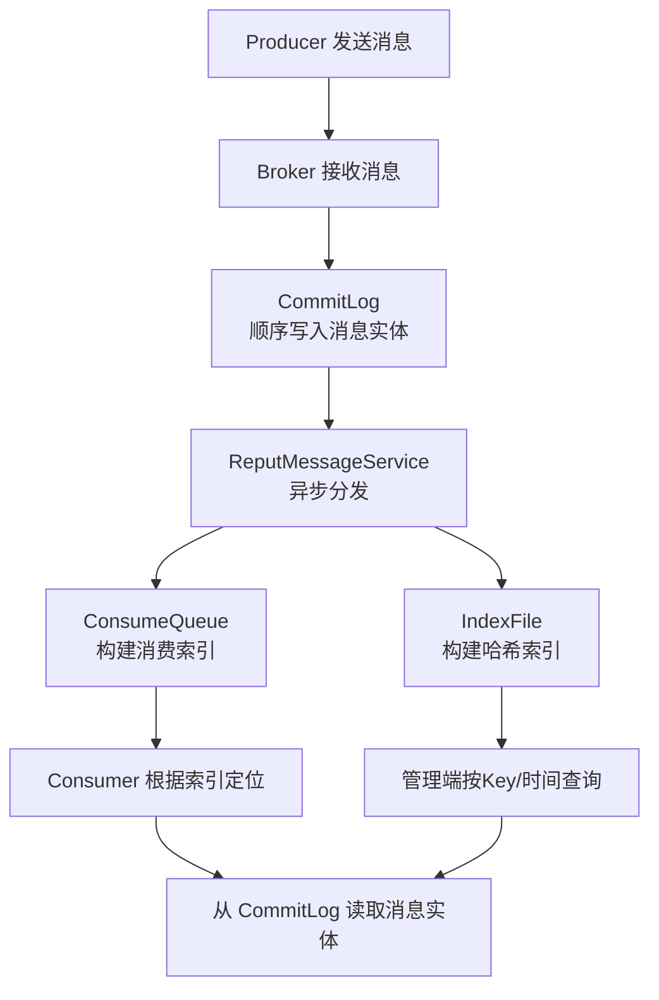

###### 1. RocketMQ 的 CommitLog、ConsumeQueue 和 IndexFile 分别是什么？
RocketMQ 采用**混合型存储架构**，通过三大核心文件协同工作，平衡高性能写入与快速检索的需求。

|**组件**​|**角色定位**​|**核心职责**​|**物理特性**​|
|---|---|---|---|
|**CommitLog**​|**消息实体仓库**​|存储所有消息的完整内容（元数据+消息体）|单个文件默认1GB，顺序追加写入|
|**ConsumeQueue**​|**消费索引目录**​|记录消息在CommitLog中的位置，提供按Topic的快速消费路由|定长结构（20字节/条目），逻辑队列|
|**IndexFile**​|**消息检索索引**​|提供基于Message Key或时间区间的消息查询能力|哈希索引结构，文件大小固定（约400MB）|
**工作原理与交互流程**：


**源码级深度解析**：
- **CommitLog 写入机制**：消息通过 `CommitLog.putMessage()`方法写入 。核心过程包含获取锁、序列化消息、获取 MappedFile 并追加写入 。
    ```java
    // 简化的源码逻辑
    public PutMessageResult putMessage(final MessageExtBrokerInner msg) {
        putMessageLock.lock(); // 保证线程安全
        try {
            // 1. 序列化消息
            byte[] messagesBytes = serializeMessage(msg);
            // 2. 获取当前MappedFile（内存映射文件）
            MappedFile mappedFile = this.mappedFileQueue.getLastMappedFile();
            // 3. 追加写入
            AppendMessageResult result = mappedFile.appendMessage(messagesBytes);
            return new PutMessageResult(PutMessageStatus.PUT_OK, result);
        } finally {
            putMessageLock.unlock();
        }
    }
    ```
- **ConsumeQueue 构建机制**：由 `ReputMessageService`线程异步处理 。它持续监测 CommitLog 的新增消息，解析出关键信息（物理偏移量、大小、Tag哈希码）并写入定长的 ConsumeQueue 条目 。每个条目固定为 **20 字节**（8字节偏移量 + 4字节消息大小 + 8字节tagsCode）。
- **IndexFile 查询机制**：通过 `IndexService.buildIndex()`方法构建 。采用**哈希槽（Hash Slot）**​ 加**链表**的结构解决冲突，支持通过 `mqadmin queryMsgByKey`命令进行消息查询 。
###### 2. RocketMQ 是如何实现零拷贝的？
RocketMQ 主要通过两种技术实现零拷贝，优化不同场景下的数据传输效率。
1.mmap（内存文件映射）**
- **应用场景**：主要用于 **CommitLog 和 ConsumeQueue 的读写操作**​ 。
- **实现原理**：通过 `FileChannel.map()`将磁盘文件直接映射到进程的虚拟内存空间 。应用程序像操作普通内存一样读写文件，省去了内核缓冲区到用户缓冲区的数据拷贝 。
- **源码体现**：在 `MappedFile`类中，通过 `mappedByteBuffer = fileChannel.map(...)`实现映射 。
**2. sendfile（Linux 系统调用）**
- **应用场景**：**Consumer 消费消息**时，Broker 将消息从 CommitLog 发送到网络 Socket 。
- **实现原理**：数据直接从内核空间的 PageCache 拷贝到网络协议栈，无需绕道用户空间 。
- **源码体现**：在 `FileChannel`的 `transferTo()`方法中，底层会调用 `sendfile64`系统调用 。
**性能对比与选择**

|**技术**​|**数据路径**​|**CPU 开销**​|**适用场景**​|
|---|---|---|---|
|**传统 I/O**​|磁盘 → 内核缓冲区 → 用户缓冲区 → Socket 缓冲区|高（4次拷贝，2次上下文切换）|无要求|
|**mmap**​|磁盘 → 内核缓冲区 → 进程虚拟内存（映射）|中（减少拷贝，但需管理内存映射）|文件随机读写、消息持久化|
|**sendfile**​|磁盘 → 内核缓冲区 → Socket 缓冲区|低（2次拷贝，0次上下文切换）|文件网络传输、消息消费|
###### 3. 什么是 RocketMQ 的 mmap 技术？它如何提升性能？
mmap（Memory Mapping）是 RocketMQ 提升 I/O 性能的**核心技术手段**，它通过操作系统的虚拟内存机制，将磁盘文件直接映射到进程的地址空间。
**性能提升原理**：
1. **减少数据拷贝次数**：传统 `read()`/`write()`需要数据在**内核缓冲区**和**用户缓冲区**之间来回拷贝。mmap 让应用程序直接通过指针操作文件数据，省去了这一次拷贝 。
2. **利用操作系统的页缓存（Page Cache）**：映射的区域由操作系统自动缓存。当 RocketMQ 读写 MappedFile 时，实际是在与 Page Cache 交互，速度极快。内核的 `pdflush`线程会负责将脏页异步写入磁盘 。
3. **预读优化**：操作系统会对映射的文件进行预读，提前将可能需要的数据加载到 Page Cache，提高后续读取速度 。
**RocketMQ 的优化实践**​ ：
- **文件预热（Warm Up）**：在 `MappedFile.warmMappedFile()`方法中，会先用0填充文件，并调用 `mlock()`锁定内存，防止被交换到 SWAP 空间，同时使用 `madvise(MADV_WILLNEED)`建议操作系统预加载文件数据，避免后续读写产生缺页中断 。
- **读写分离**：通过开启 `transientStorePoolEnable`，写入先到堆外内存，再异步提交到 Page Cache，实现内存级别的读写分离，进一步减轻 Page Cache 压力 。
###### 4. RocketMQ 的消息存储文件过期机制是怎样的？
RocketMQ 的消息存储文件过期机制是基于**时间**的清理策略，而非空间占用率，核心目标是**防止磁盘被无限撑满**。
- **触发条件**：Broker 会启动一个定时任务，默认每 60 秒检查一次 CommitLog、ConsumeQueue 和 IndexFile 的存储时间 。
- **判断依据**：消息的保留时间由 `fileReservedTime`参数控制（默认 72 小时）。当某个文件（如一个 1GB 的 CommitLog）的**最后修改时间**与当前时间之差超过设定值，且该文件不被任何消费组引用时，它就会被标记为可删除 。
- **清理粒度**：**以文件为单位**进行删除。例如，一个 1GB 的 CommitLog 文件中的所有消息只要达到过期时间，整个文件都会被删除 。
- **约束力**：这是一个**软约束**。如果磁盘空间使用率已达到高危水位线（`diskMaxUsedSpaceRatio`，默认 85%），即使文件未到期也会被强制删除，以保障 Broker 的可用性 。
###### 5. 如何优化 RocketMQ 的磁盘性能？
优化 RocketMQ 的磁盘性能需要从硬件、配置、架构多个层面综合考虑。

|**优化维度**​|**具体策略**​|**效果**​|
|---|---|---|
|**硬件层面**​|使用 **SSD 磁盘**​|显著提升随机 I/O 性能，对 ConsumeQueue/IndexFile 读取有益|
|**刷盘策略**​|业务允许少量丢失时，采用 **异步刷盘（ASYNC_FLUSH）**​|大幅提升写入吞吐量|
|**复制策略**​|非金融级场景，采用 **异步复制（ASYNC_MASTER）**​|降低主从同步延迟，提升集群吞吐|
|**内存管理**​|开启 **TransientStorePool**（堆外内存缓冲）|实现读写分离，缓解 PageCache 压力，避免 `broker busy`|
|**JVM 参数**​|设置合适的 `-XX:MaxDirectMemorySize`|保障堆外内存充足，避免 OOM|
**关键配置示例**：
```properties
# broker.conf
# 刷盘方式：ASYNC_FLUSH（异步） 或 SYNC_FLUSH（同步）
flushDiskType=ASYNC_FLUSH
# 主从复制方式：ASYNC_MASTER（异步） 或 SYNC_MASTER（同步）
brokerRole=ASYNC_MASTER
# 启用堆外内存缓冲池，通常异步刷盘时开启
transientStorePoolEnable=true
# 磁盘最大使用率，超过此值将触发文件清理
diskMaxUsedSpaceRatio=85
```
###### 6. RocketMQ 如何处理大消息？有什么限制和建议？
**默认限制与影响**：
- **限制值**：RocketMQ 对单条消息的**默认最大限制为 4MB**​ 。
- **影响**：
    - **网络传输**：大消息会占用大量网络带宽，增加传输延迟。
    - **内存压力**：在 Broker 和 Consumer 端都会占用更多内存，可能影响其他消息的处理。
    - **存储效率**：写入 CommitLog 时，如果消息过大，会干扰后续小消息的写入效率，因为 CommitLog 是顺序写入。
**处理建议与最佳实践**：
1. **消息拆分**：将大消息**拆分成多个小块**，作为多条小消息发送。在消息头（Properties）中携带序列号、总数等信息，由消费者端进行重组。这是最推荐的方式。
2. **外部存储**：将大内容（如文件、图片、视频）上传到**OSS（对象存储）或 HDFS**，消息体中只存储该内容的访问地址（URL）。这是处理超大消息（如百MB以上）的标准方案。
3. **调整参数**：若非拆不可，可适当调大 `maxMessageSize`参数（在 Broker 和 Producer 端均需配置），但需谨慎评估对集群整体性能的影响。
4. **隔离处理**：为大数据量 Topic 创建**独立的 Broker 集群**，避免影响核心业务消息的时效性。