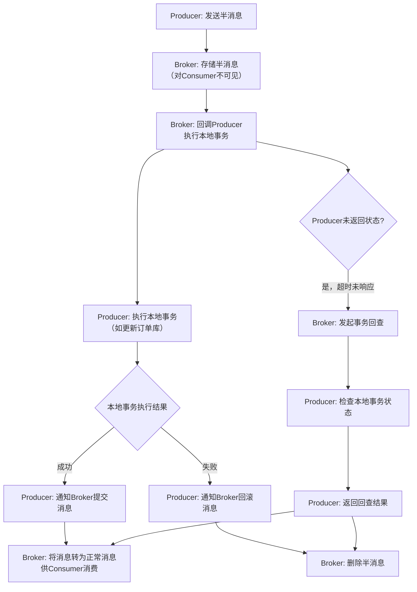

###### 1. RocketMQ 在电商系统中的典型应用场景有哪些？
RocketMQ 在电商系统中扮演着"中枢神经"的角色，主要通过四大核心场景支撑高并发、分布式架构下的业务需求 。

|**应用场景**​|**解决的核心问题**​|**实现机制与价值**​|
|---|---|---|
|**订单流程异步化**​|同步处理链路过长导致用户等待时间久（1秒至几秒）|支付成功后，仅同步更新订单状态和扣减库存（约120ms），其余步骤（积分、优惠券、短信、物流）通过消息异步执行，提升响应速度10倍以上 。|
|**系统间解耦**​|子系统间直接RPC调用，形成"串联电路"式依赖，任一下游故障导致整个链路失败 。|订单系统作为生产者只需发送消息至Topic，无需感知下游消费者（积分、营销等）。新业务扩展只需新增消费者订阅，上游无感知，架构灵活性极大提升 。|
|**秒杀与流量削峰**​|瞬时高并发流量直接冲击数据库，导致系统崩溃 。|海量用户请求先作为消息存入RocketMQ，后端服务根据自身处理能力从队列中匀速拉取消息处理。RocketMQ的亿级消息堆积能力充当"水库"，平滑流量峰值 。|
|**数据同步与日志收集**​|大数据团队直接查询业务数据库，影响核心业务性能且不规范 。|订单数据变更后，通过消息实时同步至大数据平台或数据仓库，用于统计分析、实时报表等，实现业务系统与数据分析系统的隔离 。|
###### 2. 如何使用 RocketMQ 实现异步解耦？
、异步解耦是 RocketMQ 最核心的价值，其本质是将系统间复杂的**网状同步调用拓扑**简化为**星形的异步消息传递拓扑**，将依赖关系从乘法级别（M*N）降至加法级别（M+N）。
**1. 代码实现层面**
- **生产者端**：订单服务在完成核心业务（如更新订单状态）后，将需要通知其他系统的数据封装成消息发送至RocketMQ，而非直接进行RPC调用。
    ```java
    // 订单服务 - 生产者 (基于Spring风格封装 [3](@ref))
    @Service
    public class OrderServiceImpl implements OrderService {
        @Autowired
        private RocketMQTemplate rocketMQTemplate; // Spring Boot集成
    
        @Transactional
        public void createOrder(OrderDTO orderDTO) {
            // 1. 本地数据库事务：插入订单记录
            orderMapper.insert(orderDTO);
            // 2. 异步发送消息，与下游系统解耦
            rocketMQTemplate.convertAndSend("OrderTopic:PAY_SUCCESS", orderDTO.getOrderId());
        }
    }
    ```
- **消费者端**：各下游系统（如积分服务、物流服务）作为独立的消费者，订阅感兴趣的Topic。
    ```java
    // 积分服务 - 消费者 [3](@ref)
    @Component
    @RocketMQMessageListener(topic = "OrderTopic", selectorExpression = "PAY_SUCCESS")
    public class CreditListener implements RocketMQListener<String> {
        @Override
        public void onMessage(String orderId) {
            // 处理积分业务逻辑，与订单服务完全解耦
            creditService.addCredit(orderId);
        }
    }
    ```
**2. 架构价值层面**
- **可用性解耦**：即使积分服务或物流服务暂时不可用，只要RocketMQ可用，用户的订单操作仍可成功。订单服务的可用性不再依赖于所有下游服务 。
- **延迟解耦**：无论下游业务逻辑如何增加，订单服务只需一次消息发送（通常在5ms内），响应延迟为常量，避免业务链路过长导致的性能衰减 。
###### 3. 如何使用 RocketMQ 实现流量削峰？
流量削峰的核心在于利用消息队列的**存储-转发**模型，将瞬时的突发流量缓冲起来，让后端服务按照自身处理能力匀速消费 。
**1. 秒杀场景下的架构设计**
- **前端层**：进行用户请求的初步验证（如验证码、用户登录状态）。
- **消息队列层**：接收并缓存通过验证的秒杀请求。RocketMQ在此环节承担核心的缓冲作用。
- **业务逻辑层**：多个消费者实例从RocketMQ拉取请求，执行库存扣减、订单创建等核心逻辑，其处理速度是可控且平滑的。
**2. 关键配置与源码视角**
- **生产者端**：在秒杀开始时，瞬间涌入的大量请求被快速转换为消息并存入RocketMQ。RocketMQ的 `CommitLog`顺序写入机制使得即使在高并发下也能保持极高的写入吞吐量 。
    ```java
    // 秒杀请求生产者示例 [1](@ref)
    public class FlashSaleProducer {
        public static void main(String[] args) throws Exception {
            DefaultMQProducer producer = new DefaultMQProducer("FlashSaleGroup");
            producer.start();
            // 模拟海量用户请求
            for (int i = 0; i < 100000; i++) {
                Message msg = new Message("FlashSaleTopic", "TagA", ("Request:" + i).getBytes());
                // 消息在Broker端快速持久化，请求不会被立即丢弃
                SendResult result = producer.send(msg);
            }
            producer.shutdown();
        }
    }
    ```
- **消费者端**：通过设置 `ConsumeThreadMin`和 `ConsumeThreadMax`来控制消费并发度，并利用 `pullBatchSize`控制单次拉取消息数，从而实现处理速率的精准控制，避免压垮数据库 。
###### 4. 如何使用 RocketMQ 实现日志收集？
RocketMQ 在日志收集场景下，主要作为高性能、高可靠的数据传输通道，连接分散的应用节点与中央日志处理系统。
**1. 架构设计**
- **日志生产者**：在每个应用服务器上部署轻量级的日志采集代理（Agent）。代理负责读取本地日志文件，或将应用直接打印到标准输出的日志捕获，并封装成消息发送至指定的RocketMQ Topic。通常采用 **单向发送**​ 模式以追求极致吞吐 。
- **日志消费者**：中央日志处理系统（如ELK Stack中的Logstash、Flink流处理集群）作为消费者，订阅日志Topic，对日志进行解析、清洗、聚合，最后存储到搜索引擎（如Elasticsearch）或数据湖中。
**2. 优势分析**
- **可靠性**：相比直接通过网络将日志发送到中心服务器，RocketMQ提供了消息持久化，防止日志丢失。
- **解耦与缓冲**：当日志处理系统（如Elasticsearch）需要维护或出现性能瓶颈时，日志消息可以在RocketMQ中堆积，避免反压到业务应用。
- **过滤能力**：可以利用RocketMQ的 **Tag**​ 或 **SQL92表达式**​ 过滤功能，实现日志的初步分类。例如，将错误日志、业务日志发送到不同的Tag，便于消费者差异化处理 。
###### 5. RocketMQ 如何保证消息的最终一致性？
在分布式系统中，保证本地数据库操作与消息发送的原子性（即最终一致性）是巨大挑战。RocketMQ通过 **事务消息**​ 机制解决此问题，其核心是 **"半消息"**​ 和 **"事务状态回查"**​ 机制 。
**1. 事务消息流程与源码解析**
下表详细说明了事务消息两阶段提交的完整流程，这一机制确保了即使在分布式环境下，业务操作与消息发送也能达到最终一致性。
mermaid

复制


- **第一阶段：发送半消息**
    - 生产者调用 `TransactionMQProducer.sendMessageInTransaction()`方法 。
    - 消息首先作为 **半消息**​ 发送到Broker。Broker将其存储在主题 `RMQ_SYS_TRANS_HALF_TOPIC`下，此时消费者无法看到此消息 。
    - **源码角度**：在Broker端，`TransactionalMessageService`负责处理半消息的存储和状态维护。
- **第二阶段：执行本地事务并通知Broker**
    - Broker收到半消息后，会异步回调生产者实现的 `TransactionListener.executeLocalTransaction()`方法 。
    - 生产者在此方法中执行本地数据库事务（如插入订单记录）。
    - 根据本地事务执行结果，生产者返回 `LocalTransactionState.COMMIT_MESSAGE`、`ROLLBACK_MESSAGE`或 `UNKNOWN`。
- **第三阶段：事务状态回查**
    - **场景**：如果生产者执行本地事务成功后，在发送确认指令给Broker之前发生网络闪断或生产者重启，消息将处于"悬挂"状态 。
    - **机制**：Broker会启动定时任务（`TransactionalMessageCheckService`），定期扫描处于 `UNKNOWN`状态或长时间未确认的半消息，并向生产者发起回查 。
    - 生产者通过实现 `TransactionListener.checkLocalTransaction()`方法，根据消息Key（如订单ID）查询本地数据库，确定该事务的最终状态，并返回给Broker 。
**2. 代码示例**
```java
// 事务消息生产者 [7](@ref)
TransactionMQProducer producer = new TransactionMQProducer("transaction_producer_group");
producer.setTransactionListener(new TransactionListener() {
    @Override
    public LocalTransactionState executeLocalTransaction(Message msg, Object arg) {
        // 执行本地事务
        try {
            // 1. 解析消息，获取订单ID
            String orderId = msg.getKeys();
            // 2. 本地数据库事务操作
            orderService.createOrder(orderId);
            return LocalTransactionState.COMMIT_MESSAGE;
        } catch (Exception e) {
            return LocalTransactionState.ROLLBACK_MESSAGE;
        }
    }

    @Override
    public LocalTransactionState checkLocalTransaction(MessageExt msg) {
        // 事务回查逻辑
        String orderId = msg.getKeys();
        Order order = orderDao.selectById(orderId);
        return order != null ? LocalTransactionState.COMMIT_MESSAGE : LocalTransactionState.ROLLBACK_MESSAGE;
    }
});
```
###### 6. 如何设计基于 RocketMQ 的消息补偿机制？
即使有事务消息，在极端情况下（如消费者持续消费失败），仍需一套完整的补偿机制来保证业务的最终一致性。其核心是 **重试队列**、**死信队列**​ 和 **人工干预**​ 的组合拳 。
**1. 自动补偿机制**
- **重试队列**：当消费者消费失败返回 `RECONSUME_LATER`时，消息并不会立即被丢弃，而是进入一个 **重试队列**。RocketMQ会按照延迟级别（1s, 5s, 10s, 30s, 1m... 2h）进行延迟重试，默认最多重试16次 。这种 **"时间衰减"**​ 的重试策略避免了无效的频繁重试。
- **死信队列**：当消息重试16次后仍然失败，会被移入一个特殊的 **死信队列**，队列名格式为 `%DLQ%consumerGroup`。此时，意味着自动补偿已无能为力，需要预警机制触发人工干预。
**2. 人工补偿与监控**
- **死信监控**：必须为死信队列设置监控告警。一旦有消息进入死信队列，应立即通知运维或开发人员 
- **消息回溯**：如果发现是因消费者程序Bug导致的大面积消费失败，在修复Bug后，可以利用RocketMQ的 **消息回溯**​ 功能。通过 `mqadmin`命令将消费位点重置到某个时间点，让消费者重新消费这些消息 。
- **处理死信**：对于死信消息，可以开发一个独立的处理程序，消费死信队列中的消息，记录日志、发送告警，甚至尝试进行某种形式的修复或生成待办工单，由人工介入处理 。