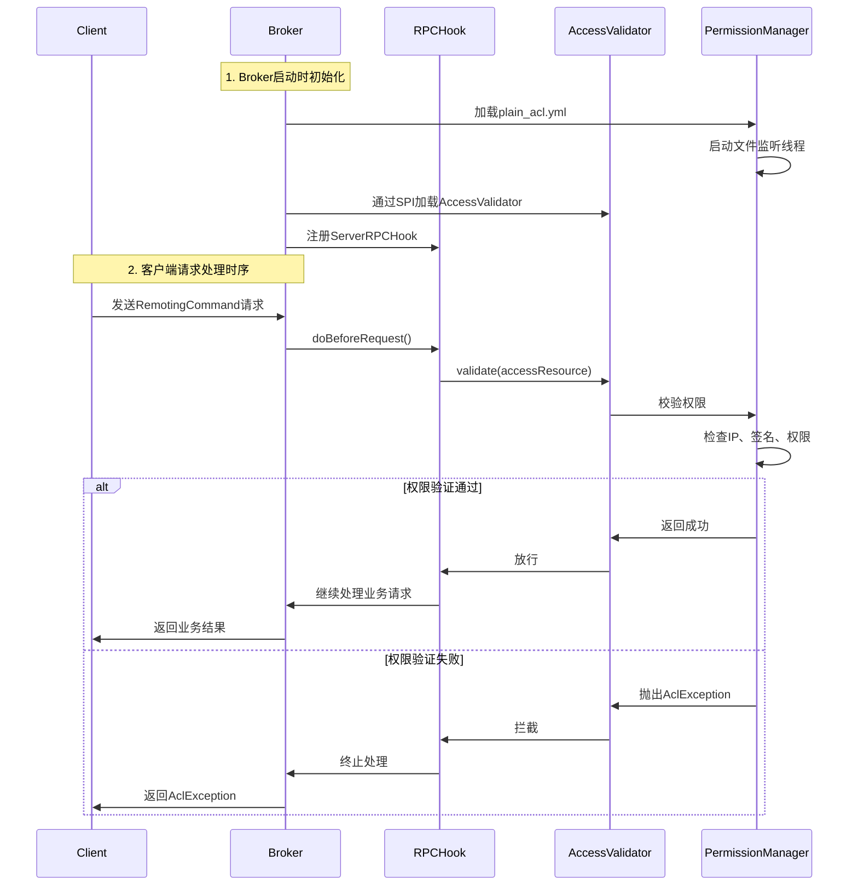

###### 1. RocketMQ 如何实现权限控制？
RocketMQ的权限控制（ACL）是一个在Broker端实现的、可插拔的拦截器模型，其核心思想是：**在真正处理业务请求（如发送消息、拉取消息）之前，插入一个钩子（Hook）来验证请求者的身份和权限**。这套机制通过定义**用户（User）、资源（Resource）和权限（Permission）**​ 来实现精细化的访问控制。
**核心架构与源码解析**
整个ACL系统的启动与执行流程，可以清晰地通过下面的序列图来展现：

具体到代码层面，其实现包含以下几个关键步骤：
1. **Broker端启用与初始化**
    在Broker启动时，如果检测到配置 `aclEnable=true`，便会初始化ACL组件 。
    ```java
    // BrokerController.initialAcl() 方法片段
    private void initialAcl() {
        if (!this.brokerConfig.isAclEnable()) {
            return; // 未开启ACL则直接返回
        }
        // 通过SPI机制加载所有实现了AccessValidator接口的类
        List<AccessValidator> accessValidators = ServiceProvider.load(ServiceProvider.ACL_VALIDATOR_ID, AccessValidator.class);
        for (AccessValidator validator : accessValidators) {
            // 为每一个Validator注册一个RPCHook
            this.registerServerRPCHook(new RPCHook() {
                @Override
                public void doBeforeRequest(String remoteAddr, RemotingCommand request) {
                    // 在处理请求前，调用验证器
                    AccessResource accessResource = validator.parse(request, remoteAddr);
                    validator.validate(accessResource);
                }
            });
        }
    }
    ```
2. **权限验证器（AccessValidator）**
    这是ACL的核心接口，默认实现是 `PlainAccessValidator`。它定义了两个关键方法 ：
    - `AccessResource parse(RemotingCommand request, String remoteAddr)`: 从网络请求中解析出本次访问需要的**资源**和**操作**。例如，对于一个 `SEND_MESSAGE`请求，它会解析出目标Topic和需要的权限（PUB）。
    - `void validate(AccessResource accessResource)`: 将解析出的请求信息与权限规则进行比对，判断是否允许访问。
3. **权限规则加载（PlainPermissionLoader）**
    `PlainAccessValidator`内部依赖 `PlainPermissionLoader`，它负责从 `plain_acl.yml`配置文件中加载和热更新权限规则 。这个文件定义了用户（`accounts`）、他们的密钥（`accessKey/secretKey`）以及对每个Topic和ConsumerGroup的精细权限 。
4. **客户端集成**
    生产者或消费者客户端需要在创建实例时注入一个 `AclClientRPCHook`，用于在发送请求前自动添加认证信息（AccessKey和基于SecretKey生成的签名） 。
    ```java
    // 客户端代码示例
    public static void main(String[] args) {
        // 创建包含认证信息的钩子
        RPCHook rpcHook = new AclClientRPCHook(new SessionCredentials("你的AccessKey", "你的SecretKey"));
        // 将钩子设置到生产者或消费者实例
        DefaultMQProducer producer = new DefaultMQProducer("ProducerGroupName", rpcHook);
        producer.start();
    }
    ```
**ACL 2.0 的重大升级**
在较新的版本中，RocketMQ引入了ACL 2.0，解决了1.0版本的一些痛点 ：
- **精细化管控**：从仅支持9个核心API的权限控制，扩展到支持全部130多个管控API。
- **集群组件间安全**：对Broker主从节点、Proxy等组件之间的通信也实施了ACL控制。
- **灵活的匹配模式**：支持通配符等模式匹配，简化大量资源的权限配置。
- **认证与授权解耦**：支持“只认证不鉴权”等灵活场景。
###### 2. RocketMQ 支持消息加密吗？如何实现？
是的，RocketMQ支持消息加密，主要从两个层面保障数据安全：**传输过程中的加密**​ 和 **存储时的加密**。
**（1）传输加密（TLS/SSL）**
这是最常用的加密方式，用于防止消息在网络上被窃听或篡改。
- **实现原理**：基于TLS/SSL协议，对Broker与客户端（生产者/消费者）之间的网络通信进行加密。
- **配置步骤**：
    1. **准备证书**：可以使用自签名证书（测试）或从权威CA获取证书（生产环境） 。
    2. **配置Broker**：在 `broker.conf`中启用SSL并指定证书路径。
        ```properties
        # broker.conf
        sslEnable = true
        sslCertPath = /path/to/broker.crt
        sslKeyPath = /path/to/broker.key
        # 如果需要双向认证（验证客户端证书）
        # sslClientAuth = need
        sslTrustCertPath = /path/to/ca.crt
        ```
    3. **配置客户端**：在Java客户端中启用SSL并指定信任的CA证书。
        ```java
        DefaultMQProducer producer = new DefaultMQProducer("group");
        // 方式一：通过系统属性
        System.setProperty("rocketmq.client.ssl.trustCertPath", "/path/to/ca.crt");
        // 方式二：通过客户端配置（视版本而定）
        producer.getProducerConfig().setSslEnable(true);
        producer.start();
        ```
- **性能优化**：TLS加密会带来性能开销，但可通过以下方式优化 ：
    - **会话复用**：通过配置 `tls.session.cache.size`等参数，复用TLS会话，避免每次连接都进行完整的握手。
    - **硬件加速**：使用支持AES-NI指令集的CPU，并确保RocketMQ使用OpenSSL引擎（`SslProvider.OPENSSL`），可以显著降低加密解密的CPU消耗。
**（2）存储加密**
主要用于云环境，防止因磁盘物理丢失或非法挂载导致的数据泄露。
- **实现原理**：在阿里云等云服务商提供的RocketMQ企业版中，可以利用**加密云盘**作为存储介质。数据在写入磁盘前自动加密，读取时自动解密，对RocketMQ本身透明 。
- **核心要点**：
    - 该功能通常由云平台管理，用户只需在创建RocketMQ实例时选择“云盘加密”并指定密钥（通常来自KMS服务）即可 。
    - 加密行为是不可逆的，一旦启用无法关闭，且必须确保密钥可用，否则会导致数据无法读取 。
###### 3. RocketMQ 如何防止消息被非法消费？
防止消息被非法消费是一个系统工程，需要结合上述的**权限控制**和**消息加密**，并辅以**网络与运维措施**，构成纵深防御体系。
1. **第一道防线：严格的权限控制（ACL）**
    这是最核心的机制，确保只有合法的消费者才能消费消息。
    - **身份认证**：非法消费者无法提供正确的 `AccessKey`和 `SecretKey`，在连接Broker时就会在ACL的 `validate`阶段被拒绝 。
    - **权限最小化**：为每个消费者组配置最小权限。例如，一个只消费TopicA的消费者，其权限应设置为 `topicA=SUB`，即使它的密钥泄露，攻击者也无法用它来消费其他Topic的消息 。
    - **IP白名单**：通过 `whiteRemoteAddress`限制消费者只能从特定的应用服务器IP地址发起的连接，即使密钥泄露，攻击者也无法从外网直接连接 。
2. **第二道防线：通信加密（TLS）**
    即使有ACL，如果网络通信是明文的，认证信息（签名）和消息内容仍可能被窃取。启用TLS可以 ：
    - 防止**中间人攻击**，确保消费者连接的是真正的Broker。
    - 防止消息内容在传输过程中被窃听。
3. **第三道防线：运维与架构安全**
    - **网络隔离**：将RocketMQ集群部署在私有网络（VPC）中，通过安全组/防火墙策略严格限制访问来源，仅允许应用程序所在的子网访问Broker的端口 。
    - **敏感信息管理**：严禁将 `SecretKey`等硬编码在代码中。应使用**环境变量**、**配置中心**或**Kubernetes Secrets**等安全方式管理，并严格控制访问权限 。
    - **审计与监控**：开启审计日志，监控所有的消费行为。如果发现异常消费（如从不熟悉的IP地址发起的消费），能够及时告警和追溯 。
    - **定期密钥轮转**：制定策略定期更换 `SecretKey`，并更新客户端配置，以降低密钥长期暴露的风险。