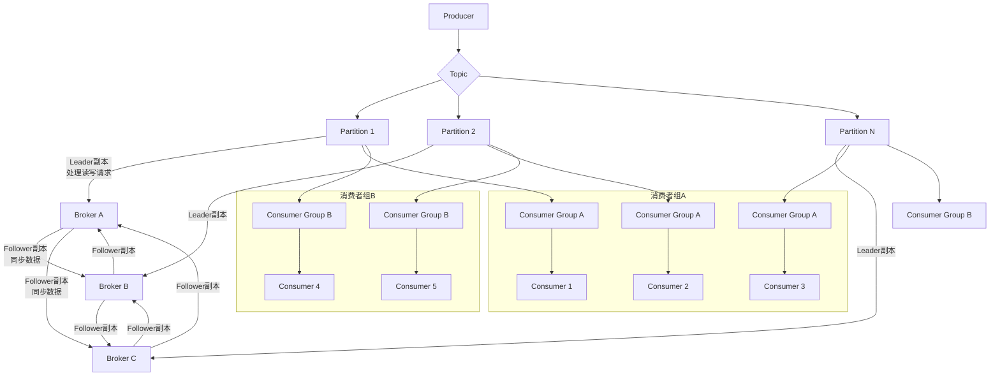

###### 1. Kafka 是什么？有什么作用？
Apache Kafka 是一个**分布式的、高吞吐量的、可持久化的流数据平台**。其核心设计目标是成为一个能够处理实时数据流的统一平台，而不仅仅是一个传统的消息队列。
**核心作用与定位：**
1. **发布与订阅消息流（消息系统）**：Kafka 扮演着应用之间的“中枢神经系统”，采用发布-订阅模式，实现了生产者（Producer）和消费者（Consumer）之间的解耦。生产者将数据发布到指定的主题（Topic），而一个或多个消费者可以订阅这些主题以接收数据。
2. **以容错和持久化的方式存储流数据（存储系统）**：Kafka 会将所有消息持久化到磁盘，并且支持配置数据的保留时间（例如7天）。这意味着消费者可以按照自己的节奏消费数据，甚至可以重新消费历史数据。这种特性使其成为一个可靠的“流数据存储层”。
3. **实时处理流数据（流处理平台）**：通过 Kafka Streams API，应用程序可以实时地处理和分析流入 Kafka 的数据流，进行诸如聚合、连接、窗口计算等复杂操作，而无需将数据导出到外部处理系统（如 Spark）。
**设计哲学与源码视角：**
Kafka 诞生于 LinkedIn，旨在解决其**数据管道**的瓶颈。它摒弃了传统消息队列（如 ActiveMQ）在内存中维护复杂路由状态的设计，转而采用**基于日志的持久化存储模型**。其高性能的关键在于：
- **顺序 I/O**：消息以追加（Append-only）的方式写入磁盘，极大提升了写入性能。
- **零拷贝（Zero-copy）技术**：通过 `sendfile`系统调用，数据可以直接从磁盘文件传输到网络套接字，避免了内核态与用户态之间的数据拷贝，显著降低了 CPU 开销和延迟。
###### 2. Kafka 的核心组件有哪些？
Kafka 的架构由一系列协同工作的核心组件构成，共同支撑其分布式流处理能力。

|**核心组件**​|**角色与职责**​|**关键特性**​|
|---|---|---|
|**Broker**​|Kafka 集群中的服务器节点，负责消息的存储和转发。|一个集群由多个 Broker 组成，用于实现高可用和负载均衡。|
|**Producer（生产者）**​|向 Kafka 的 Topic 发布消息的客户端应用程序。|支持异步发送、批量压缩、消息重试等机制以提升吞吐量和可靠性。|
|**Consumer（消费者）**​|从 Kafka 的 Topic 订阅并消费消息的客户端应用程序。|采用“拉（Pull）”模式，由消费者控制消费速率。|
|**Topic（主题）**​|消息的逻辑类别，是发布和订阅的核心单元。|类似于数据库中的表名。|
|**Partition（分区）**​|每个 Topic 可以被划分为多个 Partition，是 Kafka 实现**水平扩展和并行处理**的基石。|分区内的消息是**有序**的，但分区之间不保证顺序。|
|**Consumer Group（消费者组）**​|由一组逻辑上协同工作的 Consumer 实例组成。|**消费者组是 Kafka 实现横向扩展和负载均衡的核心机制**。一个分区在同一时间只能被同一个消费者组内的**一个**消费者消费。|
|**ZooKeeper / KRaft**​|**集群元数据管理和协调服务**。|在旧版本中，Kafka 强依赖 ZooKeeper 来管理 Broker 注册、Topic 配置、Leader 选举等。自 Kafka 3.0+，社区引入了 **KRaft 模式**，使用自研的 Raft 共识算法替代 ZooKeeper，简化了部署架构。|
###### 3. 什么是 Topic、Partition 和 Offset？
这三个概念是理解 Kafka 数据模型和存储机制的关键。
- **Topic（主题）**：消息的逻辑分类。例如，你可以有一个名为 `user_click_events`的 Topic 来专门存储用户的点击事件流。
- **Partition（分区）**：每个 Topic 可以被切分成一个或多个分区。分区是一个**有序的、不可变的消息序列**。消息在写入分区时会被分配一个唯一的标识，即 Offset。
    - **设计意义**：分区允许 Topic 的数据被分散到集群中不同的 Broker 上，不仅突破了单机存储的限制，更重要的是，它允许**多个消费者并行地消费同一个 Topic**，从而极大地提升了系统的吞吐量。
    - **源码/物理存储**：在物理上，每个分区对应于 Broker 文件系统上的一个目录。目录内包含一组**顺序写入的 Segment 文件**（例如 `00000000000.log`）。当一个 Segment 文件达到一定大小后，会滚动创建新的文件。这种机制使得基于 Offset 的消息查找非常高效（通过二分查找定位到具体文件）。
- **Offset（偏移量）**：消息在分区内的唯一序号，是一个单调递增的 long 类型数字。
    - **作用**：Offset 用于**唯一标识分区内的每条消息**和**记录消费者的消费进度**。消费者需要定期提交（Commit）其消费到的 Offset，这样在发生故障重启后，它可以从上次提交的位置继续消费，避免消息丢失或重复消费。
**关系总结**：一个 **Topic**​ 就像是一本书，**Partition**​ 是这本书的章节，而 **Offset**​ 就是每个章节里的页码。
###### 4. Kafka 中的 Broker 是什么？
Broker 是 Kafka 集群的**工作节点**，是消息存储和服务的实际提供者。
**核心职责：**
1. **消息持久化**：接收 Producer 发送的消息，并将其持久化到本地磁盘的对应 Partition 的 Segment 文件中。
2. **消息服务**：响应 Consumer 的拉取请求，将消息返回给消费者。
3. **副本管理**：每个 Partition 都有多个副本（Replica），分布在不同的 Broker 上。Broker 负责作为 Leader 或 Follower 进行副本间的数据同步。
4. **集群协调**：通过 ZooKeeper 或 KRaft 协议与其他 Broker 协同工作，参与 Leader 选举、故障检测等。
**高可用设计**：生产环境中，Kafka 集群通常由多个 Broker 组成（例如3个或5个）。这样，即使个别 Broker 宕机，整个集群仍然可以正常提供服务，实现了高可用性。
###### 5. 什么是消费者组（Consumer Group）？
消费者组是 Kafka 实现**横向扩展消费能力**和**高可用性**的核心机制。它由一个唯一的 `group.id`标识，组内包含多个消费者实例。
**核心运行机制：**
- **分区分配**：Kafka 会确保一个 Topic 的**每个 Partition 只能被同一个消费者组内的一个消费者**消费。而一个消费者可以同时消费多个 Partition。
- **负载均衡**：通过这种方式，当消费者组内的消费者数量小于或等于 Partition 数量时，可以实现消费任务的负载均衡。例如，一个拥有4个分区的 Topic 被一个拥有2个消费者的组消费，那么每个消费者大约会负责2个分区的消息处理。
- **再平衡（Rebalance）**：当消费者组内的消费者数量发生变化（如新增消费者或现有消费者下线）时，Kafka 会自动触发“再平衡”过程，重新分配分区与消费者的对应关系，以实现新的负载均衡。再平衡是保证高可用的关键，但过频的再平衡会影响系统稳定性。
**消息模式**：消费者组也决定了消息的投递模式：
- **队列模式（点对点）**：所有消费者在同一个组内，每条消息只会被组内的一个消费者处理。
- **发布/订阅模式**：不同的消费者组订阅同一个 Topic，每条消息会被广播到所有消费者组。
###### 6. Kafka 中的 Replication 是什么？
Replication（副本机制）是 Kafka 提供**数据高可靠性**的核心保障。它为每个 Partition 创建多个副本，并将这些副本分布到不同的 Broker 上。
**工作机制**：
- 每个 Partition 都有一个**Leader副本**和零个或多个**Follower副本**。
- 所有的**读写请求都由 Leader 副本负责处理**。
- Follower 副本的唯一任务就是**从 Leader 副本异步地拉取数据，保持与 Leader 的数据同步**。
**ISR（In-Sync Replicas）**：Leader 维护了一个“同步副本”列表。只有当消息被成功复制到 ISR 中的所有副本后，这条消息才被认为是“已提交”（Committed）的，从而对消费者可见。这种机制在性能和数据可靠性之间取得了平衡。
###### 7. 什么是 Leader 和 Follower？
这是副本机制中的两个核心角色。
- **Leader**：
    - 每个 Partition 在某一时刻只有一个 Leader。
    - 它负责处理所有客户端的读写请求。
    - 生产者发送消息和消费者消费消息都是直接与 Partition 的 Leader 交互。
- **Follower**：
    - 被动地、异步地从 Leader 拉取数据，以保持与 Leader 的数据同步。
    - 当 Leader 发生故障时，Kafka 会**从 ISR 列表中选举出一个新的 Follower 晋升为新的 Leader**，继续提供服务，从而实现故障自动转移（Failover）。
这种主从架构确保了 Kafka 集群在部分节点失效时仍能保持可用性和数据一致性。
###### 8. Kafka 的消息模型是什么？
Kafka 的消息模型是基于**分区的、持久化日志的发布-订阅模型**，并在此基础上通过消费者组实现了灵活的消息投递语义。
**核心流程如下**：

**模型特点**：
- **生产者（Producer） 将消息发布到特定的 主题（Topic）**。
- 主题下的每个 分区（Partition）**​ 都是一个有序的消息队列。生产者通常通过键（Key）来决定消息发送到哪个分区，以确保相关消息的顺序性。
- **消费者（Consumer） 以 消费者组（Consumer Group）​ 的形式进行订阅。如上图所示，分区是并行处理的基本单位**，同一个分区内的消息保证顺序消费。这种模型天然支持水平扩展，通过增加分区和消费者实例，可以线性提升系统的吞吐量。