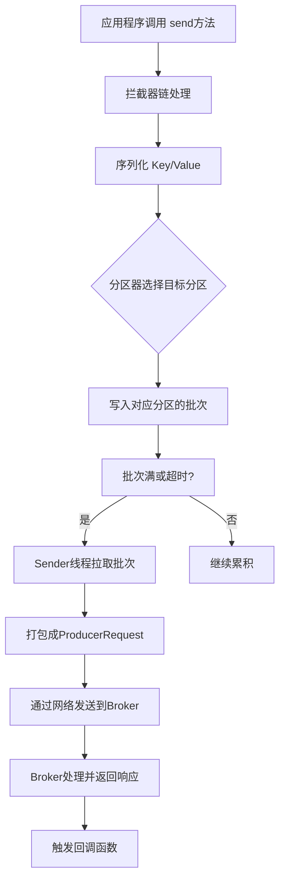

###### 1. Kafka 生产者的工作流程是什么？
Kafka 生产者的工作流程是一个多线程协作的精密过程，其核心设计目标是**高吞吐量和低延迟**。整个流程可以概括为 **"主线程-累加器-Sender线程"**​ 的异步批处理模型。

**源码与核心组件深度解析：**
1. **主线程（用户线程）**
    - **ProducerRecord创建**：应用程序创建消息对象，调用 `KafkaProducer.send()`方法。
    - **拦截器（Interceptors）**：消息首先经过配置的拦截器链（`ProducerInterceptor`）。你可以在 `onSend()`方法中对消息进行预处理（如添加审计信息、指标收集）。拦截器通过 `ProducerConfig.INTERCEPTOR_CLASSES_CONFIG`配置。
    - **序列化（Serialization）**：使用指定的序列化器（`Serializer`）将消息的 Key 和 Value 转换为字节数组。Kafka 提供了 `StringSerializer`、`ByteArraySerializer`等，也支持 Avro、Protobuf 等高性能序列化方式。
    - **分区器（Partitioner）**：这是决定消息路由的关键。分区器根据策略选择目标分区，返回 `TopicPartition`对象。
2. **消息累加器（RecordAccumulator）**
    - **数据结构**：这是生产者的核心缓冲区。其内部是一个 `ConcurrentMap<TopicPartition, Deque<ProducerBatch>>`。每个分区对应一个双端队列（Deque），队列里存放的是 `ProducerBatch`（消息批次）。
    - **批次处理**：主线程将序列化后的消息追加（`append`）到对应的 `ProducerBatch`中，而不是立即发送。这种**批处理（Batching）**​ 是 Kafka 高吞吐量的基石，它极大地减少了网络请求次数。
3. **Sender 线程（I/O 线程）**
    - **后台运行**：`Sender`线程是一个独立的守护线程，在 `KafkaProducer`创建时启动。它不断循环，从 `RecordAccumulator`中收集已就绪的批次。
    - **发送条件**：批次"就绪"指满足以下任一条件：
        - 批次大小达到 `batch.size`（默认 16KB）。
        - 批次等待时间达到 `linger.ms`（默认 0ms，即不等待）。
        - 有其他特殊条件（如缓冲区将满、有特殊指令）。
    - **网络传输**：`Sender`线程将收集到的批次按目标 Broker 分组，构建成 `ProducerRequest`，并通过 `NetworkClient`发送到 Kafka 集群。
###### 2. 生产者如何选择将消息发送到哪个分区？
分区选择是保证负载均衡和顺序性的关键，由**分区器（Partitioner）完成。其选择逻辑在 `Partitioner.partition()`方法中实现。
选择逻辑的优先级如下：**
1. **显式指定分区**：如果在构建 `ProducerRecord`时直接指定了 `partition`字段，则直接使用该分区。
2. **基于 Key 哈希**：如果未指定分区但提供了 Key，则使用**默认的哈希策略**（通常是 Murmur2 哈希算法）对 Key 进行哈希，然后对分区总数取模，即 `hash(key) % numPartitions`。这确保了**相同 Key 的消息总是被发送到同一分区**，从而保证了该分区内消息的顺序性。
3. **粘性分区策略**：如果既未指定分区也未提供 Key，则使用粘性分区策略（Sticky Partitioning）。这是 Kafka 2.4+ 版本的默认行为。其核心思想是：**随机选择一个分区，并在接下来的一段时间内（或直到当前批次被发送）将所有无 Key 的消息都发送到这个分区**。这相比于纯粹的轮询，能更好地填充批次，减少延迟，提高吞吐量。
###### 3. 什么是生产者的分区策略？
分区策略是分区器所遵循的规则，用于在多个分区间分配消息。除了上述默认逻辑，Kafka 允许**自定义分区策略**。
- **自定义分区器**：实现 `org.apache.kafka.clients.producer.Partitioner`接口，并重写 `partition`方法。然后在生产者配置中设置 `partitioner.class`。
    ```java
    // 示例：实现一个简单的自定义分区器，将包含特定前缀的Key路由到固定分区
    public class BusinessTypePartitioner implements Partitioner {
        @Override
        public int partition(String topic, Object key, byte[] keyBytes, Object value, byte[] valueBytes, Cluster cluster) {
            List<PartitionInfo> partitions = cluster.partitionsForTopic(topic);
            int numPartitions = partitions.size();
            if (keyBytes == null) {
                // 粘性分区逻辑...
            }
            String keyStr = (String) key;
            if (keyStr.startsWith("IMPORTANT_")) {
                // 重要业务消息固定发送到最后一个分区
                return numPartitions - 1;
            }
            // 其他情况使用默认哈希策略
            return Utils.toPositive(Utils.murmur2(keyBytes)) % numPartitions;
        }
        // ... 其他方法
    }
    ```
    通过 `props.put(ProducerConfig.PARTITIONER_CLASS_CONFIG, BusinessTypePartitioner.class.getName());`应用。
###### 4. 生产者的 acks 参数有哪些值？分别代表什么？
`acks`参数是**控制消息可靠性**的最关键配置，它定义了生产者必须收到多少个副本的确认才认为消息发送成功。

|配置值|含义|可靠性|吞吐量|适用场景|
|---|---|---|---|---|
|**`acks = 0`**​|生产者**不等待**任何来自 Broker 的确认。消息一发出就认为成功。|**最低**（可能丢失数据）|**最高**​|日志收集等对可靠性要求极低，但对吞吐量要求极高的场景。|
|**`acks = 1`**​|**默认值**。生产者等待 **Leader 副本**将消息写入其本地日志后确认。|**中等**（若 Leader 写入后立即宕机且数据未同步，则丢失）|**中等**​|在可靠性和吞吐量之间平衡，适用于大部分业务日志。|
|**`acks = all`**（或 `-1`）|生产者等待 **Leader 和所有 ISR（In-Sync Replicas）副本**都成功写入消息后才确认。|**最高**（只要有一个 ISR 副本存活，数据就不会丢失）|**最低**​|金融交易、计费系统等对数据可靠性要求极高的场景。|
**源码视角**：在 `Sender`线程中，根据 `acks`配置构建不同要求的 `ProduceRequest`。Broker 端处理请求时，会根据 `acks`配置决定何时给生产者返回响应。
**重要关联配置**：使用 `acks=all`时，通常需要配合设置 `min.insync.replicas`（Broker 端配置），它定义了 ISR 集合中的最小副本数。如果可用 ISR 副本数小于此值，生产者将收到 `NotEnoughReplicasException`，发送失败。
###### 5. 如何保证生产者发送消息的可靠性？
保证消息不丢失是一个**端到端**的工程，需要综合配置，而不仅仅是设置 `acks`。
1. **Broker 端可靠性**：
    - **设置 `acks=all`**：确保消息被所有 ISR 副本持久化。
    - **设置 `retries`为一个较大值（如 `Integer.MAX_VALUE`）**：应对网络抖动、Leader 选举等瞬时故障，使生产者能够自动重试。
    - **设置 `min.insync.replicas >= 2`**：保证即使一个 Broker 宕机，仍有副本可用，避免因 ISR 副本不足导致写入失败。
2. **生产者端可靠性**：
    - **使用带回调的异步发送**：在 `send`方法中传入 `Callback`，在 `onCompletion`方法中检查发送结果（`Exception`参数是否为 `null`），对发送失败的消息进行业务逻辑处理（如记录日志、告警、存入死信队列等）。
    - **在回调中处理异常**：切勿在 `send`方法后立即调用 `get()`转为同步，这会严重损害吞吐量。正确的做法是在异步回调中处理异常。
    ```java
    producer.send(record, new Callback() {
        @Override
        public void onCompletion(RecordMetadata metadata, Exception exception) {
            if (exception != null) {
                log.error("消息发送失败，进行重试或降级处理", exception);
                // 业务级的重试或补偿逻辑
            } else {
                log.info("消息发送成功: Topic-{}, Partition-{}, Offset-{}",
                        metadata.topic(), metadata.partition(), metadata.offset());
            }
        }
    });
    ```
3. **Broker 持久化**：虽然对生产者透明，但确保 Broker 的持久化配置（如 `flush`策略）合理，也是整个链条可靠的一环。
###### 6. 生产者的幂等性是什么？如何实现？
**幂等性**是指生产者无论发送一次还是多次相同的消息，Broker 端都只会**持久化一条**，从而避免因生产者重试导致的**消息重复**问题。
**实现原理**：
当开启幂等性（`enable.idempotence=true`，Kafka 2.4+ 默认开启）后，Kafka 会为每个生产者实例分配一个唯一的 **PID（Producer ID）**。同时，针对每个 `<Topic, Partition>`，消息会被分配一个单调递增的 **Sequence Number（序列号）**。
Broker 端会内存维护收到的每个 `<PID, Topic, Partition>`的最新序列号。当收到一条新消息时，Broker 会检查其序列号：
- 如果序列号正好比最新序列号**大 1**，则接受。
- 如果序列号**小于等于**最新序列号，则判定为重复消息，直接丢弃。
- 如果序列号**远大于**最新序列号，说明中间有数据丢失，会抛出 `OutOfOrderSequenceException`，表明有不可恢复的错误。
**配置与效果**：
- 只需设置 `props.put(ProducerConfig.ENABLE_IDEMPOTENCE_CONFIG, "true")`。
- 开启幂等性后，Kafka 会自动将 `acks`设置为 `all`，将 `retries`设置为 `Integer.MAX_VALUE`，并且可以将 `max.in.flight.requests.per.connection`设置为大于 1（如 5）而**依然保证分区内的顺序性**，从而在保证"恰好一次"语义的同时提升性能。
###### 7. 生产者的事务是什么？如何使用？
**事务**主要用于解决**跨分区**的"恰好一次"语义（Exactly-Once Semantics, EOS）。例如，一个业务操作需要向 Topic A 和 Topic B 同时发送消息，事务能保证这两条消息要么全部成功，要么全部失败，不会出现一个成功一个失败的局面。
**使用方式**：
1. **初始化事务型生产者**：
    ```java
    props.put(ProducerConfig.ENABLE_IDEMPOTENCE_CONFIG, "true"); // 幂等性是事务的基础
    props.put(ProducerConfig.TRANSACTIONAL_ID_CONFIG, "my-transactional-id"); // 唯一事务ID
    KafkaProducer<String, String> producer = new KafkaProducer<>(props);
    producer.initTransactions(); // 初始化事务
    ```
2. **在事务内发送消息**：
    ```java
    try {
        producer.beginTransaction(); // 开始事务
        // 发送多条消息到多个Topic/分区
        producer.send(record1);
        producer.send(record2);
        // ... 可能的其他业务逻辑
        producer.commitTransaction(); // 提交事务
    } catch (Exception e) {
        log.error("事务执行失败，中止事务", e);
        producer.abortTransaction(); // 中止事务，所有消息都会被标记为回滚
        // 处理异常
    }
    ```
**原理**：事务协调器（Transaction Coordinator）会记录事务的状态。提交事务时，会向所有涉及的分区写入一条"事务提交"的标记；中止事务则写入"事务中止"标记。消费者可以配置 `isolation.level=read_committed`来只读取已提交事务的消息。
###### 8. 什么是生产者的批量发送？
**批量发送**是 Kafka 生产者提升性能的**核心机制**。它不是每条消息都发起一次网络请求，而是将发往**同一分区**的多条消息在内存中累积成一个**批次（`ProducerBatch`）**，然后由 `Sender`线程一次性发送整个批次。
**优势**：
- **减少网络开销**：将多次小的网络请求合并为一次大的请求，显著减少网络往返（Round-Trips）。
- **提高压缩效率**：对整批消息进行压缩（如 snappy, lz4），压缩率远高于对单条消息压缩，进一步减少网络传输量。
- **减轻 Broker 压力**：Broker 持久化大块数据比持久化大量小块数据更高效。
###### 9. 生产者的 buffer.memory 参数是什么？
`buffer.memory`参数定义了 `RecordAccumulator`可使用的**总内存字节数**，默认 32MB。它限制了生产者可用于缓存尚未发送到服务器的消息的总内存。
当消息的发送速度超过其发送到服务器的速度时，缓冲区会被逐渐填满。当缓冲区被填满后，`KafkaProducer.send()`方法调用将被阻塞，阻塞时间由 `max.block.ms`参数控制（默认 60 秒）。超过此时间，将抛出 `TimeoutException`。因此，在消息产生峰值较高的场景，可能需要适当调大此参数。
###### 10. 生产者的 linger.ms 和 batch.size 参数是什么？
这两个参数共同控制批处理的行为，是性能调优的关键。

|参数|含义|默认值|调优影响|
|---|---|---|---|
|**`batch.size`**​|一个批次的最大字节数。|16KB|**增大**：能容纳更多消息，提升吞吐量，但可能增加延迟，并因内存分配而增加 GC 压力。|
|**`linger.ms`**​|`Sender`线程在发送一个批次前，等待更多消息加入的**最大时间**。|0（不等待）|**增大**：即使批次未满，也会在时间到达后发送。增加一个小的时间窗口（如 5-100ms）能显著提高批处理效果，提升吞吐量，但会引入一定的延迟。|
**触发发送的条件是"或"的关系**：只要满足 **`batch.size`已满**​ 或 **`linger.ms`时间已到**​ 中的任意一个，批次就会被发送。
###### 11. 生产者的压缩机制是什么？
压缩在生产者端进行，`compression.type`配置指定压缩算法（如 `gzip`, `lz4`, `snappy`, `zstd`），默认 `none`。压缩是**针对整个消息批次**进行的。
**优势**：
- **减少网络 I/O 和磁盘 I/O**：压缩后的数据量更小，节省了带宽和 Broker 的存储空间。
- **权衡**：压缩和解压缩需要消耗额外的 CPU 资源，是**用 CPU 资源换取网络和磁盘 I/O**​ 的经典权衡。通常，`lz4`或 `snappy`在 CPU 开销和压缩率之间取得了较好的平衡，是热门选择。
###### 12. 生产者发送消息失败时会发生什么？什么是生产者的重试机制？
当 `Sender`线程发送请求失败或超时（`request.timeout.ms`）时，如果配置了 `retries > 0`，生产者会**自动重试**。重试是保障可靠性的重要手段。
**可重试的异常**：通常是瞬时故障，如网络抖动、Broker 短暂不可用、Leader 选举中。而像"消息大小无效"这类错误重试也无用。
**重试机制**：
- `retries`：最大重试次数。为了确保可靠性，常设置为一个较大的值（如 `Integer.MAX_VALUE`）。
- `retry.backoff.ms`：重试之间的等待时间（默认 100ms），避免盲目重试加重网络负担。
**重要注意事项**：在**未开启幂等性**的情况下，重试可能导致**消息乱序**。因为如果 `max.in.flight.requests.per.connection`（单个连接上未确认请求的最大数）大于 1，前一个请求失败重试时，后一个请求可能已经成功。**解决方案**是：要么开启幂等性（推荐），要么将 `max.in.flight.requests.per.connection`设为 1（牺牲吞吐量）。
###### 13. 生产者缓冲区满了怎么办？
当 `RecordAccumulator`占用的内存达到 `buffer.memory`限制时，`KafkaProducer.send()`方法和 `partitionsFor()`方法会被阻塞。
- **阻塞时长**：阻塞的时长由 `max.block.ms`参数控制（默认 60,000 ms）。
- **超时后果**：如果在 `max.block.ms`时间内缓冲区没有腾出空间，生产者会抛出 `TimeoutException`异常。
**解决方案**：
1. **优化生产者性能**：提高发送成功率，避免因持续失败导致消息积压在缓冲区。例如，优化 `acks`, `retries`, 网络等。
2. **增加缓冲区大小**：适当调大 `buffer.memory`。
3. **监控与降级**：应用程序需要妥善处理 `TimeoutException`，例如进行降级处理或向用户返回友好提示。同时，应监控生产者的指标，如 `buffer-available-bytes`，以便提前发现瓶颈。