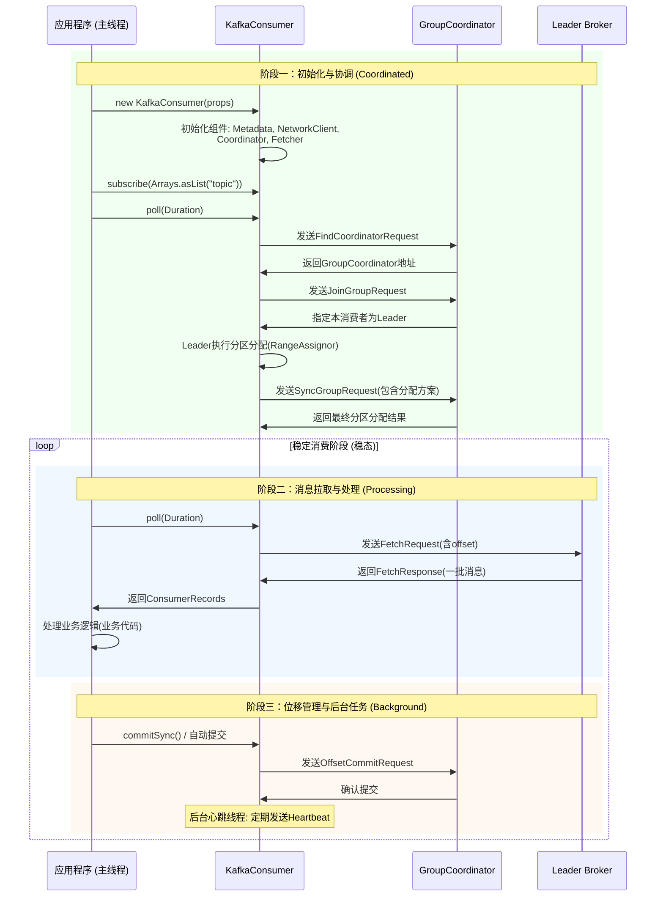
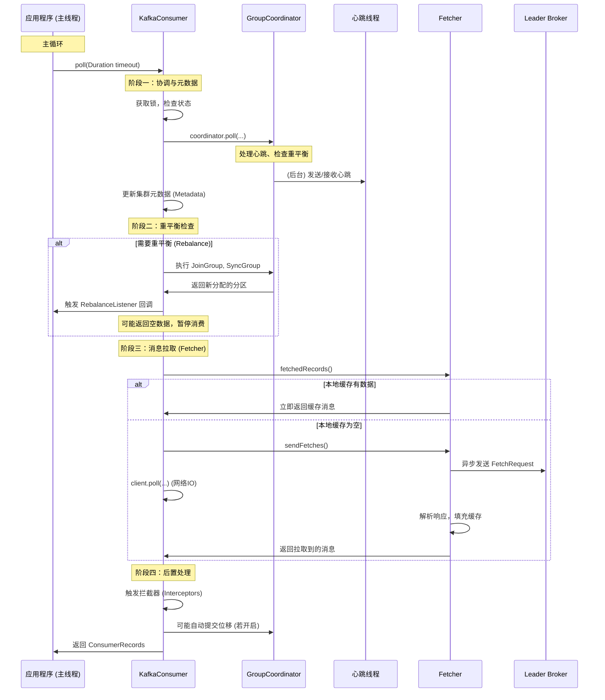

###### 1. Kafka 消费者的工作流程是什么？
Kafka消费者的工作流程是一个精巧的**单线程事件循环模型**，其核心设计目标是**高吞吐、可扩展和容错**。整个过程可以抽象为**初始化、加入组、拉取消息、位移管理**四个核心阶段，其完整生命周期与组件交互如下所示：

**源码级深度解析**：
1. **初始化 (`new KafkaConsumer()`)**：
    - 初始化了核心组件：`Metadata`（元数据缓存）、`ConsumerNetworkClient`（网络客户端）、`ConsumerCoordinator`（组协调器）、`Fetcher`（消息拉取器）`[1](@ref)`。
    - 注意：`KafkaConsumer`是**非线程安全**的，所有操作必须在同一线程，通常即调用 `poll`的主线程`[3](@ref)`。
2. **加入组与重平衡 (在第一次 `poll`中触发)**：
    - **寻找协调器**：消费者向Broker发送 `FindCoordinatorRequest`，根据 `group.id`的哈希值确定其对应的 `GroupCoordinator`（位于某个Broker上）`[4,5](@ref)`。
    - **加入组**：消费者向协调器发送 `JoinGroupRequest`。协调器会指定一个**Leader消费者**（通常是第一个加入的）。
    - **同步组状态**：**Leader消费者**根据分区分配策略（如RangeAssignor）计算分配方案，并通过 `SyncGroupRequest`上报给协调器，协调器再下发给所有组成员`[1,8](@ref)`。此后，每个消费者都明确了自己该消费哪些分区。
3. **消息拉取与处理 (核心循环)**：
    - `Fetcher`组件向已分配分区的Leader副本发送 `FetchRequest`，其中包含了要拉取的起始位移（Offset）。
    - 拉取到的消息被反序列化后，封装成 `ConsumerRecords`返回给用户线程处理。
4. **位移管理与后台任务**：
    - **位移提交**：处理完消息后，位移需要被提交到Kafka内部Topic `__consumer_offsets`中，以记录消费进度。这可以是自动的或手动的`[1,3](@ref)`。
    - **心跳机制**：一个后台线程（或由 `poll`驱动）会定期向协调器发送心跳，以告知消费者存活，防止被误判为下线而触发重平衡`[1,9](@ref)`。
###### 2. 消费者是如何订阅 Topic 的？
订阅是消费者声明其消费意图的方式，主要有三种API：
1. **订阅Topic列表**：`subscribe(Collection topics)`。最常用方式，支持**自动重平衡**。当消费者组内成员变化时，Kafka会自动重新分配分区。
2. **正则表达式订阅**：`subscribe(Pattern pattern)`。订阅所有与正则（如 `"test-.*"`）匹配的Topic。**支持动态发现**，当有新Topic匹配该正则时，消费者会自动订阅并触发重平衡`[2,3](@ref)`。
3. **直接分配分区**：`assign(Collection partitions)`。直接指定消费某些Topic的特定Partition。**这种方式下，消费者将脱离消费者组的管理，不会参与重平衡**，位移也需要自己完全管理。通常用于特殊场景`[2,6](@ref)`。
**源码视角**：调用 `subscribe`方法主要更新了 `SubscriptionState`对象的状态。真正的分区分配和加入组，是在第一次调用 `poll`方法时触发的`[1](@ref)`。
###### 3. 什么是消费者的 Rebalance？
**重平衡**是当消费者组内的消费者成员发生增减（如实例扩容、宕机），或订阅的Topic分区数发生变化时，Kafka为了**重新均衡负载**，将Topic的所有分区在组内当前所有存活的消费者之间进行重新分配的过程`[3,8,9](@ref)`。
**重平衡的负面影响是显著的**，主要包括`[9](@ref)`：
- **消费停滞**：在重平衡期间，整个消费者组的所有消费者都会暂停消息处理，导致**服务不可用**和**消息积压**。
- **重复消费**：重平衡前若位移未提交，新消费者会从上次提交的位移开始消费，导致**消息重复**。
- **系统开销**：频繁的重平衡会加剧集群负担。
###### 4. Rebalance 会带来什么问题？
不必要的重平衡主要指由于参数配置不当引发的，可通过以下策略优化`[9](@ref)`：

|**优化策略**​|**核心参数**​|**配置建议与原理**​|
|---|---|---|
|**调整超时参数**​|`session.timeout.ms`|**会话超时**（默认45s）。适当调大（如30s），避免因GC或网络抖动导致心跳超时。|
||`heartbeat.interval.ms`|**心跳间隔**（默认3s）。应设置为 `session.timeout.ms`的1/3以内，确保及时。|
||`max.poll.interval.ms`|**最大拉取间隔**（默认5min）。**最关键参数**。必须大于单批消息的最大处理时间，否则消费者会被踢出组。|
|**优化消费逻辑**​|-|将耗时的业务处理**异步化**。在 `poll`拿到消息后，立即交给后台线程池处理，然后快速再次调用 `poll`，避免阻塞。|
|**使用静态成员资格**​|`group.instance.id`|（Kafka 2.3+）为每个实例设置持久化ID。实例重启时会被视为同一成员，**避免因重启触发的重平衡**。|
|**采用粘性分区策略**​|`partition.assignment.strategy`|设置为 `StickyAssignor`。重平衡时**尽可能保留原有分配**，减少分区迁移，降低开销`[9](@ref)`。|
###### 5. 如何避免不必要的 Rebalance？
位移是消费进度的指针，存储在Kafka内部Topic `__consumer_offsets`中`[1,3](@ref)`。

|**特性**​|**自动提交**​|**手动提交**​|
|---|---|---|
|**控制方式**​|后台线程按时间间隔（`auto.commit.interval.ms`，默认5秒）自动提交`[10](@ref)`。|应用程序在消息处理成功后，主动调用 `commitSync()`（同步阻塞）或 `commitAsync()`（异步非阻塞）`[6,10](@ref)`。|
|**可靠性**​|**较低**。可能在消息处理前提交（丢消息），或处理后未提交（重复消费）`[10](@ref)`。|**高**。可实现“至少一次”语义（先处理，后提交，保证不丢，但可能重复）。|
|**适用场景**​|日志收集等允许少量消息误差的非核心业务。|**电商、金融等对可靠性要求高的核心业务**。**生产环境推荐使用**`[10](@ref)`。|
###### 6. 消费者的 Offset 是如何管理的？
保证可靠性是一个系统工程，核心是 **“至少一次”语义 + 业务幂等性**。
1. **禁用自动提交**：设置 `enable.auto.commit = false`。
2. **采用“至少一次”语义**：
    - **顺序处理**：在 `poll`拉取消息后，**先处理业务逻辑**，再**同步手动提交位移**（`commitSync`）。这保证了消息至少被处理一次。
    - **异常处理**：若处理失败，不应提交位移，可记录日志或将消息转入死信队列。
3. **实现业务逻辑的幂等性**：由于“至少一次”语义可能带来重复消息，消费者端的业务处理必须是**幂等**的。常见方法：
    - 利用数据库**唯一键约束**防止重复插入。
    - 使用 **Redis**​ 等设置唯一令牌（Token）。
    - 在业务数据中引入唯一ID（如订单ID），处理前先查重。
###### 7. 消费者的自动提交和手动提交有什么区别？
精确一次是最高级别的可靠性，意味着消息**必定被处理且仅被处理一次**。Kafka通过**事务**和**幂等性**相结合来实现。
1. **生产者端**：启用幂等（`enable.idempotence=true`）和事务（配置 `transactional.id`）。
2. **消费者端**：配置 `isolation.level=read_committed`。这样消费者只会读取已成功提交的事务性消息。
3. **端到端**：在Kafka流处理（Kafka Streams）中，可以将消息处理后的输出和位移提交放在同一个Kafka事务中，实现端到端的精确一次。对于普通消费者，实现极端复杂，通常追求 **“至少一次” + 幂等消费**​ 是更务实的选择。
###### 8. 如何保证消费者消费消息的可靠性？
Kafka采用**拉模式**，优势明显`[4](@ref)`：
- **可控的消费速率**：消费者根据自身处理能力决定拉取节奏，避免被Broker推垮（慢消费者问题）。
- **高效的批处理**：可一次性拉取一批消息（通过 `max.poll.records`控制），减少网络请求，提高吞吐。
- **灵活性**：可以主动回溯消费历史消息。
###### 9. 消费者如何实现精确一次消费（Exactly Once）？
`poll()`方法是核心驱动器，是**多功能的**`[1,7](@ref)`。
- **主要功能**：拉取消息。
- **后台任务**：在一次 `poll`调用中，它还会“暗中”处理：
    - 组协调（如JoinGroup、SyncGroup）。
    - 发送心跳，维持会话。
    - 执行位移的自动提交。
    - 更新集群元数据。
- **参数 `Duration timeout`**：此参数指**在无消息时，在Broker端等待新消息的最大时间**，而非整个方法的最大阻塞时间。设置为0则立即返回，设置为较大值可实现类似“阻塞监听”的效果。
###### 10. 消费者的拉取模式（Pull）有什么优势？
`KafkaConsumer`实例是**非线程安全**的。实现多线程消费有两大主流模式`[3](@ref)`：
1. **每线程一消费者**：
    - **描述**：启动多个消费者实例（每个在独立线程），属于同一个 `group.id`。
    - **优点**：**标准、简单、天然并行**，由Kafka负责负载均衡。
    - **推荐场景**：**绝大多数场景下的首选**。
2. **单消费者 + Worker线程池**：
    - **描述**：一个线程专用于 `poll`拉取消息，然后将消息分发到一个 `Worker`线程池进行业务处理。
    - **优点**：解耦消息获取与处理。
    - **巨大缺点**：
        - **位移提交极其复杂**：必须在所有Worker线程处理完一批消息后，才能提交位移。需要精细的协调机制。
        - **无法保证顺序**：消息被并行处理，分区顺序性被破坏。
        - 需设置很长的 `max.poll.interval.ms`。
###### 11. 消费者如何处理消费延迟？
策略由 `partition.assignment.strategy`指定`[1,3,9](@ref)`：

|**策略**​|**工作原理**​|**优点**​|**缺点**​|
|---|---|---|---|
|**RangeAssignor**​ (默认)|对每个Topic独立计算。按分区号和消费者字典序平均分配。|实现简单。|**易数据倾斜**。订阅Topic多时，前列消费者负担重`[3](@ref)`。|
|**RoundRobinAssignor**​|将所有Topic的分区打散，轮询分配给所有消费者。|分配更均匀。|消费者订阅不同Topic时，分配不均衡。|
|**StickyAssignor**​ (推荐)|首先保证均匀性，其次在重平衡时**极力保留原有分配**。|**分配均匀，重平衡开销最小**。生产环境推荐`[9](@ref)`。|-|
|**Cooperative StickyAssignor**​|粘性策略的升级，支持**增量重平衡**。|**进一步减少重平衡停顿时间**。|-|
###### 12. 什么是消费者的心跳机制？
Kafka消费者的心跳机制是其**高可用架构的核心组成部分**，本质上是消费者与集群之间维持**会话活性**的保活协议。它的主要目的不是传输数据，而是向**组协调器（GroupCoordinator）**​ 持续宣告“**我还活着，并且在正常工作中**”。
**1. 核心目标与设计哲学**
- **故障检测（Failure Detection）**：及时感知消费者实例是否宕机或发生不可恢复的故障。一旦协调器在指定时间内未收到心跳，便会判定该消费者失效，随后触发**重平衡（Rebalance）**，将其负责的分区重新分配给组内其他存活的消费者，从而保证整个消费组的持续服务能力。
- **维持组成员关系（Membership Liveness）**：在消费者正常处理消息期间，心跳是维持其在消费组中合法成员身份的唯一途径。只要心跳正常，即使该消费者当前没有消息需要处理，它也会一直被协调器视为活跃成员，保留其分配到的分区。
**2. 关键参数与协同工作**
心跳机制由三个关键参数共同控制，理解它们的协同关系至关重要。

|参数|默认值|角色与职责|相互关系|
|---|---|---|---|
|**`session.timeout.ms`**​|45秒|**会话超时时间**。协调器在此时间内未收到消费者心跳，则将其判定为失效并踢出消费组。|基础时间窗口|
|**`heartbeat.interval.ms`**​|3秒|**心跳发送间隔**。消费者发送心跳的频率。|应远小于 `session.timeout.ms`，通常建议 ≤ 1/3|
|**`max.poll.interval.ms`**​|5分钟|**最大轮询间隔**。消费者调用两次 `poll()`方法之间的最大允许间隔。|独立于心跳，用于检测消费逻辑是否“卡住”|
这三个参数共同构成了一个双重的健康检查机制：`session.timeout.ms`和 `heartbeat.interval.ms`负责检查**进程级别的存活**（进程是否挂掉），而 `max.poll.interval.ms`负责检查**消费逻辑的健康**（业务处理是否卡住）。
**3. 源码与架构视角**
在Kafka 0.10.1.0之后，心跳由一个**独立的后台线程（HeartbeatThread）**​ 负责发送，与主线程调用 `poll()`进行消息处理的逻辑实现了**解耦**。
- **独立心跳线程**：在消费者调用 `poll()`方法时，如果检测到需要启动心跳，便会创建并启动这个后台线程。
    ```java
    // 简化的源码逻辑（源于 Coordinator#startHeartbeatThreadIfNeeded）
    private synchronized void startHeartbeatThreadIfNeeded() {
        if (heartbeatThread == null) {
            heartbeatThread = new HeartbeatThread(); // 创建心跳线程
            heartbeatThread.start(); // 启动线程
        }
    }
    ```
- **工作流程**：该线程在一个循环中，每隔 `heartbeat.interval.ms`时间，就会通过 `ConsumerNetworkClient`向协调器发送一个心跳请求。发送成功后，会更新一个代表“最后心跳成功时间”的时间戳。
- **协调器的处理**：协调器端（`GroupCoordinator`）会为每个消费者维护一个会话定时器。每次收到有效心跳，就会刷新这个定时器。如果定时器超时（即超过 `session.timeout.ms`），协调器就会调用 `onExpireHeartbeat`方法，将该消费者从组中移除，并初始化重平衡流程。
这种设计带来的巨大优势是：**即使消费者的业务处理耗时很长（只要不超过 `max.poll.interval.ms`），心跳也能由独立线程正常发送，从而避免因业务处理慢而误触发重平衡**。
###### 13. 消费者的 poll() 方法是如何工作的？
`poll()`方法是Kafka消费者**最核心**的方法，其内部是一个**复杂的状态机驱动的事件循环**。它远不止是“拉取消息”，而是集成了**集群协调、元数据管理、心跳维护、消息抓取和位移管理**等一系列关键操作的入口。
**`poll()`方法的核心工作流程**
下面的序列图清晰地展示了一次 `poll()`调用所触发的完整内部流程，以及它与心跳线程、协调器、Broker之间的交互：

**源码级深度解析**
1. **状态检查与锁获取**
    `poll()`方法首先会调用 `acquireAndEnsureOpen()`获取锁并检查消费者状态。**`KafkaConsumer`是线程不安全的**，此锁确保同一时间只有一个线程能操作该实例。同时检查消费者是否已关闭或处于不可用的错误状态。
2. **元数据更新与协调器处理 (`coordinator.poll`)**
    这是最复杂的环节。它通过 `updateAssignmentMetadataIfNeeded`方法完成一系列关键操作：
    - **心跳处理**：即使心跳由独立线程发送，协调器状态的处理仍在此处进行。它会检查心跳响应，处理会话超时等问题。
    - **重平衡触发与执行**：检查是否满足重平衡条件（如成员变更）。如果需要，则依次执行 `JoinGroup`和 `SyncGroup`请求，重新分配分区，并调用用户注册的 `ConsumerRebalanceListener`。
    - **位移提交回调**：执行之前异步位移提交（如 `commitAsync`）的回调函数。
    - **自动提交**：如果开启自动提交，且到达提交间隔，会在此处异步提交位移。
3. **消息拉取 (`pollForFetches`)**
    这是用户最直观的“拉取”逻辑，由 `Fetcher`组件完成：
    - **检查本地缓存**：`Fetcher`内部维护了一个 `completedFetches`队列，存放已从网络拉取但尚未被 `poll()`方法返回的消息。这是实现高性能的关键：**网络I/O是异步的，`poll()`方法优先直接返回缓存数据，避免每次调用都发起网络请求。**
    - **异步发送拉取请求**：如果缓存为空，则通过 `sendFetches()`方法为每个分配到的分区构建 `FetchRequest`（请求中包含了下次要拉取的位移Offset），并异步地发送给对应的Broker。
    - **网络I/O**：调用 `ConsumerNetworkClient.poll(...)`方法，执行实际的网络读写，将准备好的请求发送出去，并处理接收到的响应。
    - **解析响应，填充缓存**：将Broker返回的响应解析成消息列表，存入 `completedFetches`缓存，供下一次 `poll()`调用返回。
4. **返回结果与拦截器**
    将拉取到的消息集传递给配置的拦截器链（`Interceptor`）进行后处理，最终返回给用户代码。
**关键点**：**`poll()`的超时参数 `Duration timeout`主要指的是**：**在本地缓存没有数据的情况下，允许阻塞等待新消息从Broker拉取回来的最长时间**。如果缓存中已有数据，它会立即返回。
###### 14. 如何实现消费者的多线程消费？
实现多线程消费的核心在于理解 **`KafkaConsumer`实例是线程不安全的**。所有解决方案都围绕如何安全地在多线程环境下使用它。
**方案一：每个线程拥有独立的 `KafkaConsumer`实例（推荐）**
这是**最标准、最简单、也是最推荐**的方式。每个处理线程都创建自己的 `KafkaConsumer`实例，并订阅相同的 `group.id`。
- **工作原理**：由Kafka的**组协调机制**自动进行分区分配。如果组内有3个消费者实例（即3个线程），Kafka会自动将Topic的分区平均（取决于策略）分配给它们。
- **优点**：
    - **实现简单**：无需复杂的线程间通信和任务分配逻辑。
    - **天然流控**：每个消费者独立管理自己的消费进度，速度互不干扰。
    - **容错性高**：一个线程崩溃，只影响其分配到的分区，Kafka会自动触发重平衡，将分区重新分配给其他健康实例。
- **注意事项**：
    - 消费者实例数不要超过Topic的分区总数，否则多余的消费者将闲置。
    - 每个连接都需要维护与集群的元数据、心跳等，资源开销相对较大。
**方案二：单 `KafkaConsumer`实例 + 多工作线程（Worker Thread Pool）**
此方案将消息的**拉取**与**处理**解耦。由一个专有线程（`PollThread`）负责调用 `poll()`拉取消息，然后将消息批量提交给一个由多个工作线程组成的线程池进行业务处理。
- **工作原理**：
    1. `PollThread`循环调用 `poll()`获取消息。
    2. 将获取到的 `ConsumerRecords`对象拆散，根据分区或Key分发到不同的阻塞队列（`BlockingQueue`）中。
    3. 工作线程从各自的队列中取出消息进行业务处理。
    4. 处理成功后，由专门的线程或机制负责提交位移。
- **优点**：
    - **提高吞吐**：解决了业务处理慢于消息拉取的问题，实现了消息处理阶段的水平扩展。
- **巨大缺点与复杂性**：
    - **位移提交极其复杂**：这是最大的挑战。你必须确保**一条消息被工作线程成功处理后，才能提交其位移**。由于拉取和处理是异步的，你需要在内存中精细地管理每个分区的位移状态，实现类似TCP的确认重传机制，避免消息丢失或重复。
    - **顺序性无法保证**：消息被并行处理，分区消息的顺序性被彻底打破。
    - **需要设置很长的 `max.poll.interval.ms`**：因为 `PollThread`本身不处理消息，它需要等待工作线程处理完，所以必须防止协调器因 `poll()`间隔过长而将其踢出组。
**结论**：对于绝大多数场景，**方案一（每线程一消费者）是首选**。只有在消息处理逻辑是**纯CPU密集型**、且已成为系统瓶颈、同时业务允许乱序的场景下，才考虑方案二，并需做好应对其复杂性的准备。
###### 15. 消费者的分区分配策略有哪些？
分区分配策略决定了在**重平衡**发生时，一个消费组内的消费者如何分配其订阅Topic的所有分区。策略通过 `partition.assignment.strategy`参数配置。

|策略类|名称|工作原理|优点|缺点|
|---|---|---|---|---|
|**`RangeAssignor`**​|范围分配|**默认策略**。对每个Topic独立计算。将分区按字典序排列，消费者按字典序排列，然后平均分配。|实现简单，易于理解。|**易导致数据倾斜**。当消费者订阅的Topic数量较多时，排在前面的消费者会分配到明显更多的分区。|
|**`RoundRobinAssignor`**​|轮询分配|将所有Topic的所有分区看作一个整体，按字典序排列，然后以轮询方式依次分配给每个消费者。|分配结果比Range更均匀，能避免数据倾斜。|当消费者组内的消费者订阅的Topic列表不一致时，分配结果可能不均衡。|
|**`StickyAssignor`**​|粘性分配|**追求两大目标**：1. 尽可能均匀分配；2. 在重平衡时，**尽可能保留**上一次分配的结果，只移动最少必要的分区。|**大幅减少重平衡带来的开销**。是生产环境下**推荐**的策略，能有效避免“重平衡风暴”。|-|
|**`CooperativeStickyAssignor`**​|协同粘性分配|`StickyAssignor`的升级版，支持**增量重平衡**。消费者在重平衡期间无需停止所有消费，只需停止即将被回收的分区。|**进一步减少重平衡的停顿时间**，实现更平滑的重新分配。是Kafka社区推荐的未来方向。|-|
**源码与配置视角**
这些策略都实现了 `PartitionAssignor`接口。重平衡时，组内的Leader消费者会调用 `assign(...)`方法计算分配方案，然后通过 `SyncGroup`请求将方案同步给协调器和所有成员。
```java
// 配置示例：使用粘性分配策略
Properties props = new Properties();
props.put(ProducerConfig.BOOTSTRAP_SERVERS_CONFIG, "localhost:9092");
// ... 其他配置
props.put("partition.assignment.strategy", "org.apache.kafka.clients.consumer.CooperativeStickyAssignor");
```