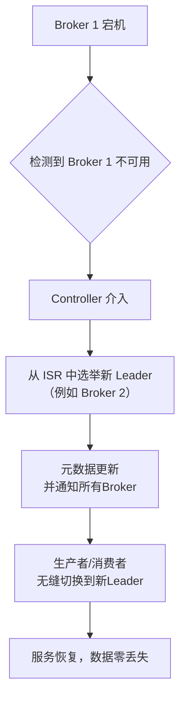

###### 1. Kafka 如何保证高可用性？
Kafka的高可用性建立在**分布式架构**和**数据冗余**两大基石之上，通过多组件协同工作，确保在部分节点故障时，整个集群依然能提供不间断的服务。
其高可用架构的核心是**分区（Partition）**​ 和**副本（Replica）**​ 机制。下面这张图清晰地展示了当一个Broker宕机时，Kafka如何通过副本机制自动进行故障转移，实现高可用：

**核心机制分解：**
1. **分区机制**：将Topic的数据分散到多个Partition中，每个Partition可以部署在不同的Broker上。这实现了**数据的水平切分和负载均衡**，避免了单点瓶颈。当某个Broker宕机时，只影响其承载的Partition，而非整个Topic的服务。
2. **副本机制**：每个Partition有多个副本（Replica），包括一个**Leader副本**和若干个**Follower副本**。
    - **Leader**：处理所有客户端（Producer和Consumer）的读写请求。
    - **Follower**：主动从Leader**异步拉取（Pull）**​ 数据，进行同步。一旦Leader宕机，其中一个Follower会被提升为新的Leader。
3. **控制器（Controller）与协调服务**：Kafka集群通过**控制器**来管理副本的状态和Leader选举。在早期版本中，控制器依赖ZooKeeper进行分布式协调；在新版本中，Kafka使用自身的**KRaft协议**进行元数据管理，消除了对ZooKeeper的外部依赖，简化了架构并提升了稳定性。
**源码视角**：在Broker启动时，会尝试在ZooKeeper或KRaft元数据日志中创建/controller节点，成功者成为Controller，承担集群大脑的角色。
###### 2. 什么是 ISR（In-Sync Replicas）？
**ISR是与Leader副本保持数据同步的副本集合**（包含Leader自身）。它是Kafka实现高可用和数据一致性的核心机制，在可靠性和性能之间取得了精妙的平衡。
- **维护机制**：Leader副本负责动态维护ISR列表。一个Follower副本之所以能留在ISR中，是因为它能够**在指定时间内（由 `replica.lag.time.max.ms`参数配置，默认10秒）追上Leader的进度**。如果一个Follower副本落后太多或长时间未发送拉取请求，Leader会将其从ISR中移除。
- **与AR的区别**：AR（Assigned Replicas）是指分配给某个Partition的所有副本的集合。而ISR是AR的一个子集，是**当前处于同步状态的、有资格在Leader宕机时立即被选举为新Leader的“精英”副本**。
**源码视角**：在Kafka的 `Partition`类中，ISR列表作为一个状态被维护。`ReplicaManager`会定期检查Follower的同步状态，并通过 `maybeShrinkIsr`等方法更新ISR。
###### 3. Leader 选举机制是什么？
当某个Partition的Leader副本宕机后，**控制器会从该Partition的ISR列表中自动选举一个新的Leader**。
- **选举过程**：
    1. **故障检测**：控制器通过心跳机制（或KRaft的元数据同步）发现Broker失联。
    2. **触发选举**：控制器遍历宕机Broker上的所有Partition，对每个Partition启动Leader选举。
    3. **选择新Leader**：**优先从ISR列表中选择第一个可用的副本**作为新Leader。这确保了新Leader拥有最完整的已提交消息，最大限度地保证数据不丢失。
    4. 更新元数据：控制器将新的Leader信息写入ZooKeeper或KRaft元数据日志，并通知其他Broker。
**设计优势**：与传统的“少数服从多数”投票算法相比，Kafka基于ISR的选举机制**不需要大量副本**（例如，3个副本就能容忍1个故障），在保证数据一致性的同时，降低了存储和同步开销，更适合大数据量的场景。
###### 4. 什么是 Unclean Leader 选举？
**Unclean Leader选举是指允许从非ISR副本（即落后较多的Follower）中选举Leader**。这是一个用**数据一致性换取服务可用性**的权衡策略。
- **触发条件**：当ISR列表中的所有副本都宕机时，Partition将不可用。如果此时开启了Unclean Leader选举（通过 `unclean.leader.election.enable=true`配置），Kafka允许从剩余的、非ISR的副本中选举Leader。
- **风险**：新Leader可能不包含ISR中最后提交的那些消息，导致**数据丢失**。同时，由于新Leader的数据是滞后的，Consumer可能会读到旧数据，造成**数据不一致**。
- **使用场景**：适用于更看重服务可用性、允许少量数据丢失的监控日志类场景。对于金融、交易等核心业务，**必须设置为 `false`**，以强制要求数据一致性
###### 5. Kafka 如何处理 Broker 宕机？
Kafka对Broker宕机的处理是一个全自动的容错流程，其故障恢复机制可以概括为以下几个核心步骤：
1. **故障检测**：控制器通过心跳或元数据同步机制（如ZooKeeper的临时节点）感知到Broker失联。
2. **Leader切换**：对于受影响的Partition，控制器立即触发Leader选举（从ISR中），秒级完成切换。在此期间，这些Partition的读写会有短暂不可用。
3. **副本同步**：宕机的Broker恢复后，其上所有的Follower副本会与新Leader重新建立连接，开始同步数据，追赶进度。如果它能重新追上Leader，就会被重新加入ISR。
4. **副本重平衡（可选）**：如果宕机是永久性的，管理员可以使用Kafka提供的工具，将缺失的副本重新分配到其他健康的Broker上，以恢复副本因子（Replication Factor）。
###### 6. 什么是 Controller 节点？它的作用是什么？
**Controller是Kafka集群的“管理大脑”**，它是一个被选举出来的特殊Broker，负责管理整个集群的元数据和状态。
**核心职责**：
- **分区和副本状态管理**：监控所有Partition和Replica的状态。
- **Leader选举**：负责执行前面提到的Partition Leader选举。
- **集群元数据管理**：维护和管理Topic创建、删除、分区扩展等操作的元数据，并同步给所有Broker。
**源码视角**：每个Broker启动时都会尝试创建 `KafkaController`实例。但只有一个Broker（即Controller）的实例会成功启动并激活（`active`），其他Broker的Controller实例则处于待命（`standby`）状态。Controller通过一系列监听器（Listener）和状态机（PartitionStateMachine, ReplicaStateMachine）来履行其职责。
###### 7. Controller 如何选举？
Controller的选举依赖于底层的分布式协调服务。
- **基于ZooKeeper的选举**：
    1. 所有Broker启动时，都尝试在ZooKeeper的 `/controller`路径下创建一个临时节点。
    2. 由于ZooKeeper保证节点唯一性，**只有一个Broker会创建成功**，该Broker即成为Controller。
    3. 其他Broker在该节点上注册Watcher进行监听。
    4. 如果当前Controller宕机，其创建的临时节点会自动消失，其他Broker通过Watcher得到通知，并立即触发新一轮的Controller选举。
- **基于KRaft的选举**：在Kafka 3.0+的KRaft模式下，Controller选举是其内置Raft共识算法的一部分，由集群节点投票决定，不再依赖外部ZooKeeper。
###### 8. Kafka 的副本同步机制是什么？
Kafka的副本同步采用**主从架构**和**拉取模式**。
1. **生产者发送**：Producer将消息发送给Partition的Leader副本。
2. **Leader本地写入**：Leader将消息顺序追加到本地日志（Commit Log）。
3. **Follower主动拉取**：Follower会定期（或连续地）向Leader发送FETCH请求，拉取新消息。
4. **Follower本地写入**：Follower将拉取到的消息同样顺序追加到自己的本地日志。
5. **更新位移**：Follower成功写入后，会更新自身的日志末端位移（LEO）。
6. **Leader更新HW**：Leader根据所有Follower的LEO和自己的LEO，计算并更新**高水位（HW）**。HW代表了已成功被所有ISR副本复制的消息边界，Consumer只能消费HW之前的消息。
###### 9. 什么是 HW（High Watermark）和 LEO（Log End Offset）？
这两个概念是理解Kafka副本同步和消费进度的关键。
- **LEO（Log End Offset）**：
    - 指向**当前副本日志中下一条待写入消息的位移**。
    - 每个副本（Leader和Follower）都有自己的LEO。
    - Leader的LEO通常是最高的，记为 `LEO`。
- **HW（High Watermark）**：
    - **消费者可见的最大消息位移**。所有副本中，**小于等于HW的消息被认为是“已提交”的**，不会因副本故障而丢失。
    - HW由Leader管理，其计算规则是：`HW = min(Leader's LEO, LEO of every Follower in ISR)`。即ISR中所有副本LEO的最小值。
**作用**：HW机制确保了数据的一致性。即使Leader宕机，新Leader的HW也代表了已安全复制的数据位置，避免了数据丢失。当Follower副本故障恢复后，会将自己的日志截断到HW处，然后从Leader重新同步，保证数据一致。
###### 10. Kafka 如何保证数据不丢失？
这是一个端到端的工程，需要生产者、Broker和消费者三方协同。

|环节|保证策略|核心配置与原理|
|---|---|---|
|**生产者**​|**ACK确认机制**​|设置为 `acks=all`（或 `-1`）。这意味着Producer会等待Leader收到所有ISR副本的确认后才认为消息发送成功。这是最可靠的模式。|
|**Broker**​|**副本与ISR机制**​|1. **设置足够的副本因子**：`replication.factor >= 3`。   2. **配置最小ISR**：`min.insync.replicas >= 2`。这样即使一个副本宕机，仍能满足 `acks=all`的条件，保证写入成功。|
|**消费者**​|**手动提交位移**​|1. **禁用自动提交**：`enable.auto.commit = false`。   2. **处理完消息后再手动提交位移**：在业务逻辑成功执行后，调用 `consumer.commitSync()`。这确保了“至少一次”语义，即消息不会因消费后未提交位移而丢失。|
###### 11. Kafka 如何保证数据不重复？
“不重复”即**幂等性**。Kafka通过两种机制来实现：
1. **生产者幂等性**：
    - **配置**：设置 `enable.idempotence = true`。
    - **原理**：Kafka会为每个Producer实例分配一个唯一的PID（Producer ID），并为每条消息分配一个序列号（Sequence Number）。Broker会缓存每个 `<PID, Partition>`已接收的最大序列号，如果收到重复的序列号，就会丢弃该消息，从而避免因Producer重试导致的消息重复。
2. **事务性消息**：
    - **配置**：为Producer和Consumer配置 `transactional.id`和 `isolation.level=read_committed`。
    - **原理**：允许将跨多个Partition的消息生产和消费封装到一个原子事务中。Consumer配置为 `read_committed`后，只会读取已成功提交的事务消息，避免了事务中止过程中部分消息被消费的问题，实现了跨分区的精确一次处理
###### 12. 什么是 Kafka 的最少同步副本数（min.insync.replicas）？
`min.insync.replicas`是一个**Broker端配置**，它定义了**一个消息被成功写入所要求的最少ISR副本数**。
- **工作逻辑**：当Producer设置 `acks=all`时，Leader必须等待至少 `min.insync.replicas`个副本（包括自己）确认收到消息，才会向Producer返回成功。
- **重要性**：假设你设置 `replication.factor=3`和 `min.insync.replicas=2`。那么，只要ISR中至少有2个副本存活，写入就能成功。即使一个Broker宕机，服务依然可用。但如果ISR副本数降至1（例如两个副本同时宕机），此时Producer的写入请求会失败（抛出 `NotEnoughReplicasException`），从而**牺牲可用性来保证数据一致性**，防止消息在未充分备份的情况下被确认为已提交。