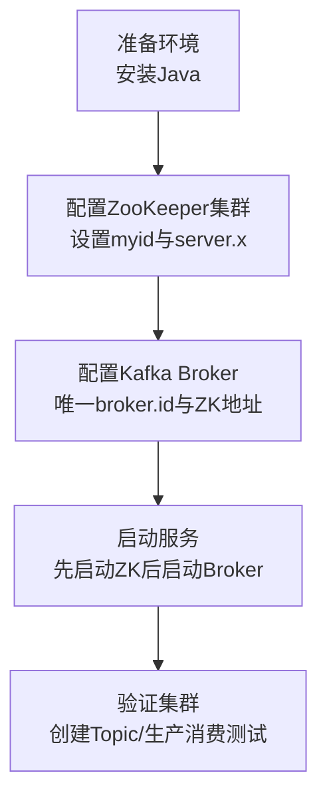

###### 1. 为什么要使用 Kafka 集群？
使用 Kafka 集群的核心目的是为了满足现代互联网应用对**高可用性、高吞吐量和可扩展性**的苛刻要求。其价值通过三大核心机制实现：
1. **高可用性与容错**：通过**副本机制**实现。每个 Topic 的分区有多个副本，分散在不同 Broker 上。当某个 Broker 宕机时，集群会自动从其他存活的副本中选举新的 Leader，实现故障转移，保证服务不间断。容错能力取决于副本因子，`n`个副本可容忍 `n-1`个节点故障 。
2. **水平扩展与负载均衡**：通过**分区机制**实现。一个 Topic 的数据被分散到多个分区，每个分区由不同的 Broker 提供服务。当需要提升吞吐能力时，可以通过增加 Broker 并重新分配分区，将负载均匀分布到更多节点上，实现近乎线性的性能提升 。
3. **海量数据持久化**：集群将消息持久化到磁盘，并通过多副本机制保证数据安全。单个节点的存储容量有限，集群通过将数据分布到多个节点，共同承担存储压力，支持海量数据的堆积和保留 。
**设计哲学**：Kafka 集群的设计遵循了分布式系统的“共享nothing”架构，Broker 之间无强依赖，通过 ZooKeeper（或 KRaft）进行轻量级协调，这使得它具备极好的水平扩展能力 。
###### 2. 如何搭建 Kafka 集群？
搭建一个基本的 Kafka 集群主要包括以下步骤，其核心配置交互关系如下：

以下是具体步骤与关键配置：
1. **环境准备**：确保所有服务器上已安装相同版本的 Java 8 或更高版本环境 。
2. **配置 ZooKeeper 集群**：Kafka 依赖 ZooKeeper 进行元数据管理和领导者选举。
    - **配置文件**​ (`zoo.cfg`)：主要配置 `dataDir`（数据目录）、`clientPort`（客户端端口）以及 `server.x`列表，其中 `x`对应每个 ZooKeeper 节点的 `myid`文件中的数字 。
    - **创建 `myid`文件**：在每个 ZooKeeper 节点的 `dataDir`目录下创建 `myid`文件，内容为对应的唯一数字 ID（如1,2,3）。
3. **配置 Kafka Broker**：修改每个 Broker 的 `config/server.properties`文件。
    - `broker.id=0`：**必须唯一**，是 Broker 在集群中的唯一标识 。
    - `listeners=PLAINTEXT://:9092`：监听地址和端口。
    - `log.dirs=/tmp/kafka-logs`：Kafka 数据日志的存储目录。
    - `zookeeper.connect=node1:2181,node2:2181,node3:2181`：**关键配置**，指向 ZooKeeper 集群的所有节点地址 。
4. **启动与验证**：
    - **启动顺序**：先启动 ZooKeeper 集群，再启动所有 Kafka Broker 。
    - **验证命令**：使用 `kafka-topics.sh`脚本创建 Topic、`kafka-console-producer.sh`生产消息、`kafka-console-consumer.sh`消费消息，验证整个数据链路是否通畅 。
###### 3. Kafka 集群如何扩容？
扩容是 Kafka 应对业务增长的核心能力，主要包括**增加 Broker 节点**和**增加分区**两种方式。
**增加 Broker 节点（水平扩展）**：
1. **准备新节点**：在新服务器上完成与现有集群相同版本的 Kafka 安装和基础配置，确保 `broker.id`唯一，并指向相同的 ZooKeeper 集群 。
2. **启动并加入集群**：启动新 Broker，它会自动注册到 ZooKeeper 并加入集群。此时，**新创建的 Topic 可能会分布到新 Broker 上，但已有 Topic 的分区不会自动迁移**​ 。
3. **分区重分配（关键步骤）**：使用 Kafka 提供的 `kafka-reassign-partitions.sh`工具，生成并执行分区重分配计划，将现有 Topic 的一些分区及其副本迁移到新 Broker 上，实现负载均衡 。此过程可能耗时较长，建议在业务低峰期进行并限制迁移速率以减少对业务的影响 。
**增加 Topic 的分区数**：使用 `kafka-topics.sh --alter --partitions`命令增加分区数。注意，分区数只能增加不能减少，且增加后可能会影响基于 Key 的消息顺序性 。
###### 4. Kafka 集群如何缩容？
缩容是安全地移除集群中的 Broker，核心在于**先迁移数据，再下线节点**。
1. **规划**：确定要下线的目标 Broker ID。
2. **分区迁移**：使用 `kafka-reassign-partitions.sh`工具，生成一个将所有分区副本从目标 Broker 迁移到其他留存 Broker 的重分配计划，并执行该计划 。这是缩容最关键的步骤，确保目标 Broker 上不再存有任何分区的副本。
3. **监控迁移进度**：使用工具的 `--verify`选项监控迁移状态，直到所有分区都成功迁移 。
4. **安全下线**：确认迁移完成后，停止目标 Broker 进程。此时，该 Broker 已不再服务于任何数据，可以安全地从集群中移除 。**切勿直接关闭 Broker**，否则会导致其承载的分区暂时不可用。
###### 5. 如何进行 Kafka 集群的升级？
推荐采用**滚动升级**的方式，以实现业务不中断或仅有短暂中断的平滑升级。
1. **备份与检查**：备份配置和数据，并**严格检查升级路径的版本兼容性**​ 。
2. **逐个节点升级**：
    - 依次停止集群中的一个 Broker 节点。
    - 更新该节点的 Kafka 软件版本和配置文件。
    - 重启该节点，并等待它重新加入集群，完成数据同步。
3. **重复步骤**：对集群中的每个 Broker 节点重复上述操作。
4. **验证**：升级完成后，全面测试集群功能。如果 ZooKeeper 也需要升级，同样采用滚动方式 。务必在业务低峰期进行操作。
###### 6. 什么是 Kafka 的地域复制？
地域复制是指**将 Kafka 集群中的数据自动、异步地复制到另一个物理位置（如另一个数据中心或云区域）的 Kafka 集群中**。其主要目的是：
- **灾备**：当主数据中心发生严重故障时，可以快速切换到备数据中心。
- **就近服务**：让不同地理位置的消费者能够从离自己最近的集群消费数据，降低访问延迟。
- **数据聚合**：将多个边缘机房的数据汇总到中央集群进行分析。
###### 7. 什么是 MirrorMaker？它的作用是什么？
MirrorMaker 是 Kafka 官方提供的、用于实现**集群间数据复制**的工具集。其核心架构是一个独立的消费者-生产者管道 。
- **工作原理**：一个或多个 MirrorMaker 实例从**源集群**的一个或多个 Topic **消费**消息，然后不经过任何处理（或可配置少量处理）地将这些消息**生产**到**目标集群**的同名 Topic 中。
- **核心作用**：
    1. **构建灾备系统**：实现跨机房、跨地域的数据同步。
    2. **数据迁移**：帮助将数据从一个旧的 Kafka 集群迁移到新的集群。
###### 8. MirrorMaker 和 MirrorMaker 2 有什么区别？
MirrorMaker 2（MM2）是对初代 MirrorMaker 的彻底重构，解决了其诸多痛点。

|特性|MirrorMaker (初代)|MirrorMaker 2 (MM2)|
|---|---|---|
|**架构模式**​|独立的 Consumer-Producer 管道，配置相对独立。|深度集成的**连接器**，基于 Kafka Connect 框架，管理更便捷。|
|**偏移量同步**​|**不支持**。目标集群的偏移量与源集群不同，故障切换后易导致重复消费或丢失。|**支持**。通过内部 Topic 同步偏移量，能实现更精确的故障转移。|
|**Topic 配置同步**​|不自动同步 Topic 的配置（如分区数、保留策略）。|**自动同步**​ Topic 的配置和 ACL（访问控制列表）。|
|**双向复制**​|配置复杂，容易形成消息循环。|内置**防止消息循环**的机制，简化双向复制配置。|
**结论**：对于新项目，**强烈推荐使用 MirrorMaker 2**，它在可靠性、易用性和功能上都远超初代。
###### 9. Kafka 集群如何进行跨机房部署？
跨机房部署主要考虑**网络延迟和带宽成本**，常见的模式有：
1. **主从模式**：在主数据中心部署完整集群，在从数据中心部署一个灾备集群，通过 MirrorMaker 进行单向同步。
2. **双活模式**：在两个数据中心部署规模相近的集群，并配置双向复制。此模式复杂度高，需精心设计以防止消息循环和处理冲突。
3. **机架感知**：即使在单集群跨机房部署时，也应配置 `broker.rack`参数，Kafka 会尽量将同一分区的副本分布到不同机架（机房），以提升容灾能力 。
###### 10. 如何备份和恢复 Kafka 数据？
Kafka 的数据可靠性主要通过其**多副本机制**在集群内部保证。所谓的“备份恢复”更多指逻辑数据的导出和导入。
- **备份**：实质是**消费数据并存入外部系统**。可以使用 `kafka-console-consumer.sh`脚本将特定 Topic 的数据重定向到文件，但更生产化的方式是使用 **Kafka Connect**​ 框架，将数据实时备份到如 HDFS、S3、或其他数据库等持久化存储中。
- **恢复**：实质是**将外部数据作为数据源重新生产到 Kafka**。可以使用 `kafka-console-producer.sh`脚本从文件读取数据并发送，或使用 Kafka Connect 从外部存储拉取数据并灌入 Kafka。
**注意**：Kafka 自身的副本不是传统意义上的备份，它防止的是节点故障，无法防止逻辑错误（如误删 Topic）。因此，对于关键数据，建议结合 MirrorMaker 做跨集群复制，或使用 Connect 进行周期性的异地、异质备份。