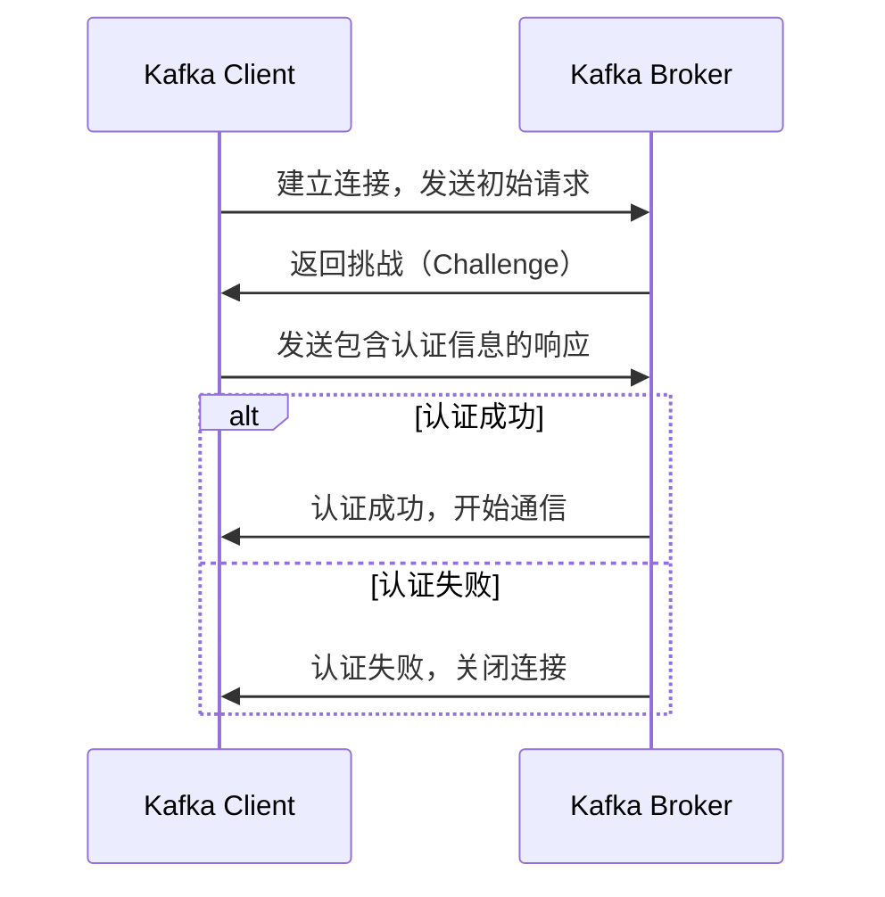
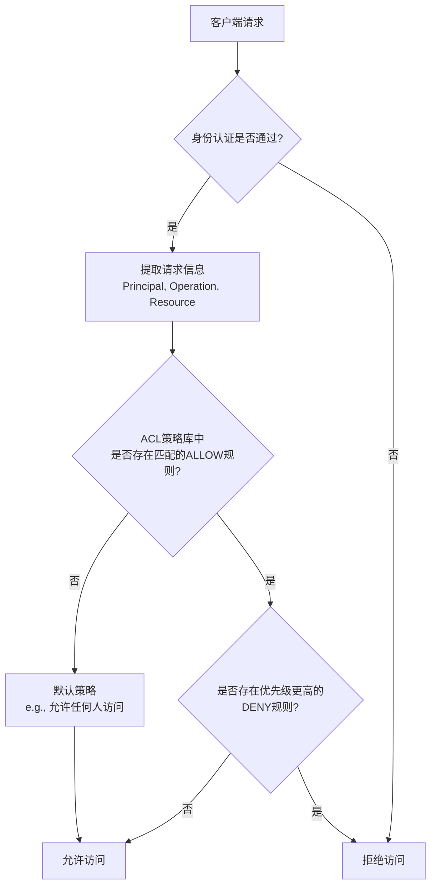

###### 1. Kafka 支持哪些认证机制？
Kafka 提供了一套完整的安全框架，主要包括**认证（Authentication）、信道加密（Encryption）和授权（Authorization）**​ 三大功能 。其认证机制灵活多样，可根据安全需求选择不同方案。
**核心认证机制概览**

|机制/协议|认证方式|安全级别|适用场景|特点|
|---|---|---|---|---|
|**SSL/TLS 双向认证**​|基于数字证书|高|生产环境，需严格身份校验|客户端和服务端互相验证证书，信道加密|
|**SASL/GSSAPI (Kerberos)**​|票据（Ticket）|非常高|企业内网（已有 Kerberos 或 Active Directory）|集成企业级认证系统，配置复杂|
|**SASL/PLAIN**​|用户名/密码|低（若未加密）|测试或内部安全网络|配置简单，但密码明文传输，**必须与 SSL 结合**用于生产|
|**SASL/SCRAM**​|用户名/密码（挑战-响应）|中到高|生产环境|密码不以明文传输，支持动态增减用户，比 PLAIN 安全|
|**SASL/OAUTHBEARER**​|OAuth 2.0 令牌|高|云原生和微服务架构|适合基于令牌的现代认证体系|
**设计与选型建议**
- **信道加密**：SSL 协议用于加密网络数据传输，防止窃听和篡改 。
- **机制组合**：实际应用中常组合使用，例如 `SASL_SSL`（SASL 认证 over SSL 加密）是生产环境常见配置 。
- **选型考量**：选择机制时需权衡安全需求、运维复杂度和现有基础设施。对于多数生产环境，**SASL/SCRAM 或 SASL/PLAIN over SSL（即 SASL_SSL）**​ 是平衡安全与易用性的选择 。
###### 2. 什么是 Kafka 的 SASL 认证？
SASL 是一个用于网络协议认证的框架，Kafka 利用 SASL 在客户端与 Broker、Broker 与 Broker 以及 Broker 与 ZooKeeper 之间实现身份验证 。其核心流程如下：


**核心组件：JAAS**
Kafka 通过 **JAAS（Java Authentication and Authorization Service）**​ 配置 SASL 。JAAS 使用登录模块（LoginModule）来封装特定认证机制的细节。
- **Broker 端配置**：在 `server.properties`中指定 JAAS 配置，可以是静态文件路径或直接内嵌配置 。
    ```properties
    # 方式一：通过 JVM 参数指定静态文件
    -Djava.security.auth.login.config=/etc/kafka/kafka_server_jaas.conf
    
    # 方式二：在 server.properties 中内嵌配置（Kafka 2.0+）
    sasl.jaas.config=org.apache.kafka.common.security.plain.PlainLoginModule required \
        username="admin" \
        password="admin-secret" \
        user_admin="admin-secret" \
        user_alice="alice-secret";
    [3,5](@ref)
    ```
- **客户端配置**：同样可通过 JVM 参数或 Producer/Consumer 的属性进行配置，为同一 JVM 内不同客户端使用不同凭据提供了灵活性 。
    ```java
    Properties props = new Properties();
    props.put("bootstrap.servers", "localhost:9092");
    props.put("security.protocol", "SASL_SSL");
    props.put("sasl.mechanism", "PLAIN");
    props.put("sasl.jaas.config", 
        "org.apache.kafka.common.security.plain.PlainLoginModule required " +
        "username=\"alice\" " +
        "password=\"alice-secret\";");
    [5](@ref)
    ```
###### 3. Kafka 如何配置 SSL 加密？
SSL/TLS 加密用于保证 Kafka 通信的机密性和完整性。配置过程涉及证书生成、Broker 和客户端设置 。
**核心配置步骤**
1. **生成证书**
    - 创建自签名 CA 或使用公共 CA。
    - 为每个 Broker 生成密钥对和证书签名请求（CSR），由 CA 签名后得到证书。
    - 创建包含 CA 证书的信任库（Truststore），供通信方验证证书链。常用 `keytool`命令操作 。
2. **配置 Broker**
    在 `server.properties`中启用 SSL 监听器并配置相关路径和密码。
    ```properties
    # 启用 SSL 监听器
    listeners=SSL://:9093
    # 指定密钥库和信任库
    ssl.keystore.location=/var/private/ssl/kafka.server.keystore.jks
    ssl.keystore.password=keystore_password
    ssl.key.password=key_password
    ssl.truststore.location=/var/private/ssl/kafka.server.truststore.jks
    ssl.truststore.password=truststore_password
    # 启用客户端认证（双向认证）
    ssl.client.auth=required
    # 设置协议和算法
    ssl.enabled.protocols=TLSv1.2,TLSv1.3
    ssl.endpoint.identification.algorithm=HTTPS
    [4,7](@ref)
    ```
3. **配置客户端**
    客户端需配置信任库（若启用双向认证，还需配置密钥库）。
    ```properties
    security.protocol=SSL
    ssl.truststore.location=/path/to/client.truststore.jks
    ssl.truststore.password=truststore_password
    # 如需双向认证
    ssl.keystore.location=/path/to/client.keystore.jks
    ssl.keystore.password=keystore_password
    ssl.key.password=key_password
    [4,7](@ref)
    ```
###### 4. Kafka 的 ACL（访问控制列表）是什么？
ACL 是 Kafka 实现**授权（Authorization）**​ 的核心机制，用于控制经过认证的用户（Principal）对特定资源（Resource）能否执行某些操作（Operation） 。其核心模型可以概括为以下流程：

**ACL 核心概念**
- **资源（Resource）**：Kafka 中受保护的实体，包括：
    - `TOPIC`（主题）
    - `GROUP`（消费者组）
    - `CLUSTER`（集群）
    - `TRANSACTIONAL_ID`（事务ID）
    - `DELEGATION_TOKEN`（委托令牌） 。
- **操作（Operation）**：对资源执行的动作，如 `READ`（消费）、`WRITE`（生产）、`DESCRIBE`（查看详情）、`CREATE`、`DELETE`、`ALTER`等 。
- **权限类型（Permission Type）**：`ALLOW`（允许）或 `DENY`（拒绝）。当规则冲突时，通常 `DENY`规则优先 。
- **模式类型（Pattern Type）**：定义资源名称的匹配方式，如 `LITERAL`（字面匹配）、`PREFIXED`（前缀匹配） 。
###### 5. 如何配置 Kafka 的权限管理？
配置 Kafka 的权限管理主要包括启用 ACL 授权器、使用命令行工具管理规则以及遵循最佳实践 。
**1. 启用 ACL**
在 Broker 的 `server.properties`中配置：
```properties
# 启用 ACL 授权器
authorizer.class.name=kafka.security.authorizer.AclAuthorizer
# 设置未配置 ACL 时的默认行为（通常设为 false，即显式允许才可访问）
allow.everyone.if.no.acl.found=false
# 可选：指定超级用户，拥有所有权限
super.users=User:admin;User:kafkabroker
[2,5](@ref)
```
**2. 使用 kafka-acls.sh 管理 ACL**
Kafka 提供 `kafka-acls.sh`命令行工具进行权限管理 。
- **授予生产者权限**（允许用户 `alice`从 IP `192.168.1.100`对主题 `test-topic`进行写操作）：
    ```bash
    kafka-acls.sh --bootstrap-server localhost:9092 --add \
      --allow-principal User:alice \
      --allow-host 192.168.1.100 \
      --operation Write --operation Describe \
      --topic test-topic
    [5](@ref)
    ```
- **授予消费者权限**（允许用户 `bob`从消费者组 `group1`读取主题 `test-topic`）：
    ```bash
    kafka-acls.sh --bootstrap-server localhost:9092 --add \
      --allow-principal User:bob \
      --operation Read --group group1 \
      --topic test-topic
    [5](@ref)
    ```
- **查看 ACL**：
    ```bash
    kafka-acls.sh --bootstrap-server localhost:9092 --list --topic test-topic
    ```
**3. 最佳实践**
- **最小权限原则**：只授予用户完成任务所必需的最小权限 。
- **SSL + SASL + ACL**：生产环境推荐组合使用 SSL 加密、SASL 认证和 ACL 授权，构建纵深防御体系 。
- **避免使用 PLAIN 明文传输**：除非在绝对安全的网络环境中，否则 SASL/PLAIN 应与 SSL 结合使用（即 `SASL_SSL`） 。
- **定期审计权限**：定期使用 `--list`命令审查 ACL 规则，清理不必要的权限 。