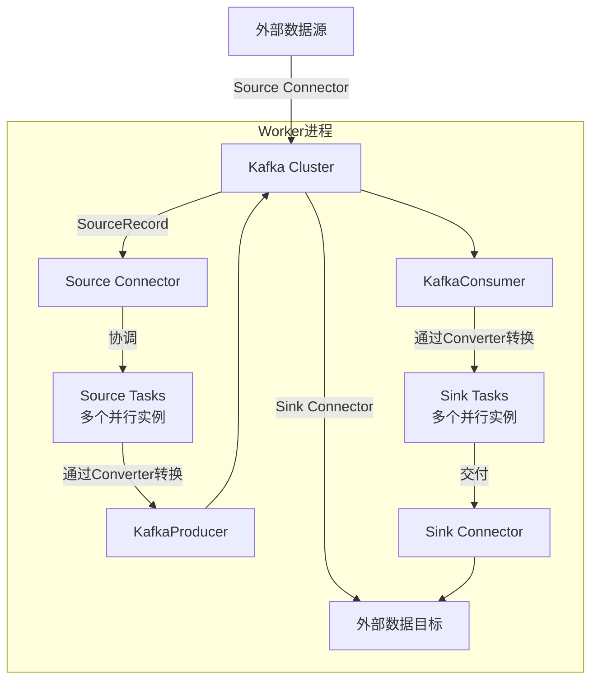

###### 1. 什么是 Kafka Connect？
Kafka Connect 是 Apache Kafka 生态系统中的一个核心组件，是一个专为在 **Kafka 和外部系统（如数据库、消息队列、云存储、文件系统等）之间进行可靠、可扩展数据流传输**​ 而设计的工具或框架 。其核心定位是**简化数据集成**，让你无需编写大量样板代码，就能构建高效的数据管道 。
**核心价值与设计哲学：**
1. **专注于数据管道**：Kafka Connect 将数据从源系统到 Kafka，或从 Kafka 到目标系统的流动过程进行高度抽象，形成标准化的“连接器”插件。它处理了诸如分布式执行、容错、偏移量管理、序列化等复杂问题，让开发者只需关注特定系统的数据读写逻辑即可 。
2. **插件化架构**：其强大之处在于丰富的连接器生态。社区已有上百种连接器，支持与主流数据系统（如 MySQL、Elasticsearch、S3、Oracle、MongoDB 等）无缝集成 。你可以“即插即用”，极大地提升了开发效率。
3. **生产级特性**：它原生支持**水平扩展**和**容错**。在分布式模式下，多个 Worker 节点会自动协调工作负载，当节点故障时，任务会自动重新分配到健康节点上，保证数据管道的高可用性 。它还与 Kafka 的安全、监控等生态紧密集成。
与直接使用 Kafka Producer/Consumer API 自行开发集成工具相比，Kafka Connect 提供了一个**更高级、更健壮、更易维护**的解决方案，避免了重复解决分布式系统中的共性难题 。
###### 2. Kafka Connect 的核心概念有哪些？
理解 Kafka Connect 的运作机制，需要掌握其核心抽象概念，它们之间的协作关系如下：

**1. Connector（连接器）**
这是**逻辑作业**的抽象，负责管理数据复制的方向和元数据。它本身不直接处理数据，而是负责创建和管理实际干活的 **Task**​ 。它有两种类型：
- **Source Connector**：从外部系统（如数据库）读取数据，并写入 Kafka Topic。
- **Sink Connector**：从 Kafka Topic 读取数据，并写入外部系统（如 Elasticsearch）。
**2. Task（任务）**
任务是**数据复制的实际执行者**。一个 Connector 可以根据数据量大小被分解为多个 Task 并行执行，这是 Kafka Connect 实现高性能和水平扩展的关键 。Task 是**无状态**的，其状态（如读取进度、配置）存储在 Kafka 的内部 Topic 中，这使得它们可以随时启停或重新分配，实现容错 。
**3. Worker（工作进程）**
Worker 是**执行 Connector 和 Task 的物理进程**​ 。Kafka Connect 支持两种运行模式：
- **独立模式**：所有 Connector 和 Task 在单个 Worker 进程中运行。简单，但无高可用性 。
- **分布式模式**：多个 Worker 进程组成一个集群，通过相同的 `group.id`进行协同。它们会自动平衡集群中所有 Connector 和 Task 的负载，提供可扩展性和容错能力 。这是生产环境的标配。
**4. Converter（转换器）**
Converter 负责在 Kafka 的字节数组格式与 Connect 内部数据格式（包含 Schema 和 Value 的结构化数据）之间进行**序列化和反序列化**​ 。常见的 Converter 有 `StringConverter`、`JsonConverter`和与 Schema Registry 配合使用的 `AvroConverter`等。Converter 与 Connector 解耦，可以被任何 Connector 复用。
**5. Transform（转换）**
Transform 是用于对单条消息进行**轻量级修改**的简单逻辑，例如重命名字段、添加时间戳、根据值路由到不同 Topic 等。多个 Transform 可以链式组合使用 。对于复杂的流处理逻辑，建议使用 Kafka Streams。
**6. Dead Letter Queue（死信队列）**
当 Sink Connector 无法处理某条记录时（如数据格式错误），可以配置 `errors.tolerance=all`并将这些失败记录路由到一个专门的 Kafka Topic（死信队列），而不是让整个 Task 失败。这便于后续排查问题和数据修复 。
###### 3. 什么是 Source Connector 和 Sink Connector？
这是 Kafka Connect 中两种最基本的 Connector 类型，定义了数据流动的方向。

|特性|Source Connector|Sink Connector|
|---|---|---|
|**数据流向**​|**从外部系统到 Kafka**​|**从 Kafka 到外部系统**​|
|**核心职责**​|从源系统（如数据库表、日志文件）拉取或监听数据变更，并将其转换为消息写入指定的 Kafka Topic。|从指定的 Kafka Topic 消费消息，将其转换为外部系统（如数据库、索引）所能理解的格式并写入。|
|**应用场景**​|数据库变更捕获、日志文件收集、应用指标采集。|数据导出到数据仓库、索引到搜索引擎、归档到对象存储。|
|**配置示例**​|需配置 `connector.class`（如 `JdbcSourceConnector`）、`tasks.max`、连接信息以及 `topic.prefix`等 。|需配置 `connector.class`（如 `JdbcSinkConnector`）、`tasks.max`、连接信息以及 **`topics`**​ 或 **`topics.regex`**​ 。|
**工作流程（源码视角）：**
- **Source Task**：在 `WorkerSourceTask`线程中，循环调用自定义 SourceTask 的 `poll()`方法获取一批 `SourceRecord`。然后使用配置的 Converter 将其序列化为字节数组，最后通过一个**被所有 Source Task 共享的 KafkaProducer 实例**发送到 Kafka 。
- **Sink Task**：在 `WorkerSinkTask`线程中，每个 Task 拥有**自己独立的 KafkaConsumer 实例**。它从 Kafka 拉取消息，使用 Converter 反序列化为 `SinkRecord`，然后调用自定义 SinkTask 的 `put()`方法将记录写入外部系统。成功后，通过 Consumer 提交偏移量 。
###### 4. 如何开发自定义的 Kafka Connector？
当现有连接器无法满足需求时，需要开发自定义 Connector。以下是核心步骤和源码级要点。
**1. 实现 Source Connector**
- **创建 Connector 类**：继承 `SourceConnector`。主要实现以下方法：
    - `start(Map<String, String> props)`：初始化配置。
    - `taskClass()`：返回实现该 Connector 的 Task 类。
    - `taskConfigs(int maxTasks)`：**这是关键**。根据最大任务数，将数据源（如数据库表、文件分片）合理划分为多个子集，为每个 Task 生成一份独立的配置列表。例如，一个有 3 个表的源，可以创建 3 个 Task，每个 Task 负责一个表 。
    - `stop()`：清理资源。
- **创建 Task 类**：继承 `SourceTask`。主要实现：
    - `poll()`：**核心方法**。从源系统获取数据，返回 `List<SourceRecord>`。该方法应避免阻塞，并周期性地返回数据。
    - `start(Map<String, String> props)`：根据配置启动任务。
    - `stop()`：停止任务。
**2. 实现 Sink Connector**
- **创建 Connector 类**：继承 `SinkConnector`。方法与 SourceConnector 类似，`taskConfigs`方法通常根据 `topics`或分区进行任务划分。
- **创建 Task 类**：继承 `SinkTask`。主要实现：
    - `put(Collection<SinkRecord> records)`：**核心方法**。将一批记录写入目标系统。需要处理幂等性或事务，以保证“至少一次”或“精确一次”语义。
    - `start(Map<String, String> props)`：启动任务。
    - `flush(Map<TopicPartition, OffsetAndMetadata> currentOffsets)`：可选，确保记录被持久化。
**3. 偏移量管理（仅对 Source Connector 重要）**
在 `SourceRecord`中，除了主题和值，还需要提供 `sourcePartition`和 `sourceOffset`。这是一个 Map 结构，用于唯一标识数据源中的读取位置（如数据库的表名和行ID，或文件名和行号）。Kafka Connect 会将它存储在 `connect-offsets`Topic 中，任务恢复时，会将该偏移量信息传递给 Task，以便从断点继续读取 。
**4. 打包与部署**
将实现类及其依赖打包为 JAR 文件，放入 Kafka Connect 工作节点的 `plugin.path`目录下，重启 Worker 即可被识别和加载 。
###### 5. Kafka Connect 的分布式模式和独立模式有什么区别？
这两种模式是 Kafka Connect 的不同运行时形态，适用于不同场景，其核心区别如下：

| 维度           | 独立模式                                           | 分布式模式                                                                                                    |
| ------------ | ---------------------------------------------- | -------------------------------------------------------------------------------------------------------- |
| **架构与进程**​   | **单进程**。所有 Connector 和 Task 运行在单一 Worker 进程中 。 | **多进程集群**。多个 Worker 进程通过相同的 `group.id`组成集群，协同工作 。                                                        |
| **高可用性与容错**​ | **差**。该 Worker 进程宕机，整个数据管道即中断 。                | **强**。自动容错。如果一个 Worker 宕机，其负责的 Connector 和 Task 会被集群中存活的 Worker 自动重新分配并恢复 。                              |
| **可扩展性**​    | **差**。只能通过增强单机性能进行垂直扩展，有上限。                    | **优秀**。通过添加新的 Worker 节点即可实现水平扩展，系统自动进行负载重平衡 。                                                            |
| **管理与配置**​   | 通过**配置文件**和**命令行参数**启动和管理，配置相对简单 。             | 通过 **REST API**​ 进行动态管理（创建、查看、修改、删除连接器），非常适合自动化运维和集成 。                                                   |
| **状态存储**​    | 偏移量和配置默认存储在本地文件（如 `connect.offsets`文件）中 。      | 偏移量、配置和状态存储在 Kafka 内部的三个专用 Topic 中（`connect-offsets`, `connect-configs`, `connect-status`），实现了中心化管理和容错 。 |
| **适用场景**​    | 开发、测试、概念验证，或数据量小、可靠性要求不高的边缘场景 。                | **生产环境**。需要高可用、高吞吐、易运维的大规模数据集成场景 。                                                                       |
**配置差异示例：**
分布式模式需要配置集群标识和内部 Topic：
```properties
# config/connect-distributed.properties
bootstrap.servers=kafka-broker1:9092,kafka-broker2:9092
group.id=my-connect-cluster  # 集群唯一标识
config.storage.topic=connect-configs
offset.storage.topic=connect-offsets
status.storage.topic=connect-status
```