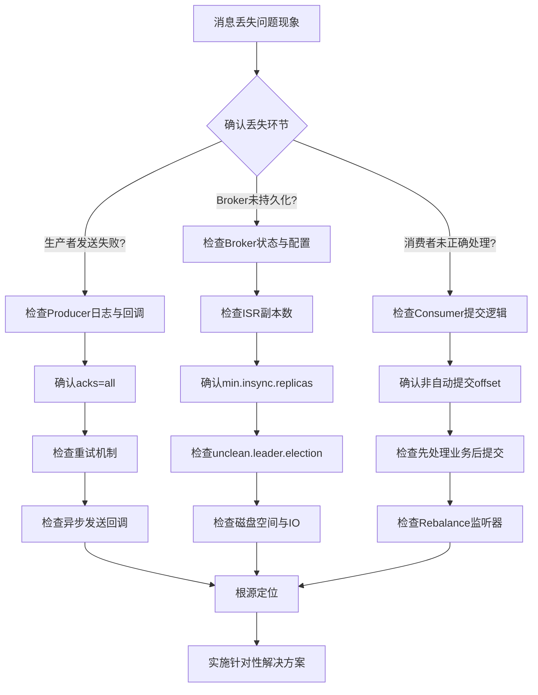

###### 1. 如何排查 Kafka 消息丢失问题？
消息丢失是Kafka应用中最为严重的问题之一，其排查需要遵循一条清晰的路径，贯穿Producer、Broker和Consumer三大组件。下图清晰地展示了从问题现象到根源的完整排查流程：

**（1）Producer端排查与解决方案**
消息丢失的排查起点永远是Producer端。核心在于确认消息是否成功离开了客户端。
- **检查发送回调**：**绝对禁止**使用`producer.send(record)`这种"发后即忘"的方式。必须为每次发送配置回调函数，在回调中检查异常。这是排查的**第一现场**。
    ```java
    producer.send(record, (metadata, exception) -> {
        if (exception != null) {
            log.error("消息发送失败，Key: {}", record.key(), exception);
            // 触发告警或重试逻辑
        } else {
            log.debug("消息发送成功: Topic-{}, Partition-{}, Offset-{}",
                    metadata.topic(), metadata.partition(), metadata.offset());
        }
    });
    ```
- **核实关键配置**：检查Producer的核心配置，这是消息可靠性的基石。
    - `acks=all`：必须配置为`all`（或`-1`），确保消息被所有ISR副本确认后才认为成功。`acks=1`仅在Leader副本写入时即返回，在Leader宕机且未同步至Follower时可能丢消息。
    - `retries`与 `delivery.timeout.ms`：必须设置合理的重试次数（如`Integer.MAX_VALUE`）和一个总超时时间（如120秒），以应对网络抖动或Broker短暂不可用。
    - `enable.idempotence=true`：开启幂等性，防止因重试导致的消息重复，同时它要求`retries`开启、`acks=all`，进一步保证了可靠性。
**（2）Broker端排查与解决方案**
消息到达Broker后，需确保其被安全持久化。
- **检查副本机制**：这是Broker端高可用的核心。
    - **`replication.factor`**：Topic的副本因子必须大于1，建议为3，确保数据有备份。
    - **`min.insync.replicas`**：这是**最关键的配置之一**。它定义了**最小同步副本数**。必须设置该值大于1（如2），并且满足 `replication.factor`> `min.insync.replicas`。这样，当Producer设置`acks=all`时，会等待至少`min.insync.replicas`个副本写入成功，即使一个Broker宕机，数据也不会丢失。
    - **`unclean.leader.election.enable`**：必须设置为`false`（默认值）。禁止非ISR中的副本（即数据可能落后的副本）在Leader选举中当选，防止已提交的消息因新Leader数据不全而"消失"。
- **检查Broker状态**：登录Broker服务器，检查系统状态。
    - **磁盘空间**：使用`df -h`命令检查Kafka数据目录的磁盘使用率。如果磁盘写满，Broker将无法接收新消息，导致丢失。务必设置监控告警。
    - **Broker日志**：检查`server.log`，关注是否有如`ReplicaManager`相关的错误、频繁的Leader选举等异常信息。
**（3）Consumer端排查与解决方案**
Consumer端的"丢失"通常是由于错误提交了位移。
- **关闭自动提交**：**严禁**使用`enable.auto.commit=true`（默认值）。因为自动提交是周期性的，若在提交后、业务处理前Consumer崩溃，消息将不会被处理，且位移已提交，导致消息永久"丢失"。
- **采用手动提交**：改为手动提交位移，并严格遵守 **"先成功处理消息，再提交位移"**​ 的原则。
    ```java
    try {
        ConsumerRecords<String, String> records = consumer.poll(Duration.ofMillis(1000));
        for (ConsumerRecord<String, String> record : records) {
            // 1. 处理业务逻辑
            processMessage(record);
            // 2. 业务处理成功后，手动同步提交位移（单条或批量）
            consumer.commitSync(); // 谨慎使用，高吞吐场景可用异步提交
        }
    } catch (Exception e) {
        log.error("消费处理异常", e);
        // 3. 处理异常，可选择重试或进入死信队列
    }
    ```
###### 2. 如何排查 Kafka 消息重复问题？
消息重复通常由Producer重试或Consumer位移管理不当引起。解决方案的核心是**幂等性**。
**（1）Producer端：启用幂等生产**
- **原理**：设置`enable.idempotence=true`后，Producer会被分配一个唯一的PID（Producer ID），并为每个`<Topic, Partition>`维护一个序列号（Sequence Number）。Broker会缓存已接收的最大序列号，如果收到更小或相等的序列号，则视为重复消息并丢弃。
- **配置**：开启幂等性后，通常会自动将`acks`设为`all`，`retries`设为`Integer.MAX_VALUE`，且`max.in.flight.requests.per.connection`被设置为5（Kafka 2.0+），在保证不重复的同时允许更高的吞吐。
**（2）Consumer端：实现业务幂等**
- **根本原因**：即使Producer不重复，Consumer在以下场景也会导致重复消费：
    - 处理消息后，在提交位移前Consumer崩溃，重启后重新消费。
    - Consumer Group发生Rebalance，分区被重新分配。
- **解决方案**：在消费逻辑中实现**幂等性**。
    - **数据库唯一键**：若消息处理涉及数据库写入，利用数据库表的唯一键约束是最高效的去重方式。
    - **Redis Set**：为每条消息生成全局唯一ID（如业务ID），在处理前检查该ID是否已在Redis的Set中存在。
    - **日志法**：在本地数据库或文件中记录已处理成功的消息ID，处理前先查询。
###### 3. 如何排查 Kafka 消费延迟问题？
消费延迟指Consumer处理速度跟不上Producer生产速度，导致消息积压（Lag）。
**（1）监控与定位**
- **查看消费延迟**：使用Kafka自带的命令查看`consumer-group`的延迟情况。
    ```bash
    bin/kafka-consumer-groups.sh --bootstrap-server localhost:9092 \
    --describe --group your-consumer-group
    ```
    观察输出中的`LAG`列，即为延迟消息数。
**（2）性能优化**
- **增加并发度**：确保**Consumer实例数 <= Topic分区数**。如果一个Topic有4个分区，但Consumer Group只有2个实例，那么每个实例需要消费2个分区，可能成为瓶颈。可以增加Consumer实例或增加Topic的分区数（需谨慎，分区数只能增不能减）。
- **优化消费逻辑**：
    - **异步化处理**：在Consumer的`poll`线程中，不要执行耗时的同步I/O操作（如复杂的数据库写入）。应迅速将消息放入内存队列，由后台线程池异步处理，让`poll`线程能快速返回，继续拉取新消息。
    - **调整参数**：适当增大`max.poll.records`，减少拉取次数，但需确保一批消息的处理时间小于`max.poll.interval.ms`，否则会因被认为"假死"而触发Rebalance。
- **检查Broker与网络**：Broker负载过高、磁盘IO瓶颈或网络带宽打满，都会影响Consumer拉取消息的速度。需监控Broker节点的CPU、磁盘IO和网络流量。
###### 4. 如何排查 Kafka Rebalance 频繁问题？
Rebalance是Consumer Group为重新分配分区而发生的"协调"过程，频繁Rebalance会导致服务不可用。
**（1）根源分析**
- **会话超时**：Consumer通过心跳与Group Coordinator保持联系。如果Consumer在`session.timeout.ms`配置的时间内未发送心跳，就会被认为已死亡，触发Rebalance。原因可能是GC暂停或网络问题。
- **轮询超时**：Consumer单次处理消息的时间（从poll到下一次poll）不能超过`max.poll.interval.ms`（默认5分钟），否则会主动离开Group，触发Rebalance。
**（2）解决方案**
- **优化消费逻辑**：同延迟问题，避免在`poll`线程中进行耗时操作，确保处理速度。
- **合理配置参数**：
    - `session.timeout.ms`：对于新版Consumer（通常指0.10.2之后），保持默认（如10秒）即可，心跳由独立线程维护。
    - `max.poll.interval.ms`：根据业务处理的最长时间适当调大，但不宜过大。
    - `max.poll.records`：减小每次poll拉取的消息数，从而缩短单次处理周期。
- **保持版本统一**：确保集群中所有Consumer客户端版本一致，避免因协议不兼容导致意外断开。
###### 5. 如何排查 Kafka 生产者发送慢的问题？
**（1）排查路径**
- **检查生产者配置**：
    - `linger.ms`与 `batch.size`：这两个参数共同影响批处理效率。`linger.ms`决定了发送前等待更多消息加入批次的时间，`batch.size`是批次大小的上限。若追求低延迟，可适当调小`linger.ms`（如5ms）；若追求高吞吐，可调大`batch.size`（如32KB）和`linger.ms`（如100ms）。
    - `compression.type`：启用压缩（如`snappy`或`lz4`）可以减少网络传输的数据量，提升效率，但会消耗少量CPU。
- **检查Broker负载**：Broker CPU过高、磁盘IO打满（特别是使用HDD时）、网络带宽不足，都会导致其无法及时响应Producer的请求。需监控Broker端的系统指标。
- **检查消息大小**：确认消息体没有异常巨大。Broker端有`message.max.bytes`参数限制单个消息的大小，过大的消息会影响序列化、传输和持久化的效率。
###### 6. 如何排查 Kafka Broker 宕机问题？
Broker宕机通常由硬件、系统或Kafka自身问题引起。
- **检查操作系统日志**：如`/var/log/messages`，排查是否有内核恐慌、OOM Killer等系统级问题。
- **检查KBroker日志**：首要查看`kafkaServer.log`和`controller.log`。重点关注：
    - **OutOfMemoryError**：可能是JVM堆内存不足，需调整`KAFKA_HEAP_OPTS`。
    - **IOException**：可能是磁盘故障或权限问题。
    - **Controller 选举失败**：如果多个Broker都无法成为Controller，集群将无法工作，可能与ZooKeeper连接有关。
- **检查ZooKeeper连接**：Broker需要与ZooKeeper保持连接以进行元数据管理和Leader选举。使用`zkCli.sh`检查ZooKeeper集群状态及Broker注册的临时节点是否健康。
###### 7. 如何排查 Kafka 磁盘空间不足问题？
磁盘空间不足会直接导致Broker停止服务。
- **监控与清理**：
    - **设置监控**：对Kafka数据目录的磁盘使用率设置监控告警（如>80%告警）。
    - **调整留存策略**：Kafka会根据`log.retention.hours`（时间）或`log.retention.bytes`（大小）自动删除旧的日志段。根据业务需要调整这些参数，平衡数据保留需求与磁盘容量
    - **手动清理**：紧急情况下，可手动删除最旧的`.log`文件，但**强烈不建议**直接操作文件系统。应使用`kafka-delete-records.sh`脚本或通过调整留存策略让Kafka自动处理。
    - **扩容**：长远来看，最根本的解决方案是增加磁盘容量或添加新的Broker节点，将数据均衡过去。