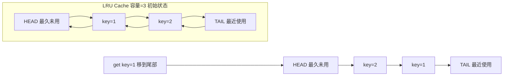

---
tags:
  - Java/集合框架
  - Java/Map
aliases:
  - LinkedHashMap
  - LRU缓存实现
  - 访问顺序
date: 2026-03-18
---

# LinkedHashMap 与 LRU 缓存

> **核心关键词**：插入顺序、访问顺序、双向链表、LRU、removeEldestEntry

---

## 一、整体架构

### 1.1 LinkedHashMap 的核心设计

```
LinkedHashMap = HashMap + 双向链表

在 HashMap 的基础上，用一条贯穿所有节点的双向链表维护条目的顺序（插入顺序或访问顺序）。

内存结构：
  HashMap 的 bucket 数组（处理哈希冲突）
  +
  双向链表（维护顺序：head → entry1 ↔ entry2 ↔ entry3 → tail）
```

### 1.2 继承关系

```
HashMap<K,V>
    └── LinkedHashMap<K,V>
```

### 1.3 Entry 节点

```java
// LinkedHashMap.Entry 在 HashMap.Node 基础上添加了前后指针
static class Entry<K,V> extends HashMap.Node<K,V> {
    Entry<K,V> before;  // 双向链表前驱（按顺序）
    Entry<K,V> after;   // 双向链表后继（按顺序）
    
    Entry(int hash, K key, V value, Node<K,V> next) {
        super(hash, key, value, next);
    }
}
```

### 1.4 关键字段

```java
public class LinkedHashMap<K,V> extends HashMap<K,V> {
    // 双向链表的头节点（最老的节点）
    transient LinkedHashMap.Entry<K,V> head;
    
    // 双向链表的尾节点（最新的节点）
    transient LinkedHashMap.Entry<K,V> tail;
    
    // 迭代顺序模式：
    // false（默认）：插入顺序（Insertion Order）
    // true：访问顺序（Access Order）— 每次 get/put 都把该节点移到尾部
    final boolean accessOrder;
}
```

---

## 二、两种顺序模式

### 2.1 插入顺序（默认）

```java
// accessOrder = false（默认）
Map<String, Integer> map = new LinkedHashMap<>();
map.put("banana", 2);
map.put("apple", 1);
map.put("cherry", 3);

// 迭代顺序 = 插入顺序：banana → apple → cherry
for (Map.Entry<String, Integer> entry : map.entrySet()) {
    System.out.println(entry.getKey() + "=" + entry.getValue());
}
// 输出：banana=2  apple=1  cherry=3

// get 操作不影响顺序（插入顺序模式）
map.get("banana");  // 顺序不变：banana → apple → cherry
```

### 2.2 访问顺序（Access Order）

```java
// accessOrder = true
Map<String, Integer> map = new LinkedHashMap<>(16, 0.75f, true);
map.put("banana", 2);
map.put("apple", 1);
map.put("cherry", 3);
// 插入后：banana → apple → cherry

map.get("banana");
// 访问 banana 后：apple → cherry → banana（banana 被移到尾部）

map.put("apple", 10);
// 操作 apple 后：cherry → banana → apple（apple 被移到尾部）

// 此时迭代顺序：cherry → banana → apple（最久未使用 → 最近使用）
```

---

## 三、关键源码

### 3.1 afterNodeAccess（访问后调整顺序）

```java
// 每次 get/put 操作某个节点后调用（仅 accessOrder=true 时生效）
void afterNodeAccess(Node<K,V> e) {
    LinkedHashMap.Entry<K,V> last;
    if (accessOrder && (last = tail) != e) {
        LinkedHashMap.Entry<K,V> p =
            (LinkedHashMap.Entry<K,V>)e;
        LinkedHashMap.Entry<K,V> b = p.before, a = p.after;
        
        p.after = null;  // 将 p 从链表中摘除
        if (b == null)
            head = a;
        else
            b.after = a;
        if (a != null)
            a.before = b;
        else
            last = b;
        
        if (last == null)
            head = p;
        else {
            p.before = last;  // 将 p 插入链表尾部
            last.after = p;
        }
        tail = p;
        ++modCount;
    }
}
```

### 3.2 afterNodeInsertion（插入后决定是否删除头节点）

```java
// 每次新节点插入后调用
// 这是实现 LRU 的关键！
void afterNodeInsertion(boolean evict) {
    LinkedHashMap.Entry<K,V> first;
    // removeEldestEntry 默认返回 false（不删除），子类可重写
    if (evict && (first = head) != null && removeEldestEntry(first)) {
        K key = first.key;
        removeNode(hash(key), key, null, false, true);  // 删除头节点（最老的节点）
    }
}

// 子类重写此方法，实现容量限制的 LRU 缓存
protected boolean removeEldestEntry(Map.Entry<K,V> eldest) {
    return false;  // 默认不删除
}
```

---

## 四、实现 LRU 缓存

### 4.1 最简洁的 LRU 实现

利用 `LinkedHashMap`（accessOrder=true）+ 重写 `removeEldestEntry`：

```java
public class LRUCache<K, V> extends LinkedHashMap<K, V> {
    
    private final int capacity;
    
    public LRUCache(int capacity) {
        // 初始容量、负载因子、accessOrder=true（关键）
        super(capacity, 0.75f, true);
        this.capacity = capacity;
    }
    
    // 超出容量时，删除最久未使用的条目（head 节点）
    @Override
    protected boolean removeEldestEntry(Map.Entry<K, V> eldest) {
        return size() > capacity;
    }
    
    // 使用方式
    public static void main(String[] args) {
        LRUCache<Integer, String> cache = new LRUCache<>(3);
        
        cache.put(1, "a");
        cache.put(2, "b");
        cache.put(3, "c");
        // 链表：1 → 2 → 3（head → tail）
        
        cache.get(1);
        // 访问 1 后，链表：2 → 3 → 1（1 移到尾部）
        
        cache.put(4, "d");
        // 插入 4，容量超出，删除 head（最久未使用）= 2
        // 链表：3 → 1 → 4
        
        System.out.println(cache.containsKey(2));  // false（已被驱逐）
        System.out.println(cache.keySet());         // [3, 1, 4]
    }
}
```

### 4.2 线程安全的 LRU 缓存

```java
// 方案1：加锁（简单，性能一般）
public class ThreadSafeLRUCache<K, V> {
    private final Map<K, V> cache;
    
    public ThreadSafeLRUCache(int capacity) {
        cache = Collections.synchronizedMap(new LRUCache<>(capacity));
    }
    
    public V get(K key) { return cache.get(key); }
    public void put(K key, V value) { cache.put(key, value); }
}

// 方案2：Caffeine（生产推荐，高性能并发 LRU）
// Cache<Integer, String> cache = Caffeine.newBuilder()
//         .maximumSize(100)
//         .expireAfterAccess(10, TimeUnit.MINUTES)
//         .build();
```

### 4.3 LRU 的工作原理图



---

## 五、LinkedHashMap vs HashMap vs TreeMap

| 特性 | HashMap | LinkedHashMap | TreeMap |
|------|---------|---------------|---------|
| 底层结构 | 数组+链表+红黑树 | HashMap + 双向链表 | 红黑树 |
| 迭代顺序 | **无序** | 插入顺序/访问顺序 | **按键排序** |
| 时间复杂度（增删查）| O(1) | O(1) | O(log n) |
| 内存占用 | 低 | 中（额外双向链表）| 中 |
| null 键/值 | ✅ | ✅ | null 键❌（键需要可比较）|
| 线程安全 | ❌ | ❌ | ❌ |
| 适用场景 | 通用 | 需要有序迭代 / LRU 缓存 | 需要按键排序 |

---

## 六、实战场景

### 场景1：保持 API 参数的传入顺序

```java
// 在一些需要维护键值对顺序的场景（如 JSON 序列化、请求参数）
Map<String, Object> params = new LinkedHashMap<>();
params.put("userId", 123);
params.put("action", "login");
params.put("timestamp", System.currentTimeMillis());

// 序列化时保持插入顺序，方便调试
// {"userId":123,"action":"login","timestamp":1234567890}
```

### 场景2：记录最近访问记录

```java
// 访问顺序的 LinkedHashMap，用于最近访问记录
Map<String, String> recentPages = new LinkedHashMap<>(10, 0.75f, true) {
    @Override
    protected boolean removeEldestEntry(Map.Entry<String, String> eldest) {
        return size() > 10;  // 只保留最近10条
    }
};

recentPages.put("/home", "首页");
recentPages.put("/product/123", "商品详情");
recentPages.put("/cart", "购物车");

// 再次访问首页
recentPages.get("/home");
// /home 被移到尾部（最近访问），顺序：product/123 → cart → /home
```

### 场景3：实现简单的二级缓存

```java
public class TwoLevelCache<K, V> {
    // L1：内存 LRU 缓存（容量小，速度快）
    private final LRUCache<K, V> l1Cache;
    // L2：数据库/Redis（容量大，速度慢）
    private final Map<K, V> l2Cache;
    
    public TwoLevelCache(int l1Capacity) {
        l1Cache = new LRUCache<>(l1Capacity);
        l2Cache = new HashMap<>();
    }
    
    public V get(K key) {
        // 先查 L1
        V value = l1Cache.get(key);
        if (value != null) return value;
        
        // L1 未命中，查 L2（模拟数据库）
        value = l2Cache.get(key);
        if (value != null) {
            l1Cache.put(key, value);  // 放入 L1
        }
        return value;
    }
}
```

---

## 七、面试要点速查

| 问题 | 要点 |
|------|------|
| LinkedHashMap 和 HashMap 的区别 | LinkedHashMap 额外维护双向链表记录顺序（插入顺序或访问顺序）|
| LinkedHashMap 有哪两种顺序模式 | 插入顺序（默认）和访问顺序（accessOrder=true，每次访问节点移到尾部）|
| 如何用 LinkedHashMap 实现 LRU | accessOrder=true + 重写 removeEldestEntry，超容量时删除头节点 |
| LRU 中为什么头节点是最久未用的 | accessOrder=true 时，每次访问/插入都把节点移到尾部，头部就是最久没被访问的 |
| afterNodeAccess 的作用 | 将被访问的节点移到双向链表的尾部（仅 accessOrder=true 时生效）|
| removeEldestEntry 的默认实现 | 返回 false，即不自动删除，需要子类重写来实现容量限制 |


---

**相关面试题** → [[../../10_Developlanguage/001_Java/02_JavaCollectionSubject/04、Map 相关|04、Map 相关]]
