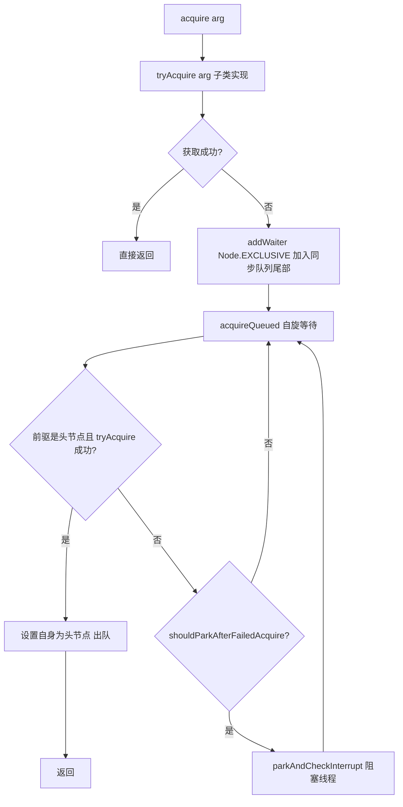

---
tags:
  - Java/并发编程
  - Java/锁
aliases:
  - AQS原理
  - AbstractQueuedSynchronizer
  - CLH队列
  - 同步器框架
date: 2026-03-18
---

# AQS 框架深度解析


> **核心关键词**：AbstractQueuedSynchronizer、CLH队列、state、独占模式、共享模式、条件队列

---

## 一、AQS 概述

### 1.1 定位

`AbstractQueuedSynchronizer`（AQS）是 Java 并发包（`java.util.concurrent.locks`）的**核心基础框架**，是构建锁和同步组件的"骨架"。

**基于 AQS 实现的组件**：

```
AQS
├── 独占模式
│   ├── ReentrantLock（可重入锁）
│   └── ThreadPoolExecutor.Worker（工作线程状态管理）
├── 共享模式
│   ├── Semaphore（信号量）
│   ├── CountDownLatch（倒计时门闩）
│   └── CyclicBarrier（依赖 ReentrantLock）
└── 独占 + 共享
    └── ReentrantReadWriteLock（读写锁）
```

### 1.2 设计思想：模板方法模式

AQS 定义了**算法骨架**（线程排队、阻塞、唤醒），把**状态定义**留给子类实现：

```java
// AQS 提供的模板（不需要子类实现，已有完整逻辑）
public final void acquire(int arg);        // 独占获取
public final void acquireShared(int arg);  // 共享获取
public final boolean release(int arg);     // 独占释放
public final boolean releaseShared(int arg); // 共享释放

// 子类必须实现的"钩子方法"（默认抛 UnsupportedOperationException）
protected boolean tryAcquire(int arg);          // 独占：尝试获取
protected boolean tryRelease(int arg);          // 独占：尝试释放
protected int     tryAcquireShared(int arg);    // 共享：尝试获取（负=失败，0=成功无剩余，正=成功有剩余）
protected boolean tryReleaseShared(int arg);    // 共享：尝试释放
protected boolean isHeldExclusively();          // 是否被当前线程独占
```

---

## 二、核心数据结构

### 2.1 整体结构图

```
AQS 内部结构：

         ┌─────────────────────────────────────────┐
         │                  AQS                     │
         │  volatile int state  （同步状态）          │
         │  Thread exclusiveOwnerThread             │
         │                                          │
         │  同步队列（CLH 变体，双向链表）：            │
         │  head → [虚拟头节点] ↔ [Node1] ↔ [Node2] ↔ ... ↔ tail
         │                                          │
         │  条件队列（每个 Condition 独立）：           │
         │  firstWaiter → [Node] → [Node] → ...     │
         └─────────────────────────────────────────┘
```

### 2.2 state 变量

```java
// volatile 保证可见性，CAS 保证原子性
private volatile int state;

protected final int getState() { return state; }
protected final void setState(int newState) { state = newState; }
protected final boolean compareAndSetState(int expect, int update) {
    return unsafe.compareAndSwapInt(this, stateOffset, expect, update);
}
```

**不同组件中 state 的语义**：

| 组件 | state 含义 |
|------|-----------|
| `ReentrantLock` | 0=未锁定，>0=重入次数 |
| `Semaphore` | 剩余许可证数量 |
| `CountDownLatch` | 剩余计数值（减到0时所有等待线程释放）|
| `ReentrantReadWriteLock` | 高16位=读锁持有数，低16位=写锁重入数 |

### 2.3 Node 节点

```java
static final class Node {
    // 共享模式标记
    static final Node SHARED = new Node();
    // 独占模式标记
    static final Node EXCLUSIVE = null;
    
    // 等待状态
    static final int CANCELLED =  1;  // 节点已取消（超时或中断）
    static final int SIGNAL    = -1;  // 后继节点需要被唤醒
    static final int CONDITION = -2;  // 节点在条件队列中等待
    static final int PROPAGATE = -3;  // 共享模式：释放需要向后传播
    
    volatile int waitStatus;   // 等待状态
    volatile Node prev;        // 前驱节点
    volatile Node next;        // 后继节点
    volatile Thread thread;    // 对应的线程
    Node nextWaiter;           // 条件队列中的后继 / 共享模式标记
}
```

---

## 三、独占模式：acquire / release

### 3.1 acquire 流程



### 3.2 关键源码

```java
// 独占获取（不响应中断）
public final void acquire(int arg) {
    if (!tryAcquire(arg) &&
        acquireQueued(addWaiter(Node.EXCLUSIVE), arg))
        selfInterrupt();
}

// 将当前线程包装成 Node 加入队列尾部
private Node addWaiter(Node mode) {
    Node node = new Node(Thread.currentThread(), mode);
    Node pred = tail;
    if (pred != null) {
        node.prev = pred;
        if (compareAndSetTail(pred, node)) {  // CAS 设置尾节点
            pred.next = node;
            return node;
        }
    }
    enq(node);  // CAS 失败或队列为空，自旋入队
    return node;
}

// 自旋等待获取锁
final boolean acquireQueued(final Node node, int arg) {
    boolean failed = true;
    try {
        boolean interrupted = false;
        for (;;) {  // 自旋
            final Node p = node.predecessor();
            // 前驱是头节点才有资格尝试获取（FIFO 保证）
            if (p == head && tryAcquire(arg)) {
                setHead(node);  // 获取成功，自身设为头节点
                p.next = null;  // 帮助 GC
                failed = false;
                return interrupted;
            }
            // 判断是否应该挂起
            if (shouldParkAfterFailedAcquire(p, node) && parkAndCheckInterrupt())
                interrupted = true;
        }
    } finally {
        if (failed)
            cancelAcquire(node);
    }
}
```

### 3.3 shouldParkAfterFailedAcquire 详解

```java
private static boolean shouldParkAfterFailedAcquire(Node pred, Node node) {
    int ws = pred.waitStatus;
    if (ws == Node.SIGNAL)
        // 前驱节点已经标记了"释放时通知我"，可以安心挂起
        return true;
    if (ws > 0) {
        // 前驱已取消（CANCELLED），跳过所有取消的节点，找到有效前驱
        do {
            node.prev = pred = pred.prev;
        } while (pred.waitStatus > 0);
        pred.next = node;
    } else {
        // 前驱状态是 0 或 PROPAGATE，先 CAS 设为 SIGNAL（下次循环再决定是否挂起）
        compareAndSetWaitStatus(pred, ws, Node.SIGNAL);
    }
    return false;
}
```

### 3.4 release 流程

```java
public final boolean release(int arg) {
    if (tryRelease(arg)) {  // 子类实现：释放锁
        Node h = head;
        if (h != null && h.waitStatus != 0)
            unparkSuccessor(h);  // 唤醒后继节点
        return true;
    }
    return false;
}

private void unparkSuccessor(Node node) {
    int ws = node.waitStatus;
    if (ws < 0) compareAndSetWaitStatus(node, ws, 0);
    
    Node s = node.next;
    // 跳过已取消的节点（从尾部向前找第一个有效节点）
    if (s == null || s.waitStatus > 0) {
        s = null;
        for (Node t = tail; t != null && t != node; t = t.prev)
            if (t.waitStatus <= 0) s = t;
    }
    if (s != null)
        LockSupport.unpark(s.thread);  // 唤醒目标线程
}
```

---

## 四、共享模式：acquireShared / releaseShared

### 4.1 与独占模式的核心区别

```
独占模式：一次只有一个线程能持有
共享模式：多个线程可以同时持有（如读锁、Semaphore）

关键区别在于：共享模式获取成功后，会继续唤醒后续等待的共享节点（doReleaseShared）
```

### 4.2 tryAcquireShared 返回值含义

```java
// 返回值含义：
// 负数：获取失败（需要排队等待）
// 0：  获取成功，但无剩余资源（后续节点无法获取）
// 正数：获取成功，且有剩余资源（可以继续唤醒后续共享节点）
protected int tryAcquireShared(int arg) {
    throw new UnsupportedOperationException();
}
```

### 4.3 Semaphore 的实现示例

```java
// Semaphore 的非公平实现（tryAcquireShared）
protected int tryAcquireShared(int acquires) {
    for (;;) {
        int available = getState();
        int remaining = available - acquires;
        if (remaining < 0 ||
            compareAndSetState(available, remaining))
            return remaining;  // 正数或0=成功，负数=失败
    }
}

// Semaphore 的 tryReleaseShared
protected final boolean tryReleaseShared(int releases) {
    for (;;) {
        int current = getState();
        int next = current + releases;
        if (next < current) throw new Error("Maximum permit count exceeded");
        if (compareAndSetState(current, next))
            return true;
    }
}
```

---

## 五、条件队列（Condition）

### 5.1 Condition vs Object 监视器

| 特性 | Object（wait/notify）| Condition（await/signal）|
|------|---------------------|-------------------------|
| 绑定锁 | synchronized | Lock（如 ReentrantLock）|
| 条件队列数 | 一个 | **多个**（每个 Lock 可创建多个 Condition）|
| 可中断等待 | 有限 | `awaitUninterruptibly()`支持不可中断 |
| 超时支持 | `wait(timeout)` | `await(time, unit)` `awaitNanos(nanos)` |
| 等待到指定时间 | ❌ | `awaitUntil(date)` |

### 5.2 Condition 使用模式：阻塞队列

```java
class BoundedBuffer<T> {
    private final ReentrantLock lock = new ReentrantLock();
    private final Condition notFull  = lock.newCondition();  // 条件队列1：未满
    private final Condition notEmpty = lock.newCondition();  // 条件队列2：非空
    private final Object[] items;
    private int putPtr, takePtr, count;

    BoundedBuffer(int capacity) { items = new Object[capacity]; }

    public void put(T item) throws InterruptedException {
        lock.lock();
        try {
            while (count == items.length)
                notFull.await();       // 满了：等待"未满"条件
            items[putPtr] = item;
            if (++putPtr == items.length) putPtr = 0;
            ++count;
            notEmpty.signal();         // 通知"非空"条件的等待者
        } finally { lock.unlock(); }
    }

    public T take() throws InterruptedException {
        lock.lock();
        try {
            while (count == 0)
                notEmpty.await();      // 空了：等待"非空"条件
            T item = (T) items[takePtr];
            if (++takePtr == items.length) takePtr = 0;
            --count;
            notFull.signal();          // 通知"未满"条件的等待者
            return item;
        } finally { lock.unlock(); }
    }
}
```

### 5.3 await 流程

```
线程调用 condition.await()：
1. 将当前线程封装为 Node（CONDITION 状态）加入条件队列
2. 释放锁（completley，包括重入计数）
3. 挂起（LockSupport.park）

其他线程调用 condition.signal()：
1. 将条件队列头节点转移到同步队列（节点状态改为 0）
2. 唤醒该节点对应的线程

被唤醒的线程：
1. 在同步队列中竞争重新获取锁
2. 获取锁后从 await() 返回
```

---

## 六、公平锁 vs 非公平锁

### 6.1 实现差异

**区别只在 `tryAcquire` 中的一次检查**：

```java
// 公平锁 FairSync
protected final boolean tryAcquire(int acquires) {
    final Thread current = Thread.currentThread();
    int c = getState();
    if (c == 0) {
        if (!hasQueuedPredecessors() &&           // ← 关键：检查队列中是否有等待者
            compareAndSetState(0, acquires)) {
            setExclusiveOwnerThread(current);
            return true;
        }
    }
    // ...重入逻辑...
}

// 非公平锁 NonfairSync
protected final boolean tryAcquire(int acquires) {
    // 直接 CAS 抢占，无论队列中是否有等待者
    return nonfairTryAcquire(acquires);
}
```

### 6.2 性能对比

非公平锁吞吐量更高的原因：
- 避免了频繁的线程挂起和唤醒
- 减少了线程上下文切换
- 当前线程可能恰好在锁释放时重新获取，无需排队

非公平锁的问题：可能导致某些线程**饥饿**（长时间无法获取锁）。

---

## 七、自定义同步器示例

基于 AQS 实现一个**不可重入的互斥锁**：

```java
class SimpleMutex implements Lock {
    
    private final Sync sync = new Sync();
    
    // 继承 AQS，只需实现 tryAcquire 和 tryRelease
    private static class Sync extends AbstractQueuedSynchronizer {
        
        @Override
        protected boolean tryAcquire(int arg) {
            // CAS 将 state 从 0 改为 1
            if (compareAndSetState(0, 1)) {
                setExclusiveOwnerThread(Thread.currentThread());
                return true;
            }
            return false;
        }
        
        @Override
        protected boolean tryRelease(int arg) {
            if (getState() == 0) throw new IllegalMonitorStateException();
            setExclusiveOwnerThread(null);
            setState(0);  // 写 volatile，保证可见性
            return true;
        }
        
        @Override
        protected boolean isHeldExclusively() {
            return getExclusiveOwnerThread() == Thread.currentThread();
        }
        
        Condition newCondition() {
            return new ConditionObject();  // AQS 内置
        }
    }
    
    @Override public void lock()               { sync.acquire(1); }
    @Override public void unlock()             { sync.release(1); }
    @Override public boolean tryLock()         { return sync.tryAcquire(1); }
    @Override public Condition newCondition()  { return sync.newCondition(); }
    // lockInterruptibly, tryLock(time, unit) 省略...
}
```

---

## 八、面试要点速查

| 问题 | 要点 |
|------|------|
| AQS 的核心组成 | volatile int state + FIFO 双向链表（CLH变体）|
| Node 的 waitStatus 有哪些值 | CANCELLED(1) SIGNAL(-1) CONDITION(-2) PROPAGATE(-3) 初始0 |
| 独占和共享模式的区别 | 独占：一次一个线程；共享：多线程同时持有，成功后会传播唤醒 |
| 公平锁和非公平锁的实现区别 | 公平锁多一次 `hasQueuedPredecessors()` 检查 |
| 为什么 unparkSuccessor 从尾部向前找 | 节点入队时先设 prev 再设 next（非原子），从后向前遍历更安全 |
| Condition 和 Object 监视器的区别 | Condition 支持多个等待队列，支持不可中断等待和精确唤醒 |
| AQS 的设计模式 | 模板方法模式，骨架由 AQS 提供，状态语义由子类定义 |


---

**相关面试题** → [[../../10_Developlanguage/001_Java/03_JavaConcurrencySubject/05、AQS（AbstractQueuedSynchronizer）|05、AQS]] | [[../../10_Developlanguage/001_Java/03_JavaConcurrencySubject/04、Lock 接口与实现|04、Lock 接口与实现]]
