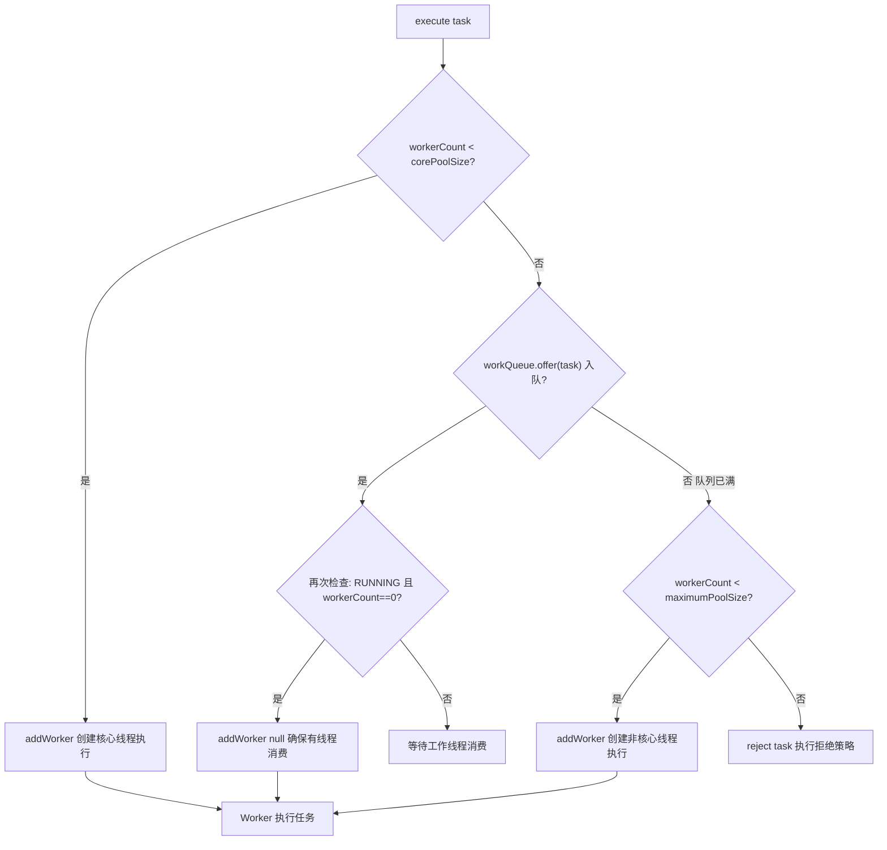

---
tags:
  - Java/并发编程
  - Java/线程池
aliases:
  - ThreadPoolExecutor
  - 线程池七大参数
  - 拒绝策略
  - 线程池调优
date: 2026-03-18
---

# 线程池深度解析

> **核心关键词**：ThreadPoolExecutor、七大参数、工作流程、拒绝策略、线程池监控、动态调参

---

## 一、线程池的本质

线程池是**资源复用 + 任务调度**的并发框架：

```
没有线程池：
  任务到来 → 创建线程（~1ms）→ 执行（~1ms）→ 销毁线程（~0.5ms）
  开销：线程创建/销毁成本占总成本 > 50%，每个线程默认栈 512KB~1MB

有线程池：
  提前创建 N 个线程（常驻）
  任务到来 → 从池中取线程（微秒级）→ 执行 → 归还线程
  开销：几乎只有执行时间
```

**线程池解决的问题**：
1. **资源消耗**：避免频繁创建/销毁线程的 CPU 和内存开销
2. **响应速度**：任务来了马上有线程可用
3. **线程管理**：控制最大并发数，防止资源耗尽
4. **功能增强**：定时任务、线程命名、监控统计等

---

## 二、核心类：ThreadPoolExecutor

### 2.1 类继承关系

```
Executor（接口）
    └── ExecutorService（接口，扩展了 submit/shutdown）
            └── AbstractExecutorService（抽象类，实现 submit/invokeAll/invokeAny）
                    └── ThreadPoolExecutor（核心实现类）
                            └── ScheduledThreadPoolExecutor（支持定时/周期任务）
```

### 2.2 七大核心参数

```java
public ThreadPoolExecutor(
    int corePoolSize,              // ① 核心线程数
    int maximumPoolSize,           // ② 最大线程数
    long keepAliveTime,            // ③ 非核心线程空闲存活时间
    TimeUnit unit,                 // ④ 时间单位
    BlockingQueue<Runnable> workQueue,  // ⑤ 任务队列
    ThreadFactory threadFactory,   // ⑥ 线程工厂
    RejectedExecutionHandler handler    // ⑦ 拒绝策略
)
```

**参数详解**：

| 参数 | 说明 | 推荐设置 |
|------|------|---------|
| `corePoolSize` | 常驻线程数，即使空闲也不销毁 | CPU 密集型：CPU 核数；IO 密集型：CPU 核数 * 2 |
| `maximumPoolSize` | 线程池最大线程数（包含核心线程）| 根据业务峰值评估，避免设太大 |
| `keepAliveTime` | 超出 core 的空闲线程存活时间 | 30s ~ 60s，不宜太长 |
| `unit` | keepAliveTime 的时间单位 | — |
| `workQueue` | 缓冲等待任务的阻塞队列 | **有界队列**，设合适容量上限 |
| `threadFactory` | 自定义线程名，便于监控排查 | 必须自定义，格式如 `biz-pool-1` |
| `handler` | 队列满+线程满时的处理策略 | 根据业务选择，默认 AbortPolicy |

### 2.3 线程池状态（ctl 字段）

```java
// ctl 是一个 AtomicInteger，高3位=状态，低29位=线程数
// 状态转换：
RUNNING    (-1 << 29)  // 正常运行，接受新任务和队列任务
SHUTDOWN   ( 0 << 29)  // 调用 shutdown()，不接受新任务，处理队列任务
STOP       ( 1 << 29)  // 调用 shutdownNow()，不接受新任务，不处理队列，中断线程
TIDYING    ( 2 << 29)  // 所有任务终止，线程数为0，即将调用 terminated()
TERMINATED ( 3 << 29)  // terminated() 执行完毕

// 状态转换图：
// RUNNING → SHUTDOWN（shutdown()）
// RUNNING/SHUTDOWN → STOP（shutdownNow()）
// SHUTDOWN → TIDYING（队列空且线程数为0）
// STOP → TIDYING（线程数为0）
// TIDYING → TERMINATED（terminated() 执行完）
```

---

## 三、任务提交与执行流程

### 3.1 execute() 流程



### 3.2 关键源码：execute()

```java
public void execute(Runnable command) {
    if (command == null) throw new NullPointerException();
    int c = ctl.get();
    
    // 1. 工作线程数 < corePoolSize，创建核心线程
    if (workerCountOf(c) < corePoolSize) {
        if (addWorker(command, true))
            return;
        c = ctl.get();
    }
    
    // 2. 线程池处于 RUNNING 且任务成功入队
    if (isRunning(c) && workQueue.offer(command)) {
        int recheck = ctl.get();
        // 双重检查：入队后线程池可能被关闭
        if (!isRunning(recheck) && remove(command))
            reject(command);
        else if (workerCountOf(recheck) == 0)
            addWorker(null, false);  // 确保至少有一个线程来消费
    }
    // 3. 队列满了，尝试创建非核心线程
    else if (!addWorker(command, false))
        reject(command);  // 4. 线程数也到最大了，执行拒绝策略
}
```

### 3.3 Worker 工作循环

```java
// Worker 内部的工作循环（简化）
private Runnable getTask() {
    boolean timedOut = false;
    for (;;) {
        // 判断是否需要超时控制
        boolean timed = allowCoreThreadTimeOut || wc > corePoolSize;
        
        // 从队列取任务
        Runnable r = timed ?
            workQueue.poll(keepAliveTime, TimeUnit.NANOSECONDS) :  // 超时等待
            workQueue.take();                                        // 永久阻塞等待
        
        if (r != null) return r;
        timedOut = true;
        // 返回 null 表示线程应该退出（超时或线程池关闭）
    }
}

// 工作线程主循环
void runWorker(Worker w) {
    Runnable task = w.firstTask;  // 先执行创建时绑定的任务
    while (task != null || (task = getTask()) != null) {
        try {
            beforeExecute(w.thread, task);  // 钩子方法，可监控
            task.run();
            afterExecute(task, null);       // 钩子方法，可监控
        } catch (Throwable ex) {
            afterExecute(task, ex);
            throw ex;
        } finally {
            task = null;
            w.completedTasks++;
        }
    }
    processWorkerExit(w, false);  // 线程退出处理
}
```

---

## 四、任务队列类型

| 队列类型 | 特点 | 适用场景 | 风险 |
|---------|------|---------|------|
| `LinkedBlockingQueue` | 可选容量（默认 Integer.MAX_VALUE），吞吐量高 | FixedThreadPool | 默认无界，可能 OOM |
| `ArrayBlockingQueue` | **有界**，FIFO | **生产推荐**，可控制任务堆积 | 队列满触发拒绝策略 |
| `SynchronousQueue` | 不存储任务，直接交给线程 | CachedThreadPool，快速执行任务 | 线程数可能爆炸 |
| `PriorityBlockingQueue` | 按优先级出队 | 有任务优先级需求 | 可能导致低优先级任务饥饿 |
| `DelayedWorkQueue` | 按延迟时间出队 | ScheduledThreadPool | — |

---

## 五、四种拒绝策略

```java
// 1. AbortPolicy（默认）：直接抛异常，让调用者感知
executor.setRejectedExecutionHandler(new ThreadPoolExecutor.AbortPolicy());
// → 抛出 RejectedExecutionException

// 2. CallerRunsPolicy：调用者线程执行任务（降低提交速度，提供反压）
executor.setRejectedExecutionHandler(new ThreadPoolExecutor.CallerRunsPolicy());
// → 主线程/提交线程自己跑，自然降速

// 3. DiscardPolicy：静默丢弃新任务，无任何通知
executor.setRejectedExecutionHandler(new ThreadPoolExecutor.DiscardPolicy());
// → 任务丢失，只适合允许丢数据的场景

// 4. DiscardOldestPolicy：丢弃队列中最老的任务，重新提交当前任务
executor.setRejectedExecutionHandler(new ThreadPoolExecutor.DiscardOldestPolicy());
// → 用于：新任务优先级更高的场景

// 5. 自定义（生产推荐）：记录日志 + 告警 + 降级处理
executor.setRejectedExecutionHandler((r, pool) -> {
    log.error("线程池已满，任务被拒绝: {}", r);
    metrics.increment("threadpool.rejected");
    // 可选：写入数据库、MQ 等待后续重试
});
```

---

## 六、Executors 工厂方法与风险

### 6.1 四种预设线程池

```java
// FixedThreadPool：固定线程数，无界队列
// ❌ 风险：LinkedBlockingQueue 默认无界，任务堆积 OOM
ExecutorService fixed = Executors.newFixedThreadPool(10);

// CachedThreadPool：线程数无界，同步队列
// ❌ 风险：线程数无上限，极端情况创建大量线程，OOM 或耗尽系统资源
ExecutorService cached = Executors.newCachedThreadPool();

// SingleThreadExecutor：单线程，无界队列
// ❌ 风险：同 FixedThreadPool（队列无界）
ExecutorService single = Executors.newSingleThreadExecutor();

// ScheduledThreadPool：定时任务
// ❌ 风险：DelayedWorkQueue 无界
ScheduledExecutorService scheduled = Executors.newScheduledThreadPool(5);
```

### 6.2 生产推荐写法

```java
// ✅ 直接使用 ThreadPoolExecutor，明确所有参数
ThreadPoolExecutor executor = new ThreadPoolExecutor(
    Runtime.getRuntime().availableProcessors(),      // corePoolSize：CPU 核数
    Runtime.getRuntime().availableProcessors() * 2,  // maximumPoolSize：CPU 核数 * 2
    60L,                                             // keepAliveTime：60秒
    TimeUnit.SECONDS,
    new ArrayBlockingQueue<>(1000),                  // ✅ 有界队列，容量1000
    new ThreadFactory() {
        private final AtomicInteger count = new AtomicInteger(0);
        @Override
        public Thread newThread(Runnable r) {
            Thread t = new Thread(r);
            t.setName("business-pool-" + count.incrementAndGet());
            t.setDaemon(false);
            return t;
        }
    },
    (r, pool) -> {                                   // 自定义拒绝策略
        log.error("线程池已满，任务被拒绝");
        throw new RejectedExecutionException("ThreadPool is FULL");
    }
);
```

---

## 七、线程数设置公式

### 7.1 CPU 密集型

```
corePoolSize = CPU 核数 + 1

+1 的原因：当线程因缺页中断等偶发原因暂停时，
额外那个线程可以继续利用 CPU，避免浪费
```

### 7.2 IO 密集型

```
corePoolSize = CPU 核数 × (1 + 等待时间/计算时间)

例：一个任务 10ms 执行，90ms 等待 IO
等待/计算 = 9
corePoolSize = 8核 × (1 + 9) = 80

粗略估算：corePoolSize = CPU 核数 × 2
```

### 7.3 实际建议

公式是起点，**压测才是终点**：
1. 用公式给出初始值
2. 配置动态调整（如美团的动态线程池方案）
3. 压测 + 监控 QPS/响应时间/队列积压量
4. 根据实际情况调整

---

## 八、线程池监控与调优

### 8.1 内置监控指标

```java
ThreadPoolExecutor executor = ...;

executor.getPoolSize();           // 当前线程数（含核心+非核心）
executor.getCorePoolSize();       // 核心线程数
executor.getMaximumPoolSize();    // 最大线程数
executor.getActiveCount();        // 活跃线程数（正在执行任务）
executor.getTaskCount();          // 总任务数（已完成+执行中+队列中）
executor.getCompletedTaskCount(); // 已完成任务数
executor.getQueue().size();       // 当前队列中的任务数
executor.getQueue().remainingCapacity(); // 队列剩余容量
```

### 8.2 扩展钩子方法

```java
ThreadPoolExecutor executor = new ThreadPoolExecutor(...) {
    @Override
    protected void beforeExecute(Thread t, Runnable r) {
        // 任务开始前：记录开始时间，打印日志
        MDC.put("taskId", getTaskId(r));
    }
    
    @Override
    protected void afterExecute(Runnable r, Throwable t) {
        // 任务完成后：记录耗时，上报监控
        if (t != null) log.error("任务执行异常", t);
    }
    
    @Override
    protected void terminated() {
        // 线程池关闭后的清理工作
        log.info("线程池已关闭");
    }
};
```

### 8.3 优雅关闭

```java
executor.shutdown();  // 不接受新任务，等待已提交任务完成
try {
    if (!executor.awaitTermination(60, TimeUnit.SECONDS)) {
        executor.shutdownNow();  // 超时后强制中断
        if (!executor.awaitTermination(60, TimeUnit.SECONDS)) {
            log.error("线程池未能正常关闭");
        }
    }
} catch (InterruptedException e) {
    executor.shutdownNow();
    Thread.currentThread().interrupt();
}
```

---

## 九、线程池的常见问题

### 问题1：任务中未处理异常导致线程"静默死亡"

```java
// ❌ 任务抛出异常，execute() 方式：线程退出，被新线程替换，异常被吞掉
executor.execute(() -> {
    throw new RuntimeException("出错了");  // 线程死亡，但无任何通知
});

// ✅ 方式1：任务内部 try-catch
executor.execute(() -> {
    try {
        // ...
    } catch (Exception e) {
        log.error("任务执行失败", e);
    }
});

// ✅ 方式2：submit() 用 Future 捕获异常
Future<?> future = executor.submit(() -> { throw new RuntimeException(); });
try {
    future.get();  // 异常会被包装在 ExecutionException 中抛出
} catch (ExecutionException e) {
    log.error("任务异常: ", e.getCause());
}

// ✅ 方式3：自定义 ThreadFactory，设置 UncaughtExceptionHandler
ThreadFactory factory = r -> {
    Thread t = new Thread(r);
    t.setUncaughtExceptionHandler((thread, ex) -> log.error("线程异常", ex));
    return t;
};
```

### 问题2：ThreadLocal 数据在线程池中的泄漏

```java
// ❌ 线程复用，上一个任务设置的 ThreadLocal 值被下一个任务读到
executor.execute(() -> {
    UserContext.set(user1);
    process();
    // 忘记 remove！
});

// 另一个任务可能读到 user1 的数据
executor.execute(() -> {
    UserContext.get();  // 可能是 user1！
});

// ✅ 任务结束时必须清理
executor.execute(() -> {
    try {
        UserContext.set(currentUser);
        process();
    } finally {
        UserContext.remove();  // ✅ 务必在 finally 清理
    }
});
```

---

## 十、面试要点速查

| 问题 | 要点 |
|------|------|
| 七大核心参数 | corePoolSize maximumPoolSize keepAliveTime unit workQueue threadFactory handler |
| 任务提交流程 | 核心线程→队列→非核心线程→拒绝策略 |
| 为什么不推荐 Executors | FixedThreadPool/Single 用无界队列可 OOM；CachedThreadPool 线程数无上限可 OOM |
| 四种拒绝策略 | Abort（抛异常）CallerRuns（调用者执行）Discard（静默丢弃）DiscardOldest（丢最老）|
| 线程池大小如何设置 | CPU密集型=核数+1；IO密集型=核数×(1+等待/计算)；压测验证 |
| execute 和 submit 区别 | execute 无返回值不感知异常；submit 返回 Future 可获取结果和异常 |
| 如何优雅关闭 | shutdown() + awaitTermination() + shutdownNow() |
| 线程池中 ThreadLocal 怎么用 | 任务开始 set，finally 中 remove，或使用 TransmittableThreadLocal |


---

## 附录：PDF补充 Future与CompletableFuture

### Future

Future 表示异步计算的结果，提供了检查计算是否完成、等待计算完成、获取计算结果等方法。

### FutureTask

FutureTask 是 Future 的实现类，同时实现了 Runnable 接口，可以作为线程执行。

### CompletableFuture

CompletableFuture 是 JDK 8 引入的异步编程工具，提供了丰富的异步任务组合能力。

**执行通知**：
- thenApply()：任务完成后应用函数
- thenAccept()：任务完成后消费结果
- thenRun()：任务完成后执行回调
- whenComplete()：任务完成时触发

**执行异步任务**：
- supplyAsync()：执行有返回值的异步任务
- runAsync()：执行无返回值的异步任务

**相关面试题** → [[../../10_Developlanguage/001_Java/03_JavaConcurrencySubject/06、线程池|06、线程池]]
